Arduino 教程
============

.. _1-关于arduino-ide:

1. 关于Arduino IDE
------------------

.. _11-windows系统:

1.1. Windows系统：
~~~~~~~~~~~~~~~~~~

|Img|

**1.1.1. 下载安装Arduino软件：**

\ **特别提醒**\ ：本教程使用的是Arduino IDE 2.3.3
版本，其他的版本不能保证本教程的示例代码编译和上传成功。

(1) 首先，进入Arduino官方网站：\ https://www.arduino.cc/en/software/
，如下图所示：

|image1|

(2)
然后，根据你的操作系统选择并下载相应的安装程序。如果你是Windows用户，请选择安装2.3.3版本Arduino
IDE，当点击“\ **Windows** Win10 and newer,64bits”或“\ **Windows** MSI
installer”，代表下载安装文件(.exe) ，需要手动安装; 当点击“\ **Windows**
ZIP file”，代表直接下载2.3.3版本Arduino
IDE，是一个压缩文件，解压就可以直接使用，无需安装。

|image2|

点击下面图标，就可直接安装Arduino IDE了。

|image3|

一般情况下，点击“\ **JUST
DOWNLOAD**\ ”就可以下载了，当然如果你愿意，你可以选择小小的赞助，以帮助伟大的Arduino开源事业。

**特别提醒：为了防止Arduino IDE版本更新过快，我们也提供了Arduino IDE
2.3.3
版本的安装包下载链接。而更高级的版本可能会导致本教程的实验代码编译不成功。如果这样的话，建议采用我们提供的Arduino
IDE 2.3.3 版本安装包（\ Windows系统\ ）下载链接**\ 。

`Arduino IDE 2.3.3
版本 <https://downloads.arduino.cc/arduino-ide/arduino-ide_2.3.3_Windows_64bit.exe>`__

(3) Arduino软件下载完成后,如果你是点击“\ **Windows** Win10 and
newer,64bits”或“\ **Windows** MSI installer”下载的(.exe)文件
“\ **arduino-ide_2.3.3_Windows_64bit.exe**\ ”
，需要双击(.exe)文件继续安装，当你收到操作系统的警告时，请点击“\ **Allow
access**\ ”允许驱动程序安装。首先点击“\ **I Agree**\ ”, 然后选择 “Anyone
who uses this computer(all users)”后再点击 “\ **Next**\ ”。

|image4|

|image5|

|image6|

(4) 点击“\ **Next**\ ”后，如果又出现下面页面，点击“\ **I Agree**\ ”。

|image7|

(5) 选择安装目录(我们建议保持默认目录)，然后点击“\ **Install**\ ”。

|image8|

(6) 如果出现以下界面，则应选择“\ **Install**\ ”。

|image9|

该过程将提取并安装所有必需的文件，以正确执行Arduino软件(IDE)。

|image10|

(7) 安装完成后，会在桌面上生成一个Arduino IDE软件快捷方式。

|image11|

**1.1.2. 在Windows系统上安装驱动：**

**注意：如果电脑已经安装了驱动程序，则不需要再安装驱动；如果没有，则需要进行以下操作**

在使用ESP32主板之前，必须安装驱动程序，否则ESP32主板将无法与计算机通信。将主控板用USB线连接在电脑上，一般MacOS和Windows10系统的电脑会自动安装驱动。如果没能自动安装，则需要手动安装驱动。

（1）查看电脑是否自动安装好驱动：

点击“\ **计算机**\ ”--“\ **属性**\ ”--“\ **设备管理器**\ ”，显示如下图是安装成功的了：

|image12|

（2）如果没能自动安装，那就手动安装，步骤如下：

下载CP2102驱动程序的链接：\ https://www.silabs.com/developers/usb-to-uart-bridge-vcp-drivers?tab=downloads

|image13|

右键点击“\ **USB Serial**\ ”，选择“\ **更新驱动程序(P)**\ ”并点击。

|image14|

跳转到以下页面，选择“\ **浏览我的电脑以查找驱动程序(R)**\ ”并点击。

|image15|

我们在对应的文件夹中也提供有CP210X系列芯片的驱动文件，位置如下：

|image16|

你可以先将驱动文件复制到电脑桌面上，然后点击“\ **浏览(R)...**\ ”,选中CP210X系列芯片的驱动，最后点击“\ **下一页**\ ”。

|image17|

过一会儿，驱动安装成功。

|image18|

这个时候再打开计算机设备管理器，就可以看到CP2102驱动程序已经安装成功了，刚刚那个黄色的感叹号不见了。\ **(不同的计算机，串口端口(COMXX)不一样)**

|image19|

**1.1.3. Arduino IDE工具栏介绍：**

**点击电脑桌面上的图标\ Img\ ，打开Arduino IDE。**

|image20|

|image21| -- 用于检查是否存在任何编译错误。

|image22| -- 用于将程序上传到Arduino板。

|image23| -- 用于编写程序时的单步调试。

|image24| -- 用于从板接收串行数据并将串行数据发送到板的串行监视器。

|image25| -- 用于串口接收的数据转换成动态曲线图。

|image26| -- 用于打开最近保存的示例草图。

|image27| -- 用手动安装开发板。

**语言切换功能：**

（1）单击“File”→“Preferences”，在 Preferences
页面中将语言“English”切换成“简体中文”，点击“OK”就可以了。

|image28|

|image29|

|image30|

**1.1.4. 在Arduino IDE上安装ESP32：**

上面已经学习了怎么下载ArduinoIDE和怎么安装驱动，那下面就要在Arduino
IDE上安装ESP32，请执行以下步骤：

\ **特别注意：**\  你需要Arduino IDE
1.8.5或更高版本才能在其上安装ESP32。

(1) 点击电脑桌面上的图标\ |image31|\ ，打开Arduino IDE。

|image32|

(2) 点击“文件” →“首选项”，如下图：

|image33|

(3) 打开下图标出的按钮

|image34|

(4)
将这个地址：\ ``https://espressif.github.io/arduino-esp32/package_esp32_index.json``
，复制粘贴到里面去再点击“\ **确定**\ ”保存这个地址，如下图：

|image35|

(5) 再点击“\ **确定**\ ”。

|image36|

（6）先点击“\ **工具**\ ” → “\ **开发版:**\ ”，再点击
“\ **开发版管理器...**\ ” 进入 “\ **开发版管理器**\ ”
页面，在文本框中输入“\ **esp32**\ ”，选择 **3.1.3版本**
进行安装(⚠️\ **请注意，这里我们采用 3.1.3版本
的ESP32。如果选择其他版本，可能会不兼容套件中提供的库文件和示例代码，导致使上传库文件和示例代码报错**)，安装包不大，点击“\ **安装**\ ”开始安装相关安装包。如下图。

|image37|

|image38|

|image39|

**假如，由于网络问题实在是下载安装不了ESP32开发板，我们也提供有ESP32开发板的压缩包**\ ，\ **ESP32开发板的压缩包下载地址：**
https://pan.baidu.com/s/1yD4JXWmTwZ9vYbM8iSvAbg?pwd=5cyx

**提取码：5cyx**

**压缩包下载后解压，把解压后的ESP32开发板文件夹按照以下路径添加。ESP32开发板一般需要存放于以下路径，才能说明ESP32开发板安装好。**

- **Windows
  系统**\ ：路径为C:\\Users\\你的用户名\\AppData\\Local\\Arduino15\\packages 。其中，AppData 是一个隐藏文件夹，你需要在文件夹选项中开启
  “显示隐藏的文件、文件夹和驱动器” 才能看到。
- **macOS
  系统**\ ：位于~/Library/Arduino15/packages。Library 也是一个隐藏文件夹，你可以通过在
  “\ **访达**\ ” 中使用快捷键Command + Shift +
  G ，然后输入该路径来访问。
- **Linux 系统**\ ：存于~/.arduino15/packages 。

（7）安装成功后，重新启动 Arduino
IDE，然后点击“\ **工具**\ ”→“\ **开发版:**\ ”，就可以看到安装好的ESP32
Arduino，你可以在里面查看到各种不同型号ESP32开发板，选择对应的ESP32开发板型号。

|image40|

|image41|

（8）设置好板型后，再选择正确的COM口（安装驱动成功后可看到对应COM口），设置如下图。

|image42|

|image43|

|image44|

.. _12-mac系统:

1.2. Mac系统:
~~~~~~~~~~~~~

|image45|

**1.2.1.下载安装Arduino IDE:**

进入Arduino官方网站：\ https://www.arduino.cc/en/software/
，如下图所示：

|image46|

**1.2.2.如何安装CP2102驱动程序：**

**注意：**
如果已经安装了驱动程序，则不需要再安装驱动；如果没有，则需要进行以下操作

（1）用USB线将ESP32主板连接到你的MacOS系统电脑上，并打开Arduino IDE。

|image47|

（2）CP2102驱动下载链接：

https://cn.silabs.com/developers/usb-to-uart-bridge-vcp-drivers?tab=downloads

（3）点击下载MacOS 版本。

|image48|

（4）解压下载好的压缩包。

|image49|

我们也在对应的文件中提供有 CP2102 驱动文件。

|image50|

（5）打开文件夹，双击“SiLabsUSBDriverDisk.dmg”文件。

|image51|

可以看到以下文件。

|image52|

（6）双击“Install CP210x VCP Driver”，勾选“Don’t warn me when opening
application on this disk image”并单击“Open”。

|image53|

（7）单击“Continue”。

|image54|

（8）先点击“Agree”，然后点击“Continue”。

|image55|

（9）继续点击“Continue”，然后输入你的用户密码

|image56|

|image57|

（10）选择“Select Open Security Preferences”。

|image58|

（11）点击安全锁，输入你的用户密码来授权。

|image59|

|image60|

（12）看到锁被打开了，点击“Allow”。

|image61|

（13）回到安装界面，根据提示等待安装.

|image62|

（14）安装成功

|image63|

**1.2.3. 在Arduino IDE上安装ESP32：**

上面已经学习了怎么下载ArduinoIDE和怎么安装驱动，那下面就要在Arduino
IDE上安装ESP32，请执行以下步骤：

\ **特别注意：你需要Arduino IDE 1.8.5或更高版本才能在其上安装ESP32。**

(1)点击电脑桌面上的图标\ |image64|\ ，打开Arduino
IDE。先切换语言，然后点击 “Arduino IDE” →“首选项”，如下图：

|image65|

(2)打开下图标出的按钮

|image66|

(3)将这个地址：\ ``https://espressif.github.io/arduino-esp32/package_esp32_index.json``
，复制粘贴到里面去再点击“\ **确定**\ ”保存这个地址，如下图：

|image67|

(4)再点击“\ **确定**\ ”。

|image68|

（5）先点击“\ **工具**\ ”→“\ **开发版:**\ ”，再点击“\ **开发版管理器...**\ ”进入“\ **开发版管理器**\ ”页面，在文本框中输入“\ **esp32**\ ”，选择
**3.1.3版本**
进行安装(⚠️\ **请注意，这里我们采用3.1.3版本的ESP32。如果选择其他版本，可能会导致不兼容套件中提供的库文件，使上传库文件报错。**
)，安装包不大，点击“\ **安装**\ ”开始安装相关安装包。如下图。

|image69|

|image70|

|image71|

（6）点击“\ **工具**\ ”→“\ **开发版:**\ ”，就可以看到安装好的ESP32
Arduino，你可以在里面查看到各种不同型号ESP32开发板，选择对应的ESP32开发板型号。这里是以“ESP32
Wrover Module”为例。

|image72|

（7）设置好板型后，再选择正确的COM口（安装驱动成功后可看到对应COM口），设置如下图。

|image73|

.. _13-添加arduino库文件:

1.3. 添加arduino库文件
~~~~~~~~~~~~~~~~~~~~~~

我们提供的Arduino 库文件是放在资料的
“\ **重要资源\\库文件\\Arduino库文件**\ ” 文件夹中，如下图：

|image74|

**1.3.1. Windows系统添加库文件的方法：**

（1）打开Arduino IDE\ |image75|\ ，在Arduino
IDE界面点击“\ **项目**\ ”→“\ **包含库**\ ”→“\ **添加.ZIP库...**\ ”。

|image76|

（2）找到库文件存放的位置，选中对应的库文件，点击“\ **打开**\ ”添加即可。库文件只能一个一个的添加。（\ **注意：库文件需要压缩为
.ZIP\ 格式，我们在文件夹中是以 .ZIP 格式提供有；这里以
“\ Adafruit_NeoPixel.ZIP\ ” 为演示，其他库文件的添加方法是一样的。**\ ）

|image77|

**1.3.2. MacOS系统的库文件添加方法:**

（1）arduino IDE界面选择“\ **项目**\ ” > “\ **包含库**\ ” >
“\ **添加.ZIP库...**\ ”。 |image78|

（2）找到库文件存放的位置，选中对应的库文件，再点击\ **打开**\ ，库文件只能一个一个的添加。（\ **这里以添加“Adafruit_NeoPixel-1.3.5.ZIP”库文件为例，其他库文件的添加方法一样**\ ），如下图：

|image79|

|image80|

到这，正常是安装成功的了。

.. _2-项目教程:

2. 项目教程
-----------

\ **特别提醒：**
在下面的教程中用到库文件的，首先我们先确保安装了库文件，不然代码会编译出错，如何安装库文件请参考“\ **1.3.
添加arduino库文件**\ ”。如果库文件已安装，就跳过这一步骤。

项目01: SK6812 RGB
~~~~~~~~~~~~~~~~~~

**1. 实验简介：**

小车扩展板上有4个RGB LED，RGB
LED属于简单的发光模块，可以通过调节色彩调出不同颜色的灯效，可广泛应用于建筑物、桥梁、道路、花园、庭院、地板等领域的装饰照明与会场布置、圣诞节、万圣节、情人节、复活节、国庆节等节日期间烘托气氛等场景。在本实验中，使小车扩展板上的4个RGB实现各种灯光效果。

**2. 元件知识：**

**SK6812RGB：** 小车扩展板上有4个RGB
LED，从原理图中可以看出，这4个RGBLED都是串联起来的，在电压电流充足的情况下可以接几百个RGB
LED，都可以用一根信号线控制任意一个RGB
LED，并且让它显示任意一种颜色。每一颗RGBLED都是一个独立的像素点，每个像素点都是由R、G、B三基色颜色组成，可实现256级亮度显示，完成16777216种颜色的全真色彩显示，同时像素点内部包含了智能数字接口数据锁存信号整形放大驱动电路，还内置信号整形电路，有效保证了像素点光的颜色高度一致。

|image81|

**3. 实验代码：**

小车PCB板上的SK6812RGB是由ESP32主板上的GPIO 14 控制。

\ **特别提醒：**\  首先我们先确保安装了<Adafruit_NeoPixel.h>
库文件，不然代码会编译出错，如何安装库文件请参考“\ `1.3.
添加arduino库文件 <https://www.keyesrobot.cn/projects/KE3059/zh-cn/latest/docs/Arduino%E6%95%99%E7%A8%8B.html#id1>`__\ ”。如果库文件已安装，就跳过这一步骤。

.. code:: c

   //*************************************************************************************
   /*
     Project 01 SK6812 RGB
     4个rgb用于各种照明效果。
   */
   #include <Adafruit_NeoPixel.h>

   #define PIN 14

   //参数1 = strip中像素的个数
   //参数2 = Arduino引脚编号（大多数是有效的）
   //参数3 =像素类型标志，根据需要加在一起：
   //   NEO_KHZ800  800 KHz 比特流（大多数带有WS2812 led的NeoPixel产品）
   //   NEO_KHZ400  400 KHz （经典的“v1”（不是v2） FLORA像素，WS2811驱动）
   //   NEO_GRB     像素是为GRB比特流连接的（大多数NeoPixel产品）
   //   NEO_RGB     像素为RGB比特流连接（v1 FLORA像素，而不是v2）
   Adafruit_NeoPixel strip = Adafruit_NeoPixel(60, PIN, NEO_GRB + NEO_KHZ800);

   //重要：为了减少NeoPixel耗尽风险，在像素电源引线上添加1000 uF电容器，在第一个像素的数据输入上添加300 - 500欧姆电阻，并尽量减少Arduino与第一个像素之间的距离。
   //避免在带电电路上连接…如果必须，请先连接GND。

   void setup() {
     strip.begin();
     strip.show(); // 将所有像素初始化为“off”
   }

   void loop() {
     // 一些演示如何显示像素的示例程序：
     colorWipe(strip.Color(255, 0, 0), 50); // 红
     colorWipe(strip.Color(0, 255, 0), 50); // 绿
     colorWipe(strip.Color(0, 0, 255), 50); // 蓝
     // 发送一个影院像素追逐…
     theaterChase(strip.Color(127, 127, 127), 50); // 白
     theaterChase(strip.Color(127,   0,   0), 50); // 红
     theaterChase(strip.Color(  0,   0, 127), 50); // 蓝

     rainbow(20);
     rainbowCycle(20);
     theaterChaseRainbow(50);
   }

   // 用一种颜色一个接一个地填充这些点
   void colorWipe(uint32_t c, uint8_t wait) {
     for(uint16_t i=0; i<strip.numPixels(); i++) {
         strip.setPixelColor(i, c);
         strip.show();
         delay(wait);
     }
   }

   void rainbow(uint8_t wait) {
     uint16_t i, j;

     for(j=0; j<256; j++) {
       for(i=0; i<strip.numPixels(); i++) {
         strip.setPixelColor(i, Wheel((i+j) & 255));
       }
       strip.show();
       delay(wait);
     }
   }

   // 略有不同，这使得彩虹均匀分布在各处
   void rainbowCycle(uint8_t wait) {
     uint16_t i, j;

     for(j=0; j<256*5; j++) { // 车轮上所有颜色的5个循环
       for(i=0; i< strip.numPixels(); i++) {
         strip.setPixelColor(i, Wheel(((i * 256 / strip.numPixels()) + j) & 255));
       }
       strip.show();
       delay(wait);
     }
   }

   //剧院式的爬行灯。
   void theaterChase(uint32_t c, uint8_t wait) {
     for (int j=0; j<10; j++) {  //做10个循环的追逐
       for (int q=0; q < 3; q++) {
         for (int i=0; i < strip.numPixels(); i=i+3) {
           strip.setPixelColor(i+q, c);    //打开每三个像素
         }
         strip.show();
        
         delay(wait);
        
         for (int i=0; i < strip.numPixels(); i=i+3) {
           strip.setPixelColor(i+q, 0);        //关闭每三个像素
         }
       }
     }
   }

   //带有彩虹效果的剧院式爬行灯
   void theaterChaseRainbow(uint8_t wait) {
     for (int j=0; j < 256; j++) {     // 在轮盘上循环所有256种颜色
       for (int q=0; q < 3; q++) {
           for (int i=0; i < strip.numPixels(); i=i+3) {
             strip.setPixelColor(i+q, Wheel( (i+j) % 255));    //打开每三个像素
           }
           strip.show();
          
           delay(wait);
          
           for (int i=0; i < strip.numPixels(); i=i+3) {
             strip.setPixelColor(i+q, 0);        //关闭每三个像素
           }
       }
     }
   }

   // 输入0到255的值来获取颜色值。
   // 颜色是一个过渡r - g - b -回到r。
   uint32_t Wheel(byte WheelPos) {
     if(WheelPos < 85) {
      return strip.Color(WheelPos * 3, 255 - WheelPos * 3, 0);
     } else if(WheelPos < 170) {
      WheelPos -= 85;
      return strip.Color(255 - WheelPos * 3, 0, WheelPos * 3);
     } else {
      WheelPos -= 170;
      return strip.Color(0, WheelPos * 3, 255 - WheelPos * 3);
     }
   }
   //*************************************************************************************

**4. 实验现象：**

编译并上传代码到ESP32主板上（如果上传代码不成功，可以在点击\ |image82|\ 后用手按住ESP32主板上的Boot键，出现上传进度百分比再松开Boot键\ |image83|\ ，如下图所示：），利用USB线上电后，小车PCB板上的4个RGB
LED发出各种颜色灯光效果。

|image84|

|image85|

项目02: 无源蜂鸣器
~~~~~~~~~~~~~~~~~~

**1. 实验简介：**

小车扩展板上有个喇叭功放元件，它常用来播放音调和音乐，作为一些音乐播放设备的外接扩音设备。

在本实验中，我们利用喇叭功放元件来播放一段音调。

**2. 元件知识：**

喇叭功放元件：喇叭功放元件（原理相当于无源蜂鸣器），其内部不带震荡电路，控制时需要在元件正极输入不同频率的方波，负极接地，从而控制喇叭功放元件响起不同频率的声音。

**3.实验代码：**

小车PCB板上的喇叭功放元件是由ESP32主板上的GPIO 2 控制。

.. code:: c

   /*
   Project 02 Buzzer
   蜂鸣器播放多种音调
   */
   const int buzzerPin = 2; //蜂鸣器引脚
   const int resolution = 8; 

   // 7个音符的频率（Hz）
   int frequencies[] = {262, 294, 330, 349, 392, 440, 494};

   // 在蜂鸣器上播放给定持续时间的频率
   void playFrequency(int frequency, int duration) {
     ledcWriteTone(buzzerPin, frequency); // 开始播放
     delay(duration); // 等待指定的持续时间
     ledcWriteTone(buzzerPin, 0); // 停止蜂鸣器
   }

   void setup() {
     ledcAttach(buzzerPin, 2000, 8); // 设置PWM引脚
   }

   void loop() {
     for (int i = 0; i < 7; i++) {
       playFrequency(frequencies[i], 300); // 每个音符播放300毫秒
       delay(50); // 在音符之间加一个短暂的停顿
     }
     delay(1000); // 延时1秒
   }

**4. 实验现象：**

编译并上传代码到ESP32主板上（如果上传代码不成功，可以在点击\ |image86|\ 后用手按住ESP32主板上的Boot键，出现上传进度百分比再松开Boot键\ |image87|\ ，如下图所示：），利用USB线上电后，小车PCB板上的喇叭功放元件就开始播放一段音调。

|image88|

项目03: 点阵屏
~~~~~~~~~~~~~~

|image89|

**1. 实验简介：**

8×8
点阵屏通过LED(发光二极管）组成，以灯珠亮灭来显示文字、图片、动画、视频等，8×8
点阵显示屏制作简单，安装方便，被广泛应用于各种公共场合，如汽车报站器、广告屏、银行窗口屏、叫号屏以及停车系统等等。在本实验中，将使用8×8
点阵屏来显示图案。

**2. 元件知识：**

**8×8点阵屏：**
LED点阵屏按照LED发光颜色可分为单色、双色、三色灯等，可显示红、黄、绿甚至是真彩色。根据LED的数量又分为4×4、8×8、16×16等不同类型。这里我们通过单色8×8点阵屏来了解其原理。

不同点阵屏封装不同，8×8点阵屏由8行8列共64个LED灯组成，其内部结构如下图：

|image90|

每个LED放置在行线和列线的交叉点上，当对应的某一行电平拉高，某一列电拉低，则对应交叉点的LED就会点亮。8×8点阵屏有16个管脚，将有丝印的一边朝下，逆时针编号为1-8，9-16。

|image91|

其对应内部管脚定义如下如所示：

|image92|

比如我们要点亮第一行第一列LED灯，则对应将点阵屏的第9脚拉高，第13脚拉低，其他LED控制以此类推即可。

**HT16K33 8X8点阵驱动模块：**
上面介绍了8\ *8点阵的原理，想控制8*\ 8点阵需要多达16个单片机的引脚。这样既浪费资源也浪费时间。这里用了一个驱动点阵屏的芯片：HT16K33。HT16K33是一款内存映射和多功能LED控制器驱动芯片。利用HT16K33芯片驱动1个8*8点阵，只需要利用单片机的I2C通信端口控制点阵，大大的节约了单片机资源。下图是HT16K33
芯片工作原理图。

|image93|

我们基于以上原理设计了一个8X8点阵驱动模块，从上图我们可以看出，我们只要通过I2C
通讯利用单片机的2个引脚就可以很好的控制点阵显示。

**8X8点阵模块的参数：**

- 工作电压: 5V    
- 额定输入频率: 400KHZ 
- 输入功率: 2.5W  
- 输入电流: 500mA  

**取模工具的使用说明：**

点阵和驱动的原理都已经介绍完了，那点阵上显示的内容是怎么来的呢，有没有比较简便的方法？这里给大家介绍一款点阵取模工具，这块工具使用的是在线版，链接：\ http://dotmatrixtool.com/#

现在就一起看看怎么使用吧。

①打开链接如下图：

|image94|

②我们的点阵是8X8的，所以调整高度为8，宽度为8，如下图：

|image95|

③在Endian 这里选择Big Endian(MSB)这个模式

|image96|

④将图案生成16进制的数据

如下图，按鼠标左键选中，右键取消，画好自己想要的图案，点击
\ **Generate**\ ，就会生成我们所需要的十六进制的数据了，这里是以下面的图案为例的。

|image97|

这个生成的十六进制的代码（0x22, 0x14, 0x48, 0x40, 0x40, 0x48, 0x14,
0x22）就是点阵需要显示的内容，如果想要点阵显示这样的图案，则需要将这十六进制的代码放到程序里面。

**3. 实验接线：**

======= =========
8X8点阵 小车PCB板
======= =========
G       G
5V      5V
SDA     SDA
SCL     SCL
======= =========

|image98|

**4. 实验代码：**

8X8点阵是由ESP32主板的GPIO21（SDA），GPIO22（SCL）控制。

\ **特别提醒：**\ 
首先我们先确保安装了"HT16K33_Lib_For_ESP32.h"库文件，不然代码会编译出错，如何安装库文件请参考“\ `1.3.
添加arduino库文件 <https://www.keyesrobot.cn/projects/KE3059/zh-cn/latest/docs/Arduino%E6%95%99%E7%A8%8B.html#id1>`__\ ”。如果库文件已安装，就跳过这一步骤。

.. code:: c

   //*************************************************************************************
   /*
    Project 03 8*8 Dot Matrix
   8*8点阵屏幕显示图案
   */
   #include "HT16K33_Lib_For_ESP32.h"
   #define SDA 21
   #define SCL 22
   ESP32_HT16K33 matrix = ESP32_HT16K33();
   byte test1[8] = {0x70, 0x88, 0x84, 0x42, 0x42, 0x84, 0x88, 0x70};

   void setup()
   {
     matrix.init(0x70, SDA, SCL);//初始化点阵
     matrix.showLedMatrix(test1,0,0);
     matrix.show();
   }

   void loop()
   {
     for (int i = 0; i <= 7; i++)
     {
       matrix.setBrightness(i);
       delay(100);
     }
     for (int i = 7; i > 0; i--)
     {
       matrix.setBrightness(i);
       delay(100);
     }
   }
   //*************************************************************************************

**5. 实验现象：**

编译并上传代码到ESP32主板上（如果上传代码不成功，可以在点击\ |image99|\ 后用手按住ESP32主板上的Boot键，出现上传进度百分比再松开Boot键\ |image100|\ ，如下图所示：），利用USB线上电后，小车前的8*8点阵屏显示对应图案。

|image101|

项目04: 舵机转动
~~~~~~~~~~~~~~~~

**1. 实验简介：**

小车上有两个舵机，这里以接在引脚GPIO4的舵机为例，舵机是一种可以非常精确地旋转的电机。目前已广泛应用于玩具车、遥控直升机、飞机、机器人等领域。在这个项目中，我们将使用ESP32主板控制舵机转动。

**2. 元件知识：**

|image102|

**舵机：**
舵机是一种位置伺服的驱动器，主要是由外壳、电路板、无核心马达、齿轮与位置检测器所构成。其工作原理是由接收机或者单片机发出信号给舵机，其内部有一个基准电路，产生周期为20ms，宽度为1.5ms
的基准信号，将获得的直流偏置电压与电位器的电压比较，获得电压差输出。经由电路板上的IC
判断转动方向，再驱动无核心马达开始转动，透过减速齿轮将动力传至摆臂，同时由位置检测器送回信号，判断是否已经到达定位。适用于那些需要角度不断变化并可以保持的控制系统。当电机转速一定时，通过级联减速齿轮带动电位器旋转，使得电压差为0，电机停止转动。
舵机有多种规格，但它们都有三根连接线，分别是棕色、红色、橙色(不同品牌可能有不同的颜色)。棕色为GND，红色为电源正极，橙色为信号线

|image103|

舵机的伺服系统由可变宽度的脉冲来进行控制，橙色的控制线是用来传送脉冲的。一般而言，PWM控制舵机的基准信号周期为20ms（50Hz），理论上脉宽应在1ms到2ms之间，对应控制舵机角度是0°～180°。但是，实际上更多控制舵机的脉宽范围是0.5ms
到2.5ms，具体需要自己实际调试下。

|image104|

经过实测，舵机的脉冲范围为0.65ms~2.5ms。180度舵机，对应的控制关系是这样的：

========== ======== ==========================
高电平时间 舵机角度 基准信号周期时间（20ms）
========== ======== ==========================
0.65ms     0度      0.65ms高电平+19.35ms低电平
1.5ms      90度     1.5ms高电平+18.5ms低电平
2.5ms      180度    2.5ms高电平+17.5ms低电平
========== ======== ==========================

**舵机的规格参数：**

+------------------+----------------------------------------------------------+
| 工作电压：       | DC 4.8V〜6V                                              |
+==================+==========================================================+
| 可操作角度范围： | 可操作角度范围：                                         |
+------------------+----------------------------------------------------------+
| 脉波宽度范围：   | 500→2500 μsec                                            |
+------------------+----------------------------------------------------------+
| 外观尺寸：       | 22.9\ *12.2*\ 30mm                                       |
+------------------+----------------------------------------------------------+
| 空载转速：       | 0.12±0.01 sec/60度（DC 4.8V） 0.1±0.01 sec/60度（DC 6V） |
+------------------+----------------------------------------------------------+
| 空载电流：       | 200±20mA（DC 4.8V） 220±20mA（DC 6V）                    |
+------------------+----------------------------------------------------------+
| 停止扭力：       | 1.3±0.01kg·cm（DC 4.8V） 1.5±0.1kg·cm（DC 6V）           |
+------------------+----------------------------------------------------------+
| 停止电流：       | ≦850mA（DC 4.8V） ≦1000mA（DC 6V）                       |
+------------------+----------------------------------------------------------+
| 待机电流：       | 3±1mA（DC 4.8V） 4±1mA（DC 6V）                          |
+------------------+----------------------------------------------------------+
| 重量:            | 9±1g (不带舵机轴)                                        |
+------------------+----------------------------------------------------------+
| 使用温度：       | -30℃~60℃                                                 |
+------------------+----------------------------------------------------------+

**3. 实验接线：**

====== ===========
舵机   小车PCB板
====== ===========
棕线   G
红线   5V
橙黄线 S1（GPIO4）
====== ===========

|image105|

**4. 实验代码：**

控制超声波传感器转动的舵机是由ESP32主板的 GPIO4 控制。

\ **特别提醒：**\ 
首先我们先确保安装了<ESP32Servo.h>库文件，不然代码会编译出错，如何安装库文件请参考“\ `1.3.
添加arduino库文件 <https://www.keyesrobot.cn/projects/KE3059/zh-cn/latest/docs/Arduino%E6%95%99%E7%A8%8B.html#id1>`__\ ”。如果库文件已安装，就跳过这一步骤。

.. code:: c

   //*************************************************************************************
   /*
   Project 04 Servo Rotation
   舵机器将从0度旋转到180度
   然后反转方向从180度旋转到0度
   然后在无限循环中重复这些动作。
   */
   #include <ESP32Servo.h>

   Servo myservo;  // 创建舵机对象来控制舵机

   int posVal = 0;    // 变量存储舵机位置
   int servoPin = 4; // 舵机引脚

   void setup() {
     myservo.setPeriodHertz(50);           // 标准50赫兹舵机
     myservo.attach(servoPin, 500, 2500);  // 将servoPin上的舵机附加到舵机对象上
   }
   void loop() {

     for (posVal = 0; posVal <= 180; posVal += 1) { // 从0°到180°
       // 以1度为步
       myservo.write(posVal);       // 告诉舵机到变量“pos”的位置
       delay(15);                   // 等待15ms让舵机到达位置
     }
     for (posVal = 180; posVal >= 0; posVal -= 1) { // 从180°到0°
       myservo.write(posVal);       // 告诉舵机到变量“pos”的位置
       delay(15);                   // 等待15ms让舵机到达位置
     }
   }
   //*************************************************************************************

**5. 实验现象：**

编译并上传代码到ESP32主板（如果上传代码不成功，可以在点击\ |image106|\ 后用手按住ESP32主板上的Boot键，出现上传进度百分比再松开Boot键\ |image107|\ ），
利用USB线上电后，舵机塑料臂将从0度旋转到180度，然后反转方向，使其从180度旋转到0度，循环往复地重复这些动作。

项目05: 电机驱动和调速
~~~~~~~~~~~~~~~~~~~~~~

**1. 实验简介：**

驱动电机的方法有很多，我们这个小车用到的是最常用的DRV8833电机驱动芯片，该芯片为玩具、打印机及其它电机一体化应用提供了一款双通道桥式电动驱动器解决方案。

在本实验中，我们使用扩展板上的DRV8833电机驱动芯片驱动小车的两个直流电机，通过编写代码实现小车分别向前，向后，向左，向右行走的效果。

**2. 元件知识：**

**DRV8833电机驱动芯片：**
具有电流控制功能的双H桥电机驱动器，可以驱动两个直流电机、一个双极步进电机、电磁阀或其他电感负载。每个H桥的输出驱动器块由N沟道功率MOSFET组成，配置为H桥以驱动电机绕组。每个H桥包括调节或限制绕组电流的电路。

带有故障输出引脚的内部停机功能是用于过大电流保护、短路保护、欠压锁定和超温。还提供了低功耗睡眠模式。我们来看一下DRV8833电机驱动芯片驱动两个直流电机的电路图和示意图：

|image108|

|image109|

**3. 规格参数：**

- 逻辑部分输入电压：DC 5V
- 驱动部分输入电压：DC 5V
- 逻辑部分工作电流：<30mA
- 驱动部分工作电流：<2A
- 最大耗散功率：10W（T=80℃）
- 电机转速：5V  200 rpm / min
- 电机驱动形式：DRV8833双路H桥驱动
- 控制信号输入电平：高电平2.3V<Vin<5V  ，低电平-0.3V<Vin<1.5V
- 工作温度：-25~130℃

**4. 驱动小车运行原理：**

根据上面电机驱动板的电路图和示意图，我们知道左电机的方向引脚在GPIO33，调速引脚在GPIO26；右电机的方向引脚在GPIO32，调速引脚在GPIO25，按照以下表格的运动逻辑，就可以知道如何通过控制数字口，PWM口控制2个电机转动，从而实现智能小车的行走。其中PWM值范围为0-255，设置数字越大，电机转动越快。

==== ====== ============= ====== ====== ============= ======
功能 GPIO33 GPIO26（PWM） 左电机 GPIO32 GPIO25（PWM） 右电机
==== ====== ============= ====== ====== ============= ======
前进 LOW    200           正转   LOW    200           正转
后退 HIGH   55            反转   HIGH   55            反转
左转 HIGH   55            反转   LOW    200           正转
右转 LOW    200           正转   HIGH   55            反转
停止 LOW    0             停止   LOW    0             停止
==== ====== ============= ====== ====== ============= ======

**5. 实验代码：**

.. code:: c

   //*************************************************************************************
   /*
    Project 05 Motor drive and speed regulation
    电机向前、向后、向左、向右移动
   */ 
   #define left_ctrl  33  //定义左电机方向控制引脚gpio33
   #define left_pwm  26   //定义左电机的PWM控制引脚gpio26
   #define right_ctrl  32 //定义右电机方向控制引脚gpio32
   #define right_pwm  25  //定义右电机的PWM控制引脚为gpio25

   void setup()
   {
     pinMode(left_ctrl,OUTPUT); //左电机方向控制引脚 OUTPUT
     ledcAttach(left_pwm, 1200, 8); //left_pwm引脚频率为1200, PWM分辨率为8，即占空比为256。
     pinMode(right_ctrl,OUTPUT);//右电机方向控制引脚 OUTPUT.
     ledcAttach(right_pwm, 1200, 8); //right_pwm引脚频率为1200, PWM分辨率为8，即占空比为256。
   }

   void loop()
   { 
     //前进
     digitalWrite(left_ctrl,LOW); // 左电机方向控制引脚 LOW.
     ledcWrite(left_pwm, 200); // 左电机输出 PWM 200
     digitalWrite(right_ctrl,LOW); // 右电机方向控制引脚 LOW.
     ledcWrite(right_pwm, 200); // 右电机输出 PWM 200
     delay(2000);//延时 2s
     
     //后退
     digitalWrite(left_ctrl,HIGH); // 左电机方向控制引脚 HIGH.
     ledcWrite(left_pwm, 55); // 左电机输出 PWM 55
     digitalWrite(right_ctrl,HIGH); // 右电机方向控制引脚 HIGH.
     ledcWrite(right_pwm, 55); // 右电机输出 PWM 55
     delay(2000);//延时 2s
     
     //左转
     digitalWrite(left_ctrl,HIGH); // 左电机方向控制引脚 HIGH..
     ledcWrite(left_pwm, 55); // 左电机输出 PWM 55.
     digitalWrite(right_ctrl,LOW); // 右电机方向控制引脚 LOW.
     ledcWrite(right_pwm, 200); // 右电机输出 PWM 200.
     delay(2000);//延时 2s
     
     //右转
     digitalWrite(left_ctrl,LOW); // 左电机方向控制引脚 LOW.
     ledcWrite(left_pwm, 200); // 左电机输出 PWM 200.
     digitalWrite(right_ctrl,HIGH); // 右电机方向控制引脚 HIGH..
     ledcWrite(right_pwm, 55); // 右电机输出 PWM 55
     delay(2000);//延时 2s
     
     //停止
     digitalWrite(left_ctrl,LOW);// 左电机方向控制引脚 LOW.
     ledcWrite(left_pwm, 0); // 左电机输出 PWM 0.
     digitalWrite(right_ctrl,LOW);// 右电机方向控制引脚 LOW.
     ledcWrite(right_pwm, 0); // 右电机输出 PWM 0
     delay(2000);//延时 2s
   }
   //*************************************************************************************

**6. 实验现象：**

编译并上传代码到ESP32主板（如果上传代码不成功，可以在点击\ |image110|\ 后用手按住ESP32主板上的Boot键，出现上传进度百分比再松开Boot键\ |image111|\ ），小车安上电池，并且将电源开关拨到ON端，上电后，小车前进2秒，后退2秒，左转2秒，右转2秒，停止2秒，循环。

项目06: 超声波传感器
~~~~~~~~~~~~~~~~~~~~

**1. 实验简介：**

小车上有个超声波传感器，超声波传感器是一种非常实惠的距离传感器，它可以检测前方是否存在障碍物，并且检测出传感器与障碍物的详细距离。它的原理和蝙蝠飞行的原理一样，就是超声波传感器发送出一种频率很高的超声波信号，通常正常人耳朵的听力的声波范围是20Hz~20kHz，人类无法听到。这些超声波的信号若是碰到障碍物，就会立刻反射回来，在接收到返回的信息之后，通过判断发射信号和接收信号的时间差，计算出传感器和障碍物的距离。超声波传感器主要用于各种机器人项目中的物体躲避和测距，也常被用于水位传感，甚至作为一个停车传感器。
在本实验中，我们使用超声波传感器来测量距离，并将数据打印在串口监视器上。

**2. 元件知识：**

**HC-SR04超声波传感器：**
像蝙蝠一样使用声纳来确定与物体的距离，它提供了精准的非接触范围检测，高精度和稳定的读数。它的操作不受阳光或黑色材料的影响，就像精密的照相机(在声学上像布料这样比较软的材料很难被探测到)。它带有超声波发射器和接收器。

**参数：**

- 工作电压:+5V DC
- 静态电流: <2mA
- 工作电流: 15mA
- 有效角度: <15°
- 距离范围: 2cm – 400 cm
- 精度: 0.3 cm
- 测量角度: 30 degree
- 触发输入脉宽: 10us

**原理：**

最常用的超声测距的方法是回声探测法，如图：

|image112|

超声波发射器向某一方向发射超声波，在发射时刻的同时计数器开始计时，超声波在空气中传播，途中碰到障碍物面阻挡就立即反射回来，超声波接收器收到反射回的超声波就立即停止计时。超声波也是一种声波，其声速V与温度有关。一般情况下超声波在空气中的传播速度为340m/s，根据计时器记录的时间t，就可以计算出发射点距障碍物面的距离s，即：s=340t/2：

(1)采用IO口TRIG触发测距，给至少10us的高电平信号;

(2)模块自动发送8个40khz的方波，自动检测是否有信号返回；

(3)有信号返回，通过ECHO输出一个高电平，单片机读取到高电平持续的时间就是超声波从发射到返回的时间。

|image113|

超声波模块的电路图：

|image114|

**3. 实验接线：**

============ ============
超声波传感器 小车PCB板
============ ============
Vcc          5V
Trig         S2（GPIO5）
Echo         S1（GPIO18）
Gnd          G
============ ============

|image115|

**4. 实验代码：**

超声波传感器的Trig引脚是由ESP32主板的GPIO5控制，Echo引脚是由ESP32主板的GPIO18控制。

.. code:: c

   //**********************************************************************************
   /*
   Project 06Ultrasonic Sensor
   超声波检测与物体的距离
   */
   #define trigPin 5 // trigPin gpio5.
   #define echoPin 18 // echoPin gpio18.
   #define MAX_DISTANCE 700 // 最大传感器距离额定为400-500cm。
   //timeOut= 2*MAX_DISTANCE /100 /340 *1000000 = MAX_DISTANCE*58.8
   float timeOut = MAX_DISTANCE * 60; 
   int soundVelocity = 340; // 定义声速=340m/s
   void setup() {
    pinMode(trigPin,OUTPUT);// 设置trigPin为输出模式
    pinMode(echoPin,INPUT); // 设置echoPin为输入模式
    Serial.begin(115200); // 波特率 115200
   }
   void loop() {
    delay(100); // ping之间等待100毫秒（大约20个ping /秒）。
    Serial.printf("Distance: ");
    Serial.print(getSonar()); // 发送ping，以厘米为单位获取距离并打印结果
    Serial.println("cm");
   }
   float getSonar() {
    unsigned long pingTime;
    float distance;
    // 使trigPin输出高电平持续10us触发HC_SR04
    digitalWrite(trigPin, HIGH); 
    delayMicroseconds(10);
    digitalWrite(trigPin, LOW);
    // 等待HC-SR04回到高电平并测量这个等待时间
    pingTime = pulseIn(echoPin, HIGH, timeOut); 
    // 根据时间计算距离
    distance = (float)pingTime * soundVelocity / 2 / 10000; 
    return distance; // 返回距离值
   }
   //**********************************************************************************

**5. 实验现象：**

编译并上传代码到ESP32主板上（如果上传代码不成功，可以在点击\ |image116|\ 后用手按住ESP32主板上的Boot键，出现上传进度百分比再松开Boot键\ |image117|\ ），利用USB线上电后，再打开串口监视器\ |image118|\ ，设置波特率为115200，当把一个物体放在超声波传感器前面移动时(远近)，它会检测到物体的距离，该值将显示在串口监视器上。

|image119|

项目07: 跟随我
~~~~~~~~~~~~~~

|image120|

**1. 实验简介：**

在上面实验中，我们已经了解了8*8点阵、电机驱动和调速、超声波传感器、舵机等硬件知识，那么在本实验中，我们将结合它们打造一款跟随小车!
在电路设计过程中，我们可以利用超声波传感器来检测小车与前方物体的距离。通过测量距离控制电机的旋转，从而控制小车的运动状态，使小车跟随物体运动。

**2. 工作原理：**

===== ==============================
检测  检测前方物体的距离（单位：cm）
===== ==============================
条件1 距离＜8
状态  小车后退
条件2 8≤距离<13
状态  小车停止
条件3 13≤距离<35
状态  小车前进
条件3 距离≥35
状态  小车停止
===== ==============================

**3. 流程图：**

|image121|

**4. 实验代码：**

.. code:: c

   //*************************************************************************************
   /*
   Project 07: follow me
   小车跟随物体
   */ 
   #include <ESP32Servo.h>
   //电机
   #define left_ctrl  33  //定义左电机的方向控制引脚为gpio33
   #define left_pwm  26   //定义左电机的PWM控制引脚为gpio26.
   #define right_ctrl  32 //定义右电机的方向控制引脚为gpio32.
   #define right_pwm  25  //定义右电机的PWM控制引脚为gpio25

   //超声波传感器
   #define TRIG_PIN 5 // 将超声波传感器的信号输入设置为gpio5.
   #define ECHO_PIN 18 //将超声波传感器的信号输出设置为gpio18.
   long distance; //定义距离变量

   //舵机
   const int servoPin = 4;//将舵机引脚设为gpio4.
   Servo myservo;  //创建舵机对象来控制舵机

   void setup() {
     pinMode(left_ctrl,OUTPUT); //将左电机控制引脚设为 OUTPUT
     ledcAttach(left_pwm, 1200, 8); //设置left_pwm引脚的频率为1200，PWM分辨率为8，占空比为256。
     pinMode(right_ctrl,OUTPUT);//将右电机控制引脚设为 OUTPUT..
     ledcAttach(right_pwm, 1200, 8); //设置right_pwm引脚的频率为1200，PWM分辨率为8，占空比为256。
     
     pinMode(TRIG_PIN,OUTPUT);//设置TRIG_PIN为OUTPUT.
     pinMode(ECHO_PIN,INPUT);//设置ECHO_PIN为INPUT.
     
     myservo.setPeriodHertz(50);           // 标准50赫兹舵机
     myservo.attach(servoPin, 500, 2500);  // 将舵机附加到舵机对象servoPin上。
     myservo.write(90);  // 舵机器的初始角度为90°。
     delay(300);
   }

   void loop() {
     distance = checkdistance();//得到超声波距离的值
     Serial.print(distance);//发送脉冲，以厘米为单位计算距离并打印结果。
     Serial.println("cm");
     if(distance<8)//distance<8
     {
       back();//后退
     }
     else if((distance>=8)&&(distance<13))//8≤distance<13
     {
       Stop();//停止
     }
     else if((distance>=13)&&(distance<35))//13≤distance<35.
     {
       front();//跟随
     }
     else//
     {
       Stop();//停止
     }
   }

   float checkdistance() {
     digitalWrite(TRIG_PIN, LOW);
     delayMicroseconds(2);
     digitalWrite(TRIG_PIN, HIGH);
     delayMicroseconds(10);
     digitalWrite(TRIG_PIN, LOW);
     float distance = pulseIn(ECHO_PIN, HIGH) / 58.00;
     delay(10);
     return distance;
   }
      
   void front()//定义状态前进
   {
     digitalWrite(left_ctrl,LOW); //左电机方向控制引脚为LOW.
     ledcWrite(left_pwm, 150); //左电机输出PWM 150
     digitalWrite(right_ctrl,LOW); //右电机方向控制引脚为LOW.
     ledcWrite(right_pwm, 150); //右电机输出PWM 150
   }
   void back()//定义状态后退
   {
     digitalWrite(left_ctrl,HIGH); //左电机方向控制引脚为HIGH..
     ledcWrite(left_pwm, 100); //左电机输出PWM 100
     digitalWrite(right_ctrl,HIGH); //右电机方向控制引脚为HIGH..
     ledcWrite(right_pwm, 100); //右电机输出PWM 100
   }
   void Stop()//停止
   {
     digitalWrite(left_ctrl,LOW);//左电机方向控制引脚为LOW.
     ledcWrite(left_pwm, 0); //左电机输出PWM 0.
     digitalWrite(right_ctrl,LOW);//右电机方向控制引脚为LOW.
     ledcWrite(right_pwm, 0); //右电机输出PWM 0
   }
   //*************************************************************************************

**5. 实验现象：**

编译并上传代码到ESP32主板（如果上传代码不成功，可以在点击\ |image122|\ 后用手按住ESP32主板上的Boot键，出现上传进度百分比再松开Boot键\ |image123|\ ）,小车安上电池，并且将电源开关拨到ON端，上电后，小车可以随着前方障碍物的移动而移动（只能在一条线直上，不能转弯）。

项目08: 躲避障碍物
~~~~~~~~~~~~~~~~~~

|image124|

**1. 实验简介：**

在上一实验中，我们制作了一个超声波跟随小车。实际上，利用同样硬件，我只需要更改一个测试代码就可以将跟随小车变为避障小车。那超声波避障小车，是怎么实现的呢？当然也是通过超声波传感器的测距来实现的。通过超声波传感器检测机器人前方障碍物，然后根据这一个数据获得机器人运动方向。

**2. 工作原理：**

|image125|

**3. 流程图：**

|image126|

\**4. 实验代码：

.. code:: c

   //*************************************************************************************
   /*
   Project 08: avoid obstacles
   避障
   */  
   #include <ESP32Servo.h>
   //motor
   #define left_ctrl  33  //定义左电机的方向控制引脚为gpio33
   #define left_pwm  26   //定义左电机的PWM控制引脚为gpio26.
   #define right_ctrl  32 //定义右电机的方向控制引脚为gpio32.
   #define right_pwm  25  //定义右电机的PWM控制引脚为gpio25

   //超声波传感器
   #define TRIG_PIN 5 // 将超声波传感器的信号输入设置为gpio5.
   #define ECHO_PIN 18 //将超声波传感器的信号输出设置为gpio18.
   long distance,a1,a2;//定义距离变量

   //舵机
   const int servoPin = 4;//将舵机引脚设为gpio4.
   Servo myservo;  //创建舵机对象来控制舵机

   void setup() {
     pinMode(left_ctrl,OUTPUT); //将左电机控制引脚设为 OUTPUT
     ledcAttach(left_pwm, 1200, 8); //设置left_pwm引脚的频率为1200，PWM分辨率为8，占空比为256。
     pinMode(right_ctrl,OUTPUT);//将右电机控制引脚设为 OUTPUT..
     ledcAttach(right_pwm, 1200, 8); //设置right_pwm引脚的频率为1200，PWM分辨率为8，占空比为256。
     
     pinMode(TRIG_PIN,OUTPUT); //设置TRIG_PIN为OUTPUT.
     pinMode(ECHO_PIN,INPUT);//设置ECHO_PIN为INPUT.
     
     myservo.setPeriodHertz(50);           // 标准50赫兹舵机
     myservo.attach(servoPin, 500, 2500);  // 将舵机附加到舵机对象servoPin上。
     myservo.write(90);
     delay(500);
   }
    
   void loop()
    {
     avoid();//避障
   }

   float checkdistance() {
     digitalWrite(TRIG_PIN, LOW);
     delayMicroseconds(2);
     digitalWrite(TRIG_PIN, HIGH);
     delayMicroseconds(10);
     digitalWrite(TRIG_PIN, LOW);
     float distance = pulseIn(ECHO_PIN, HIGH) / 58.00;
     delay(10);
     return distance;
   }

   void avoid()
   {
     distance = checkdistance(); //得到超声波距离的值
     Serial.println(distance);
     if((distance < 10)&&(distance != 0))//0<distance<10
     {
       car_Stop();//停下
       delay(100);
       myservo.write(170);  //舵机转动到180°. 
       delay(500);
       a1=checkdistance();//测距
       delay(100);
       myservo.write(10); //舵机转动到0°. 
       delay(500);
       a2=checkdistance();//测距
       delay(100);

       if(a1 > a2)//
       {
         car_left();//左转
         delay(100);
         myservo.write(90); //舵机初始角度为90° .
         delay(500);
       }
       else//如果左距离<右距离
       {
         car_right();//右转
         delay(100);
         myservo.write(90); //舵机初始角度为90° .
         delay(500);
       }
     }
     else//
     {
       car_front();//前进  
     }
   }

   void car_front()//定义状态前进
   {
     digitalWrite(left_ctrl,LOW); //左电机方向控制引脚为LOW.
     ledcWrite(left_pwm, 100); //左电机输出 PWM 100
     digitalWrite(right_ctrl,LOW); //右电机方向控制引脚为 LOW.
     ledcWrite(right_pwm, 100); //右电机输出 PWM 100
   }
   void car_back()//定义状态后退
   {
     digitalWrite(left_ctrl,HIGH); //左电机方向控制引脚为HIGH..
     ledcWrite(left_pwm, 100); //左电机输出 PWM 100
     digitalWrite(right_ctrl,HIGH); //右电机方向控制引脚为 HIGH..
     ledcWrite(right_pwm, 100); //右电机输出 PWM 100
   }
   void car_left()//定义状态左转
   {
     digitalWrite(left_ctrl,HIGH); //左电机方向控制引脚为HIGH..
     ledcWrite(left_pwm, 100); //左电机输出 PWM 100
     digitalWrite(right_ctrl,LOW); //右电机方向控制引脚为 LOW.
     ledcWrite(right_pwm, 100); //右电机输出 PWM 100
   }
   void car_right()//定义状态右转
   {
     digitalWrite(left_ctrl,LOW); //左电机方向控制引脚为LOW.
     ledcWrite(left_pwm, 100); //左电机输出 PWM 100
     digitalWrite(right_ctrl,HIGH); //右电机方向控制引脚为 HIGH..
     ledcWrite(right_pwm, 100); //右电机输出 PWM 100
   }
   void car_Stop()//定义状态停止
   {
     digitalWrite(left_ctrl,LOW);//左电机方向控制引脚为LOW.
     ledcWrite(left_pwm, 0); //左电机输出 PWM 0 
     digitalWrite(right_ctrl,LOW);//右电机方向控制引脚为 LOW.
     ledcWrite(right_pwm, 0); //右电机输出 PWM 0
   }                                                                
   //*************************************************************************************

**5. 实验现象：**

编译并上传代码到ESP32主板（如果上传代码不成功，可以在点击\ |image127|\ 后用手按住ESP32主板上的Boot键，出现上传进度百分比再松开Boot键\ |image128|\ ）,小车安上电池，并且将电源开关拨到ON端，上电后，小车可以自动避障。

项目09: 红外循迹读值
~~~~~~~~~~~~~~~~~~~~

**1. 实验简介：**

小车上有2个红外循迹，实际上就是2对ST188L3红外对管，常应用于循迹小车循线。红外循迹可以用来检测黑白线，在本实验中，我们使用ST188L3红外对管来检测黑白线，并将数据打印在串口监视器上。

**2. 元件知识：**

**红外循迹传感器：**
红外循迹传感器的红外对管分为两部分，一部分是红外发射端，另一部分是红外接收端。

|image129|

黑线或黑色物体对红外线有很好的吸收效果。当红外循迹发射端向黑线发射时，发射的红外线被吸收而未形成反射信号，红外循迹接收端未接收到信号，这样红外循迹输出高电平(1);白线或白色物体对红外线没有吸收作用，红外循迹发射端的红外信号会反射回接收端，这样红外循迹输出低电平(0)。

下表给出了小车底板上的红外循迹传感器检测不同颜色物体的所有情况下的数值。其中检测到黑线、黑色物体或无物体代表1，检测到白线或白色物体代表0。

|image130|

================== ================== ============
左边红外循迹传感器 右边红外循迹传感器 值（二进制）
================== ================== ============
0                  0                  00
0                  1                  01
1                  0                  10
1                  1                  11
================== ================== ============

警告：反射式光学传感器(包括红外循迹)应避免在阳光等有红外干扰的环境中使用。阳光中含有许多不可见光，如红外线和紫外线。在强光环境下，反射式光学传感器不能正常工作。

**3. 实验代码：**

小车PCB板上的左边红外循迹是由ESP32主板的GPIO17控制，右边红外循迹是由ESP32主板的GPIO16控制。

.. code:: c

   //*************************************************************************************
   /*
   Project 09: Line Tracking Sensor
   */ 
   #define tracking_left  17  //定义左边传感器的引脚为 gpio17
   #define tracking_right  16  //定义右侧传感器的引脚为 gpio16
   int L_val,R_val; //定义两个传感器的两个变量

   void setup() {
    Serial.begin(115200); //波特率设置为 115200
    pinMode(tracking_left, INPUT); //将左侧传感器的引脚设置为 INPUT
    pinMode(tracking_right, INPUT); //将右侧传感器的引脚设置为 INPUT
   }

   void loop() {
    L_val = digitalRead(tracking_left); //读取左边的值
    R_val = digitalRead(tracking_right); //读取右边的值
    Serial.print("L_val: "); //串口打印 L_val
    Serial.print(L_val); //串口打印s L_val
    Serial.print("    "); //串口打印s space key
    Serial.print("R_val: "); //串口打印s R_val
    Serial.println(R_val); //串口打印s the R_val
    delay(300); //延时 0.3s
   }
   //*************************************************************************************

**4. 实验现象：**

编译并上传代码到ESP32主板上（如果上传代码不成功，可以在点击\ |image131|\ 后用手按住ESP32主板上的Boot键，出现上传进度百分比再松开Boot键\ |image132|\ ），利用USB线上电后，再打开串口监视器\ |image133|\ ，设置波特率为115200，在小车的红外循迹下面放个黑色的东西，移动它，你会看到不同的指示灯亮起来，同时在串口监视器上看到红外循迹读取的值。\ **旋转电位器可调节灵敏度，将指示灯调节至亮与不亮的临界点时，灵敏度最高。**\ 

|image134|

项目10: 循线行走
~~~~~~~~~~~~~~~~

|image135|

**1. 实验简介：**

在前面的项目中，我们详细的介绍了在上面实验中，我们已经了解了电机驱动和调速、红外循迹等硬件知识。在本实验中，小车会根据红外循迹传送的数值做出不同的动作。

**2. 工作原理：**

================== ================== ============ ======
左边红外循迹传感器 右边红外循迹传感器 值（二进制） 动作
================== ================== ============ ======
0                  0                  00           停止
0                  1                  01           向右转
1                  0                  10           向左转
1                  1                  11           向前走
================== ================== ============ ======

|image136|

**3. 流程图：**

|image137|

**4. 实验代码：**

.. code:: c

   //*************************************************************************************
   /*
   Project 10: Line Tracking
   */
   #include <ESP32Servo.h>
   //电机
   #define left_ctrl  33  //定义左电机的方向控制引脚为gpio33
   #define left_pwm  26   //定义左电机的PWM控制引脚为gpio26.
   #define right_ctrl  32 //定义右电机的方向控制引脚为gpio32.
   #define right_pwm  25  //定义右电机的PWM控制引脚为gpio25

   //IR 巡线
   #define tracking_left  17   //将左巡线传感器的引脚设置为gpio17
   #define tracking_right  16  //将右巡线传感器的引脚设置为gpio16
   int L_val,R_val;//定义变量

   //舵机
   const int servoPin = 4;//将舵机引脚设为gpio4.
   Servo myservo;  //创建舵机对象来控制舵机

   void setup() {
     pinMode(left_ctrl,OUTPUT); //将左电机控制引脚设为 OUTPUT
     ledcAttach(left_pwm, 1200, 8); //设置left_pwm引脚的频率为1200，PWM分辨率为8，占空比为256。
     pinMode(right_ctrl,OUTPUT);//将右电机控制引脚设为 OUTPUT..
     ledcAttach(right_pwm, 1200, 8); //设置right_pwm引脚的频率为1200，PWM分辨率为8，占空比为256。
     
     pinMode(tracking_left, INPUT); //设置左传感器的右引脚为输入
     pinMode(tracking_right, INPUT); //设置右传感器的右引脚为输入
    
     myservo.setPeriodHertz(50);           // 标准50赫兹舵机
     myservo.attach(servoPin, 500, 2500);  // 将servoPin上的舵机附加到舵机对象上。
     myservo.write(90);  // 舵机的初始角度设置为90°
     delay(300);
   }

   void loop() 
   {
     tracking(); 
   }

   void tracking()
   {
     L_val = digitalRead(tracking_left);//读取左巡线传感器的值
     R_val = digitalRead(tracking_right);//读取右巡线传感器的值
     if((L_val == 1)&&(R_val == 1))//如果两个传感器都检测到黑线
     {
       front();//前进
     }
     else if((L_val == 1)&&(R_val == 0))//如果只有左侧传感器检测到黑线
     {
       left();//左转
     }
     else if((L_val == 0)&&(R_val == 1))//如果只有右侧传感器检测到黑线
     {
       right();//右转
     }
     else//如果没有传感器检测到黑线
     {
       Stop();//停
      }
   }

   void front()//定义状态前进
   {
     digitalWrite(left_ctrl,LOW); //左电机方向控制引脚为 LOW.
     ledcWrite(left_pwm, 130); //左电机输出 PWM 130
     digitalWrite(right_ctrl,LOW); //右电机方向控制引脚为 LOW.
     ledcWrite(right_pwm, 130); //右电机输出 PWM 130
   }
   void left()//定义状态左转
   {
     digitalWrite(left_ctrl,HIGH); //左电机方向控制引脚为 HIGH..
     ledcWrite(left_pwm, 135); //左电机输出 PWM 135
     digitalWrite(right_ctrl,LOW); //右电机方向控制引脚为 LOW.
     ledcWrite(right_pwm, 80); //右电机输出 PWM 80
   }
   void right()//定义状态右转
   {
     digitalWrite(left_ctrl,LOW); //左电机方向控制引脚为 LOW.
     ledcWrite(left_pwm, 80); //左电机输出 PWM 80
     digitalWrite(right_ctrl,HIGH); //右电机方向控制引脚为 HIGH..
     ledcWrite(right_pwm, 135); //右电机输出 PWM 135
   }
   void Stop()//定义状态停止
   {
     digitalWrite(left_ctrl,LOW);//左电机方向控制引脚为 LOW.
     ledcWrite(left_pwm, 0); //左电机输出 PWM 0
     digitalWrite(right_ctrl,LOW);//右电机方向控制引脚为 LOW.
     ledcWrite(right_pwm, 0); //右电机输出 PWM 0
   }
   //*************************************************************************************

**5. 实验现象：**

编译并上传代码到ESP32主板（如果上传代码不成功，可以在点击\ |image138|\ 后用手按住ESP32主板上的Boot键，出现上传进度百分比再松开Boot键\ |image139|\ ），小车安上电池，并且将电源开关拨到ON端，上电后，然后把小车放在循迹轨道（\ **我们提供有**\ ）上，小车就开始根据红外循迹传送的数值做出不同的动作。

项目11: 读取光敏传感器的值
~~~~~~~~~~~~~~~~~~~~~~~~~~

**1. 实验简介：**

我们都知道人类可以通过自己的眼睛在黑暗中寻找光源，那么机器人是怎样完成这项任务呢？让机器人完成这项任务首先需要给机器人安装上能看见光亮的眼睛，即光敏传感器，这样就能让机器人通过光源的强弱来寻找光源。我们的小车上左右各装有1个光敏传感器，当外界环境光线的强、弱发生变化的时候，光敏传感器的电阻也跟随发生相应的改变，并把这种变化传输给小车上的ESP32主板，ESP32主板就像人的大脑一样可以判断和思考，指挥着小车寻找光线。两个光敏传感器不停的检测是否有光线，检测到光线后就判断左、右两边哪个方向的光线较强，最后就指挥小车向着光线强的方向前进。

在本实验中，我们将了解光敏传感器的工作原理。

**2. 元件知识：**

**光敏传感器：**
它主要采用光敏电阻元件，该电阻元件电阻大小随着光照强度的变化而变化。传感器信号端连接单片机模拟口，当光线越强时，模拟口电压越大，即单片机的模拟值也大；反之，光照强度越弱时，模拟口电压越小，即单片机的模拟值也小。这样，就可以利用光敏传感器读取对应的模拟值来反映环境光线强度。

**3. 实验接线：**

通过前面的安装接线知道，两个光敏传感器的信号脚位已经接到了ESP32主板的GPIO34和GPIO35，下面我们就利用接到GPIO34的光敏传感器来完成下面的实验，首先我们来读取模拟值。

============== ===========
左边光敏传感器 小车PCB板
============== ===========
G              G
V              V
S              S（GPIO34）
============== ===========

|image140|

**4. 实验代码：**

左边光敏传感器是由ESP32主板的GPIO34控制。

.. code:: c

   //*************************************************************************************
   /*
   Project 11:Photosensor
   */
   #define PHOTOSENSITIVE_PIN 34 //定义ESP32读取的引脚光敏
   int photosensitiveADC;        //定义一个变量来存储ADC值

   void setup()
   {
     pinMode(PHOTOSENSITIVE_PIN, INPUT);//配置输入模式的引脚
     Serial.begin(115200);          //波特率 115200
   }

   void loop()
   {
     photosensitiveADC = analogRead(PHOTOSENSITIVE_PIN);//读取光敏电阻值
     Serial.print("photosensitiveADC: ");
     Serial.println(photosensitiveADC);         //打印光敏电阻值
     delay(500);
   }
   //*************************************************************************************

**5.实验现象：**

编译并上传代码到ESP32主板上（如果上传代码不成功，可以在点击\ |image141|\ 后用手按住ESP32主板上的Boot键，出现上传进度百分比再松开Boot键\ |image142|\ ），利用USB线上电后，再打开串口监视器\ |image143|\ ，设置波特率为115200，当光线增强时，串口监视器显示的模拟值增大；反之，串口监视器显示的模拟值减小。

|image144|

项目12: 寻光车
~~~~~~~~~~~~~~

|image145|

**1. 实验简介：**

前面实验已经了解过光敏传感器的工作原理、电机驱动与调速，在本实验中，我们利用光敏传感器检测光线强弱来实现小车寻光效果，哪边光敏传感器接收到的光线较强，小车就往那边走。

**2. 工作原理：**

==================== ==================== ========
左光敏传感器的模拟值 右光敏传感器的模拟值 功能
==================== ==================== ========
大于3000             大于3000             向前移动
大于3000             小于等于3000         向左移动
小于等于3000         大于3000             向右移动
小于3000             小于3000             停止
==================== ==================== ========

**3. 实验接线：**

============== =========== ============== ===========
左边光敏传感器 小车PCB板   右边光敏传感器 小车PCB板
============== =========== ============== ===========
G              G           G              G
V              V           V              V
S              S（GPIO34） S              S（GPIO35）
============== =========== ============== ===========

|image146|

|image147|

**4. 流程图：**

|image148|

**5. 实验代码：**

左边光敏传感器是由ESP32主板的GPIO34控制，右边光敏传感器是由ESP32主板的GPIO35控制。

.. code:: c

   //*************************************************************************************
   /*
   Project 12:Light Following Car
   */ 
   #include <ESP32Servo.h>
   //电机
   #define left_ctrl  33  //定义左电机的方向控制引脚为gpio33
   #define left_pwm  26   //定义左电机的PWM控制引脚为gpio26.
   #define right_ctrl  32 //定义右电机的方向控制引脚为gpio32.
   #define right_pwm  25  //定义右电机的PWM控制引脚为gpio25

   //光敏电阻
   #define light_L_Pin  34   //定义左边光敏电阻的引脚为gpio34
   #define light_R_Pin  35   //定义右边光敏电阻的引脚为gpio35
   int left_light; 
   int right_light;

   //舵机
   const int servoPin = 4;//将舵机引脚设为gpio4.
   Servo myservo;  //创建舵机对象来控制舵机

   void setup(){
     Serial.begin(115200); //波特率 115200.
     pinMode(light_L_Pin, INPUT); //将左侧传感器的引脚设置为INPUT
     pinMode(light_R_Pin, INPUT); //将右侧传感器的引脚设置为INPUT
     
     pinMode(left_ctrl,OUTPUT); //将左电机控制引脚设为 OUTPUT
     ledcAttach(left_pwm, 1200, 8); //设置left_pwm引脚的频率为1200，PWM分辨率为8，占空比为256。
     pinMode(right_ctrl,OUTPUT);//将右电机控制引脚设为 OUTPUT..
     ledcAttach(right_pwm, 1200, 8); //设置right_pwm引脚的频率为1200，PWM分辨率为8，占空比为256。
     
     myservo.setPeriodHertz(50);           // 标准50赫兹舵机
     myservo.attach(servoPin, 500, 2500);  // 将servoPin上的舵机附加到舵机对象上。
     myservo.write(90);  // 舵机的初始角度设置为90°
     delay(300);
   }

   void loop(){
     left_light = analogRead(light_L_Pin);//读取左边光敏电阻的值
     right_light = analogRead(light_R_Pin);//读取右边光敏电阻的值
     Serial.print("left_light_value = ");
     Serial.println(left_light);
     Serial.print("right_light_value = ");
     Serial.println(right_light);
     if (left_light > 3000 && right_light > 3000) //检测左、右光敏电阻范围
     {  
       Car_front(); //前进
     } 
     else if (left_light > 3000 && right_light <= 3000)  //检测左、右光敏电阻范围
     {
       Car_left(); //左转
     } 
     else if (left_light <= 3000 && right_light > 3000) //检测左、右光敏电阻范围
     {
       Car_right(); //右转
     } 
     else  //
     {
       Car_Stop(); //停下
     }
   }

   void Car_front()
   {
     digitalWrite(left_ctrl,LOW); //左电机方向控制引脚为 LOW.
     ledcWrite(left_pwm, 150); //左电机输出 PWM 150
     digitalWrite(right_ctrl,LOW); //右电机方向控制引脚为 LOW.
     ledcWrite(right_pwm, 150); //右电机输出 PWM 150
   }
   void Car_left()
   {
     digitalWrite(left_ctrl,HIGH); //左电机方向控制引脚为 HIGH..
     ledcWrite(left_pwm, 150); //左电机输出 PWM 150
     digitalWrite(right_ctrl,LOW); //右电机方向控制引脚为 LOW.
     ledcWrite(right_pwm, 150); //右电机输出 PWM 150
   }
   void Car_right()
   {
     digitalWrite(left_ctrl,LOW); //左电机方向控制引脚为 LOW.
     ledcWrite(left_pwm, 150); //左电机输出 PWM 150
     digitalWrite(right_ctrl,HIGH); //右电机方向控制引脚为 HIGH..
     ledcWrite(right_pwm, 150); //右电机输出 PWM 150
   }
   void Car_Stop()
   {
     digitalWrite(left_ctrl,LOW);//左电机方向控制引脚为 LOW.
     ledcWrite(left_pwm, 0); //左电机输出 PWM 0
     digitalWrite(right_ctrl,LOW);//右电机方向控制引脚为 LOW.
     ledcWrite(right_pwm, 0); //右电机输出 PWM 0
   }
   //*************************************************************************************

**6. 实验现象：**

编译并上传代码到ESP32主板（如果上传代码不成功，可以在点击\ |image149|\ 后用手按住ESP32主板上的Boot键，出现上传进度百分比再松开Boot键\ |image150|\ ），小车安上电池，并且将电源开关拨到ON端，上电后，用手电筒光对着小车上光敏传感器，寻光车能够跟随着光移动。

项目13: 红外遥控和接收
~~~~~~~~~~~~~~~~~~~~~~

**1. 实验简介：**

红外遥控在日常生活中随处可见，它被用来控制各种家电，如电视、音响、录影机和卫星信号接收器。红外遥控是由红外发射和红外接收系统组成的，也就是一个红外遥控器、红外接收器和一个能解码的单片机组成的，小车上有个红外接收器。

在本实验中，使用红外接收器和红外遥控器相结合，读取红外遥控器上的按键值并将按键值打印在串口监视器上。

**2. 元件知识：**

**红外(IR)遥控器：**
是一种具有一定数量按钮的设备。按下不同的按钮会使位于遥控器前端的红外发射管以不同的编码发送红外信号。红外遥控技术应用广泛，如电视、空调等。因此，在当今科技发达社会，红外遥控技术使你切换电视节目和调节空调温度都很方便。

我们使用的遥控器如下所示：

该红外遥控器采用NEC编码，信号周期为110ms。

|image151|

**红外(IR)接收器：**
它是一种元件，可以接收红外光，所以可以用它来检测红外遥控器发出的红外光信号。红外接收器解调接收到的红外光信号，并将其转换回二进制，然后将信息传递给微控制器。

红外信号调制过程图：

|image152|

**3.实验代码：**

小车PCB板上的红外接收器是由ESP32主板的GPIO19控制。

\ **特别提醒：**\ 
首先我们先确保安装了<IRremote.hpp>库文件，不然代码会编译出错，如何安装库文件请参考“\ `1.3.
添加arduino库文件 <https://www.keyesrobot.cn/projects/KE3059/zh-cn/latest/docs/Arduino%E6%95%99%E7%A8%8B.html#id1>`__\ ”。如果库文件已安装，就跳过这一步骤。

.. code:: c

   //**********************************************************************************
   /*
   Project 13 IR Remote Control
   */
   #include <IRremote.hpp>

   #define IR_RECEIVE_PIN   19   // 定义红外接收器模块引脚
   IRrecv irrecv(IR_RECEIVE_PIN);     // 创建一个接收类的类对象
   decode_results results;     // 创建一个解码的结果类对象

   void setup() {
     Serial.begin(115200);       // 初始化串口，波特率设置为115200
     IrReceiver.begin(IR_RECEIVE_PIN, ENABLE_LED_FEEDBACK);  // 开始接收
   }

   void loop() {
     if (IrReceiver.decode()) {
         Serial.println(IrReceiver.decodedIRData.decodedRawData, HEX);  //打印原始数据
         //IrReceiver.printIRResultShort(&Serial); // 在一行中打印接收到的完整数据
         //IrReceiver.printIRSendUsage(&Serial);  // 打印发送此数据所需的语句
         IrReceiver.resume(); // 启用接收下一个值
     }
     delay(100);
   }
   //**********************************************************************************

**4. 实验现象：**

编译并上传代码到ESP32主板上（如果上传代码不成功，可以在点击\ |image153|\ 后用手按住ESP32主板上的Boot键，出现上传进度百分比再松开Boot键\ |image154|\ ），利用USB线上电后，再打开串口监视器\ |image155|\ ，设置波特率为115200.

按下红外遥控器上的一个按钮，你会在串口显示器上看到一个代码。多次按下相同的按钮以确保你拥有该按钮的正确代码。如果看到
0 ，请忽略它。

|image156|

写下红外遥控器与每个按钮相关联的代码，因为你稍后将需要这些信息。

|image157|

项目14: 红外遥控车
~~~~~~~~~~~~~~~~~~

|image158|

**1. 实验简介：**

在上面实验中，我们已经了解了8*8点阵、电机驱动和调速、红外接收器和红外遥控器等硬件知识，在本实验中，我们将使用红外遥控器和红外接收器来控制小车做一些动作。

**2.工作原理：**

========== ======== ============================
按键       按键代码 功能
========== ======== ============================
|image159| B946FF00 前进，点阵屏显示“前进”图案
|image160| EA15FF00 后退，点阵屏显示“后退”图案
|image161| BB44FF00 向左转，点阵屏显示“左转”图案
|image162| BC43FF00 向右转，点阵屏显示“右转”图案
|image163| BF40FF00 停止，点阵屏显示“停止”图案
========== ======== ============================

**3. 流程图：**

|image164|

**4. 实验代码：**

\ **特别提醒：**\ 
首先我们先确保安装了<ESP32Servo.h>和<IRremote.hpp>库文件，不然代码会编译出错，如何安装库文件请参考“\ `1.3.
添加arduino库文件 <https://www.keyesrobot.cn/projects/KE3059/zh-cn/latest/docs/Arduino%E6%95%99%E7%A8%8B.html#id1>`__\ ”。如果库文件已安装，就跳过这一步骤。

.. code:: c

   //*************************************************************************************
   /*
   Project 14：IR Remote Control Car
   */ 
   #include <IRremote.hpp>
   #include <ESP32Servo.h>

   //IR 接收
   const uint16_t RECV_PIN = 19;  //红外接收引脚
   IRrecv irrecv(RECV_PIN); //初始化红外接收器引脚
   decode_results results; //创建一个解码的结果类对象

   //电机
   #define left_ctrl  33  //定义左电机的方向控制引脚为gpio33
   #define left_pwm  26   //定义左电机的PWM控制引脚为gpio26.
   #define right_ctrl  32 //定义右电机的方向控制引脚为gpio32.
   #define right_pwm  25  //定义右电机的PWM控制引脚为gpio25

   //舵机
   const int servoPin = 4;//将舵机引脚设为gpio4.
   Servo myservo;  //创建舵机对象来控制舵机

   void setup() {
     Serial.begin(115200);//波特率 115200
     pinMode(left_ctrl,OUTPUT); //将左电机控制引脚设为 OUTPUT
     ledcAttach(left_pwm, 1200, 8); //设置left_pwm引脚的频率为1200，PWM分辨率为8，占空比为256。
     pinMode(right_ctrl,OUTPUT);//将右电机控制引脚设为 OUTPUT..
     ledcAttach(right_pwm, 1200, 8); //设置right_pwm引脚的频率为1200，PWM分辨率为8，占空比为256。
     
     // 如果中断驱动程序在安装时崩溃，给用户提示发生了什么。

     IrReceiver.begin(RECV_PIN, ENABLE_LED_FEEDBACK); // 开始接收
     
     myservo.setPeriodHertz(50);           // 标准50赫兹舵机
     myservo.attach(servoPin, 500, 2500);  // 将servoPin上的舵机附加到舵机对象上。
     myservo.write(90);  // 舵机的初始角度设置为90°
     delay(300);
   }

   void loop() {
     if (IrReceiver.decode()) {
       Serial.println(IrReceiver.decodedIRData.decodedRawData, HEX);  // 打印原始数据
       handleControl(IrReceiver.decodedIRData.decodedRawData); //处理来自远程控制的命令 
       IrReceiver.resume();  // 接收下一个值
     }
   }

   void handleControl(unsigned long irr_val){
     switch(irr_val)
     {
       case 0xB946FF00 : 
         car_front();  
         break;
       case 0xEA15FF00 : 
         car_back(); 
         break;
       case 0xBB44FF00 : 
         car_left(); 
         break; 
       case 0xBC43FF00 : 
         car_right();
         break;
       case 0xBF40FF00 : 
         car_Stop();
         break;
     }  
   }

   void car_front()//前进
   {
     digitalWrite(left_ctrl,LOW); //左电机方向控制引脚为 LOW.
     ledcWrite(left_pwm, 150); //左电机输出 PWM 150
     digitalWrite(right_ctrl,LOW); //右电机方向控制引脚为 LOW.
     ledcWrite(right_pwm, 150); //右电机输出 PWM 150
   }
   void car_back()//后退
   {
     digitalWrite(left_ctrl,HIGH); //左电机方向控制引脚为 HIGH..
     ledcWrite(left_pwm, 150); //左电机输出 PWM 150
     digitalWrite(right_ctrl,HIGH); //右电机方向控制引脚为 HIGH..
     ledcWrite(right_pwm, 150); //右电机输出 PWM 150
   }
   void car_left()//左转
   {
     digitalWrite(left_ctrl,HIGH); //左电机方向控制引脚为 HIGH..
     ledcWrite(left_pwm, 150); //左电机输出 PWM 150
     digitalWrite(right_ctrl,LOW); //右电机方向控制引脚为 LOW.
     ledcWrite(right_pwm, 150); //右电机输出 PWM 150
   }
   void car_right()//右转
   {
     digitalWrite(left_ctrl,LOW); //左电机方向控制引脚为 LOW.
     ledcWrite(left_pwm, 150); //左电机输出 PWM 150
     digitalWrite(right_ctrl,HIGH); //右电机方向控制引脚为 HIGH..
     ledcWrite(right_pwm, 150); //右电机输出 PWM 150
   }
   void car_Stop()//停止
   {
     digitalWrite(left_ctrl,LOW);//左电机方向控制引脚为 LOW.
     ledcWrite(left_pwm, 0); //左电机输出 PWM 0
     digitalWrite(right_ctrl,LOW);//右电机方向控制引脚为 LOW.
     ledcWrite(right_pwm, 0); //右电机输出 PWM 0
   }
   //*************************************************************************************

**5. 实验现象：**

编译并上传代码到ESP32主板（如果上传代码不成功，可以在点击\ |image165|\ 后用手按住ESP32主板上的Boot键，出现上传进度百分比再松开Boot键\ |image166|\ ），小车安上电池，并且将电源开关拨到ON端，上电后，按下红外遥控器对应按键，小车跟着遥控器按下的按键做出相应的动作。

项目15: WIFI Station 模式
~~~~~~~~~~~~~~~~~~~~~~~~~

**1. 实验介绍：**

在如今科技高速发展的时代，人们的生活质量越来越好，生活节奏越来越快，开始有人觉得复杂多样的智能化设备控制起来十分麻烦，通过手机统一控制智能化设备这种方法逐渐得到了人们的青睐。这种方法是利用单片机通过wifi模块和Internet网络建立手机和智能化设备之间的连接以此来实现对智能化设备的远程控制。在本章中，我们将重点关注ESP32的WiFi基础设施。ESP32有3种不同的WiFi工作模式：Station模式、AP模式和AP+Station模式。所有WiFi编程项目在使用WiFi前必须配置WiFi运行模式，否则无法使用WiFi。

**2. 实验元件：**

========== ==========
|image167| |image168|
========== ==========
USB 线 x1  ESP32x1
========== ==========

**3.实验接线：**

使用USB线将ESP32主板连接到电脑上的USB口。

|image169|

**4. 元件知识：**

**Station 模式：**
当ESP32选择Station模式时，它作为一个WiFi客户端。它可以连接路由器网络，通过WiFi连接与路由器上的其他设备通信。如下图所示，PC和路由器已经连接，ESP32如果要与PC通信，需要将PC和路由器连接起来。

|image170|

**5. 实验代码：**

**注意：手机或平板一定要与ESP32开发板连接的是同一个wifi，否则将无法进入控制页面，还有就是ESP32开发板在使用WiFi功能时功耗很大需要外接DC电源才能满足他的工作电力需求，如果达不到他的工作电力需求ESP32板将会一直复位导致代码无法正常运行。**

由于各地的WiFi名称和密码是不同，所以在程序代码运行之前，用户需要在下图所示的框中输入正确的WiFi名称和密码。

|image171|

.. code:: c

   //**********************************************************************************
   /*
     项目 15: WiFi Station模式
     说明:使用ESP32连接到路由器
   */
   ###include <WiFi.h>
     
   const char *ssid_Router     = "********"; //输入路由器名称
   const char *password_Router = "********"; //输入路由器密码 

   void setup(){
     Serial.begin(115200);
     delay(2000);
     Serial.println("Setup start");
     WiFi.begin(ssid_Router, password_Router);
     Serial.println(String("Connecting to ")+ssid_Router);
     while (WiFi.status() != WL_CONNECTED){
       delay(500);
       Serial.print(".");
     }
     Serial.println("\nConnected, IP address: ");
     Serial.println(WiFi.localIP());
     Serial.println("Setup End");
   }
    
   void loop() {
   }
   //**********************************************************************************

**6. 实验现象：**

编译并上传代码到ESP32主板上（如果上传代码不成功，可以在点击\ |image172|\ 后用手按住ESP32主板上的Boot键，出现上传进度百分比再松开Boot键\ |image173|\ ），利用USB线上电后，再打开串口监视器\ |image174|\ ，设置波特率为115200，当ESP32成功连接到ssid_WiFi时，串行监视器将打印出WiFi分配给ESP32的IP地址。然后串口监视器窗口将显示如下：

|image175|

项目16：WIFI AP 模式
~~~~~~~~~~~~~~~~~~~~

**1. 实验元件&接线：**

实验元件和实验接线与\ **项目15: WIFI Station 模式**\ 相同。

**2. 元件知识：**

**AP模式：**
当ESP32选择AP模式时，会创建一个独立于Internet的热点网络，等待其他WiFi设备连接。如下图所示，以ESP32为热点。如果手机或PC需要与ESP32通信，则必须连接到ESP32的热点。只有通过ESP32建立连接后才能进行通信。

|image176|

**3. 实验代码：**

**注意：手机或平板一定要与ESP32开发板连接的是同一个wifi，否则将无法进入控制页面，还有就是ESP32开发板在使用WiFi功能时功耗很大需要外接DC电源才能满足他的工作电力需求，如果达不到他的工作电力需求ESP32板将会一直复位导致代码无法正常运行。**

在程序代码运行之前，你可以像下图所示对框中ESP32的AP名称和密码进行任何更改。当然，在默认情况下，你也可以不修改它。

|image177|

.. code:: c

   //*************************************************************************************
   /*
     项目 16: WiFi AP模式
     说明:设置ESP32为打开接入点
   */
   ###include <WiFi.h>

   const char *ssid_AP     = "ESP32_Wifi"; //输入AP名称
   const char *password_AP = "12345678"; //输入AP密码

   IPAddress local_IP(192,168,1,100);//设置ESP32本身的IP地址
   IPAddress gateway(192,168,1,10);   //设置ESP32本身的网关
   IPAddress subnet(255,255,255,0);  //设置ESP32本身的子网掩码

   void setup(){
     Serial.begin(115200);
     delay(2000);
     Serial.println("Setting soft-AP configuration ... ");
     WiFi.disconnect();
     WiFi.mode(WIFI_AP);
     Serial.println(WiFi.softAPConfig(local_IP, gateway, subnet) ? "Ready" : "Failed!");
     Serial.println("Setting soft-AP ... ");
     boolean result = WiFi.softAP(ssid_AP, password_AP);
     if(result){
       Serial.println("Ready");
       Serial.println(String("Soft-AP IP address = ") + WiFi.softAPIP().toString());
       Serial.println(String("MAC address = ") + WiFi.softAPmacAddress().c_str());
     }else{
       Serial.println("Failed!");
     }
     Serial.println("Setup End");
   }
    
   void loop() {
   }
   //*************************************************************************************

**4. 实验现象：**

编译并上传代码到ESP32主板上（如果上传代码不成功，可以在点击\ |image178|\ 后用手按住ESP32主板上的Boot键，出现上传进度百分比再松开Boot键\ |image179|\ ），利用USB线上电后，再打开串口监视器\ |image180|\ ，设置波特率为115200，然后它将显示如下：

|image181|

观察串口监视器打印信息时，打开手机WiFi扫描功能，可以看到ESP32上的ssid_AP，在本程序代码中称为“ESP32_Wifi”。你可以输入密码“12345678”连接它，也可以通过修改程序代码来修改它的AP名称和密码。

|image182|

项目17：WIFI AP+Station模式
~~~~~~~~~~~~~~~~~~~~~~~~~~~

**1. 实验元件&接线：**

实验元件和实验接线与\ **项目15: WIFI Station 模式**\ 和\ **项目16: WIFI
AP 模式**\ 相同。

**2. 元件知识：**

**AP+Station模式：**
ESP32除AP模式和Station模式外，还可以同时使用AP模式和Station模式。此模式包含前两种模式的功能。打开ESP32的Station模式，将其连接到路由器网络，它可以通过路由器与Internet通信。同时开启其AP模式，创建热点网络。其他WiFi设备可以选择连接路由器网络或热点网络与ESP32通信。

**3.实验代码：**

**注意：手机或平板一定要与ESP32开发板连接的是同一个wifi，否则将无法进入控制页面，还有就是ESP32开发板在使用WiFi功能时功耗很大需要外接DC电源才能满足他的工作电力需求，如果达不到他的工作电力需求ESP32板将会一直复位导致代码无法正常运行。**

类似于\ **项目15: WIFI Station 模式**\ 和\ **项目16: WIFI AP
模式**\ ，在运行程序代码之前，你需要修改下图框中显示的ssid_Router、password_Router、ssid_AP和password_AP。

|image183|

.. code:: c

   //*************************************************************************************
   /*
     项目 17: WiFi AP+Station模式
     描述:ESP32连接到用户的路由器，打开一个接入点
   */
   ###include <WiFi.h>
    
   const char *ssid_Router     =  "********";  //输入路由器名称
   const char *password_Router =  "********";  //输入路由器密码
   const char *ssid_AP         =  "ESP32_Wifi"; //输入AP名称
   const char *password_AP     =  "12345678";  //输入AP密码

   void setup(){
     Serial.begin(115200);
     Serial.println("Setting soft-AP configuration ... ");
     WiFi.disconnect();
     WiFi.mode(WIFI_AP);
     Serial.println("Setting soft-AP ... ");
     boolean result = WiFi.softAP(ssid_AP, password_AP);
     if(result){
       Serial.println("Ready");
       Serial.println(String("Soft-AP IP address = ") + WiFi.softAPIP().toString());
       Serial.println(String("MAC address = ") + WiFi.softAPmacAddress().c_str());
     }else{
       Serial.println("Failed!");
     }
     
     Serial.println("\nSetting Station configuration ... ");
     WiFi.begin(ssid_Router, password_Router);
     Serial.println(String("Connecting to ")+ ssid_Router);
     while (WiFi.status() != WL_CONNECTED){
       delay(500);
       Serial.print(".");
     }
     Serial.println("\nConnected, IP address: ");
     Serial.println(WiFi.localIP());
     Serial.println("Setup End");
   }

   void loop() {
   }
   //*************************************************************************************

**4. 实验现象：**

编译并上传代码到ESP32主板上（如果上传代码不成功，可以在点击\ |image184|\ 后用手按住ESP32主板上的Boot键，出现上传进度百分比再松开Boot键\ |image185|\ ），利用USB线上电后，再打开串口监视器\ |image186|\ ，设置波特率为115200，然后串口监视器窗口将显示如下：

|image187|

(如果打开串口监视器且设置波特率为115200之后，串口监视器窗口没有显示如下信息，可以按下ESP32主板上的复位键.

在观察串口显示器打印信息时，打开手机WiFi扫描功能，可以在ESP32上看到ssid_AP。

|image188|

项目18：读取APP按钮字符串
~~~~~~~~~~~~~~~~~~~~~~~~~

**1. 实验简介：**

在前面的实验中，我们已经了解了ESP32的WIFI Station模式，WIFI AP模式和WIFI
AP+Station模式等三种模式。

在本实验中，我们先使用ESP32的WIFI
Station模式通过APP连接WIFI来读取APP上各功能按钮发送的字符。

**2. 安装APP**

**安卓系统设备（手机/平板）APP：**

1. 下载Beetlebot.apk文件

A. 我们提供了Android APP 的安装包：

|image189|

现将文件夹中的Beetlebot.apk文件转移到安卓系统手机或平板上。

B. 或者使用手机浏览器中的扫描功能去扫二维码下载APP。

|image190|

2.
点击Beetlebot.apk文件进入安装页面，点击“允许”按钮，然后再点击“继续安装”按钮，安装完成后点击“打开”按钮就可以进入APP界面。

|image191|

|image192|

|image193|

|image194|

**IOS系统设备（手机/iPad）APP:**

a. 打开App Store。

|image195|

b.
在搜索框输入“\ **Beetlebot**\ ”，点击搜索，出现下载界面，点击“\ |image196|\ ”，就可以下载安装Beetlebot的APP。接下来的操作和安卓系统类似的，可以参考上面安卓系统的步骤进行操作。

**3. 实验代码：**

**注意：手机或平板一定要与ESP32开发板连接的是同一个wifi，否则将无法进入控制页面，还有就是ESP32开发板在使用WiFi功能时功耗很大需要外接DC电源才能满足他的工作电力需求，如果达不到他的工作电力需求ESP32板将会一直复位导致代码无法正常运行。**

特别注意：需要先将实验代码\ |image197|\ 中的用户Wifi名称和用户Wifi密码改成你们自己的Wifi名称和Wifi密码。

.. code:: c

   //*************************************************************************************
   /*
   项目16：读取APP按钮字符串
   */

   // generated by KidsBlock
   ###include <Arduino.h>
   ###include <WiFi.h>
   ###include <ESPmDNS.h>
   ###include <WiFiClient.h>

   String item = "0";
   const char* ssid = "ChinaNet-2.4G-0DF0";
   const char* password = "ChinaNet@233";
   WiFiServer server(80);

   void setup() {
     Serial.begin(115200);
     WiFi.begin(ssid, password);
     while (WiFi.status() != WL_CONNECTED) {
       delay(500);
       Serial.print(".");
     }
     Serial.println("");
     Serial.print("Connected to ");
     Serial.println(ssid);
     Serial.print("IP address: ");
     Serial.println(WiFi.localIP());
     server.begin();
     Serial.println("TCP server started");
     MDNS.addService("http", "tcp", 80);
   }

   void loop() {
     WiFiClient client = server.available();
     if (!client) {
         return;
     }
     while(client.connected() && !client.available()){
         delay(1);
     }
     String req = client.readStringUntil('\r');
     int addr_start = req.indexOf(' ');
     int addr_end = req.indexOf(' ', addr_start + 1);
     if (addr_start == -1 || addr_end == -1) {
         Serial.print("Invalid request: ");
         Serial.println(req);
         return;
     }
     req = req.substring(addr_start + 1, addr_end);
     item=req;
     Serial.println(item);
     String s;
     if (req == "/")
     {
         IPAddress ip = WiFi.localIP();
         String ipStr = String(ip[0]) + '.' + String(ip[1]) + '.' + String(ip[2]) + '.' + String(ip[3]);
         s = "HTTP/1.1 200 OK\r\nContent-Type: text/html\r\n\r\n<!DOCTYPE HTML>\r\n<html>Hello from ESP32 at ";
         s += ipStr;
         s += "</html>\r\n\r\n";
         Serial.println("Sending 200");
         client.println(s);
     }
     //client.print(s);
     client.stop();
   }
   //*************************************************************************************

**4. 实验现象：**

编译并上传代码到ESP32主板上（如果上传代码不成功，可以在点击\ |image198|\ 后用手按住ESP32主板上的Boot键，出现上传进度百分比再松开Boot键\ |image199|\ ），利用USB线上电后，再打开串口监视器\ |image200|\ ，设置波特率为115200，这样，串口监视器打印检测到的WiFi
IP地址，然后打开WiFi APP。在WIFI按钮前面的文本框中输入检测到的WIFI
IP地址（例如，下面串口监视器检测到的IP地址：192.168.1.137），再切换WiFi按钮来连接WiFi（白色WIFI按钮变成绿色WIFI按钮），同时WiFi
IP地址前的文本框中会显示对应的WiFi
IP地址“192.168.1.137”。这样，就说明APP已经连接上了WiFi。

|image201|

用手分别点击APP上的各个功能按钮，然后串口监视器会打印接收到的对应字符。(如果打开串口监视器且设置波特率为115200之后，串口监视器窗口没有显示如下信息，可以按下ESP32主板上的复位键\ |image202|\ ）

|image203|

项目19：WIFI控制点阵屏
~~~~~~~~~~~~~~~~~~~~~~

**1. 实验简介：**

在前面的实验中，我们已经读取了APP按钮字符串。那么在本实验中，我们将使用ESP32的WIFI
Station模式通过APP连接WIFI来控制小车上8×8点阵屏。

**2. 添加库文件：**

首先我们先确保安装了库文件，不然代码会编译出错，这里我们用到库文件“HT16K33_Lib_For_ESP32”，如何安装库文件请参考“\ `1.3.
添加arduino库文件 <https://www.keyesrobot.cn/projects/KE3059/zh-cn/latest/docs/Arduino%E6%95%99%E7%A8%8B.html#id1>`__\ ”。如果库文件已安装，就跳过这一步骤。

**3. 实验代码：**

**注意：手机或平板一定要与ESP32开发板连接的是同一个wifi，否则将无法进入控制页面，还有就是ESP32开发板在使用WiFi功能时功耗很大需要外接DC电源才能满足他的工作电力需求，如果达不到他的工作电力需求ESP32板将会一直复位导致代码无法正常运行。**

特别注意：需要先将实验代码\ |image204|\ 中的用户Wifi名称和用户Wifi密码改成你们自己的Wifi名称和Wifi密码。

.. code:: c

   #include <Arduino.h>
   #include <WiFi.h>
   #include <ESPmDNS.h>
   #include <WiFiClient.h>
   #include <HT16K33_Lib_For_ESP32.h>

   String item = "0";
   /*替换为您的网络凭据（输入您的SSID和密码）*/
   const char* ssid = "ChinaNet-2.4G-0DF0"; //在这里输入SSID
   const char* password = "ChinaNet@233";  //此处输入密码
   WiFiServer server(80);

   //点阵引脚 GPIO21,GPIO22
   #define SDA 21
   #define SCL 22
   ESP32_HT16K33 matrix = ESP32_HT16K33();
   //数组，用于存储数据的模式，可以计算自己或从触摸工具检索
   byte front[8]={0x12,0x24,0x48,0x90,0x90,0x48,0x24,0x12};
   byte back[8]={0x48,0x24,0x12,0x09,0x09,0x12,0x24,0x48};
   byte left[8]={0x18,0x24,0x42,0x99,0x24,0x42,0x81,0x00};
   byte right[8]={0x00,0x81,0x42,0x24,0x99,0x42,0x24,0x18};
   byte stop1[8]={0x00,0x00,0x00,0xfd,0xfd,0x00,0x00,0x00};

   void setup() {
     Serial.begin(115200);
     WiFi.begin(ssid, password);
     while (WiFi.status() != WL_CONNECTED) {
       delay(500);
       Serial.print(".");
     }
     Serial.println("");
     Serial.print("Connected to ");
     Serial.println(ssid);
     Serial.print("IP address: ");
     Serial.println(WiFi.localIP());
     server.begin();
     Serial.println("TCP server started");
     MDNS.addService("http", "tcp", 80);

     matrix.init(0x70, SDA, SCL);// 矩阵初始化
     matrix.clear(); //清除
     matrix.setBrightness(10);
   }

   void loop() {
     WiFiClient client = server.available();
     if (!client) {
         return;
     }
     while(client.connected() && !client.available()){
         delay(1);
     }
     String req = client.readStringUntil('\r');
     int addr_start = req.indexOf(' ');
     int addr_end = req.indexOf(' ', addr_start + 1);
     if (addr_start == -1 || addr_end == -1) {
         Serial.print("Invalid request: ");
         Serial.println(req);
         return;
     }
     req = req.substring(addr_start + 1, addr_end);
     item=req;
     Serial.println(item);
     String s;
     if (req == "/")
     {
         IPAddress ip = WiFi.localIP();
         String ipStr = String(ip[0]) + '.' + String(ip[1]) + '.' + String(ip[2]) + '.' + String(ip[3]);
         s = "HTTP/1.1 200 OK\r\nContent-Type: text/html\r\n\r\n<!DOCTYPE HTML>\r\n<html>Hello from ESP32 at ";
         s += ipStr;
         s += "</html>\r\n\r\n";
         Serial.println("Sending 200");
         client.println(s);
     }
     else if(req == "/btn/i")
     {
       Serial.write('i');
       client.println(F("i"));
       matrix.showLedMatrix(front,0,0);//显示前进
       matrix.show();
     }
     else if(req == "/btn/j")
     {
       Serial.write('j');
       client.println(F("j"));
       matrix.showLedMatrix(stop1,0,0);
       matrix.show();
     }
     else if(req == "/btn/k")
     {
       Serial.write('k');
       client.println(F("k"));
       matrix.showLedMatrix(back,0,0);
       matrix.show();
     }
     //client.print(s);
     client.stop();
   }

**4. 实验APP操作及现象：**

编译并上传代码到ESP32主板（如果上传代码不成功，可以在点击\ |image205|\ 后用手按住ESP32主板上的Boot键，出现上传进度百分比再松开Boot键\ |image206|\ ），小车安上电池，并且将电源开关拨到ON端，上电后，打开APP，连接上WiFi，点击\ |image207|\ 按钮，小车前面的8×8点阵显示“向前”图案；点击\ |image208|\ 按钮，小车前面的8×8点阵显示“停止”图案；点击\ |image209|\ 按钮，小车前面的8×8点阵显示“向后”图案。

项目20：WiFi控制多功能小车
~~~~~~~~~~~~~~~~~~~~~~~~~~

|image210|

**1. 实验简介：**

在项目18和项目19中，我们学会了通过WiFi使小车与APP通讯，能打印出APP发送的信号并且控制了点阵显示不同图案。同样的方法，我们在本项目中将学习APP控制小车运动，点阵表情切换和RGB灯颜色切换等。

**2. 添加库文件：**

首先我们先确保安装了库文件，不然代码会编译出错，这里我们用到所有库文件，如何安装库文件请参考“\ `1.3.
添加arduino库文件 <https://www.keyesrobot.cn/projects/KE3059/zh-cn/latest/docs/Arduino%E6%95%99%E7%A8%8B.html#id1>`__\ ”。如果库文件已安装，就跳过这一步骤。

**3. 实验代码：**

特别注意：需要先将实验代码\ |image211|\ 中的用户Wifi名称和用户Wifi密码改成你们自己的Wifi名称和Wifi密码。

**注意：手机或平板一定要与ESP32开发板连接的是同一个wifi，否则将无法进入控制页面，还有就是ESP32开发板在使用WiFi功能时功耗很大需要外接DC电源才能满足他的工作电力需求，如果达不到他的工作电力需求ESP32板将会一直复位导致代码无法正常运行。**

.. code:: c

   #include <WiFi.h>
   #include <ESPmDNS.h>
   #include <WiFiClient.h>
   #include <Adafruit_NeoPixel.h>
   Adafruit_NeoPixel ledStrip(4, 14, NEO_GRB + NEO_KHZ800);
   #include <ESP32Servo.h>

   #include <HT16K33_Lib_For_ESP32.h>
   //定义引脚为GPIO21和GPIO22
   #define SDA 21
   #define SCL 22
   ESP32_HT16K33 matrix = ESP32_HT16K33();
   //数组，用于存储模式数据，可以自己计算或从触摸工具获得
   uint8_t matrix_smile[8]={0x60, 0x80, 0x64, 0x02, 0x02, 0x64, 0x80, 0x60};
   uint8_t matrix_front[8]={0x12, 0x24, 0x48, 0x90, 0x90, 0x48, 0x24, 0x12};
   uint8_t matrix_back[8]={0x48, 0x24, 0x12, 0x09, 0x09, 0x12, 0x24, 0x48};
   uint8_t matrix_left[8]={0x18, 0x24, 0x42, 0x99, 0x24, 0x42, 0x81, 0x00};
   uint8_t matrix_right[8]={0x00, 0x81, 0x42, 0x24, 0x99, 0x42, 0x24, 0x18};
   uint8_t matrix_stop[8]={0x00, 0x00, 0x00, 0xfd, 0xfd, 0x00, 0x00, 0x00};
   uint8_t matrix_tsundere[8]={0x40, 0x40, 0x48, 0x10, 0x48, 0x44, 0x40, 0x00};
   uint8_t matrix_squinting[8]={0x44, 0x28, 0x12, 0x02, 0x02, 0x12, 0x28, 0x44};
   uint8_t matrix_despise1[8]={0x30, 0x10, 0x14, 0x04, 0x34, 0x10, 0x10, 0x00};
   uint8_t matrix_speechless[8]={0x40, 0x40, 0x5c, 0x14, 0x5c, 0x40, 0x40, 0x40};
   uint8_t matrix_heart[8]={0x30, 0x48, 0x44, 0x22, 0x22, 0x44, 0x48, 0x30};
   uint8_t matrix_clear[8]={0x00, 0x00, 0x00, 0x00, 0x00, 0x00, 0x00, 0x00};

   const int buzzerPin = 2; //蜂鸣器引脚
   #define tracking_left  17  //左巡线传感器引脚 gpio17
   #define tracking_right  16  //右巡线传感器引脚 gpio16
   #define light_L_Pin  34   //左光敏电阻引脚 gpio34
   #define light_R_Pin  35   //右光敏电阻引脚 gpio35
   #define left_ctrl  33  //左电机的方向控制引脚 gpio33
   #define left_pwm  26   //左电机的PWM控制引脚 gpio26.
   #define right_ctrl  32 //右电机的方向控制引脚 gpio32.
   #define right_pwm  25  //右电机的PWM控制引脚 gpio25

   //替换为您的网络凭据（输入您的SSID和密码）
   const char* ssid = "ChinaNet-2.4G-0DF0"; //此处输入SSID
   const char* password = "ChinaNet@233"; //此处输入密码

   // 端口80的TCP服务器将响应HTTP请求
   WiFiServer server(80);

   //超声波传感器
   #define TRIG_PIN 5 // 定义超声波传感器的信号输入为 gpio5
   #define ECHO_PIN 18 //定义超声波传感器的信号输入为 gpio18
   long distance,a1,a2; //定义三个距离变量

   //servo
   const int servoPin = 4;//设置舵机引脚为gpio4
   Servo myservo;  // 创建舵机对象来控制舵机

   int flag_neo = 0;
   int flag_matrix = 0;
   int speed_L = 127;
   int speed_R = 127;

   bool carFollowKey = false;
   bool carAvoidKey = false;
   bool carLineTrackingKey = false;
   bool carLightFindingKey = false;
   bool stopKey = false;

   char buzzerKey = 2;
   char musicKey = 2;

   char ledKey = 4;
   char faceKey = 4;

   bool upKey = false;
   bool downKey = false;
   bool leftKey = false;
   bool rightKey = false;
   bool isNewKey = false;

   String req;
   String M_req;
   int len_val;
   String s_M_req;

   WiFiClient client;
   void TaskWifi(void *pvParameters);

   void setup() {
       Serial.begin(115200);
       
       pinMode(left_ctrl,OUTPUT); //将左电机方向控制引脚设为 OUTPUT
       ledcAttach(left_pwm, 1200, 8); //设置left_pwm引脚的频率为1200，PWM分辨率为8，占空比为256。
       pinMode(right_ctrl,OUTPUT);//将右电机方向控制引脚设为 OUTPUT..
       ledcAttach(right_pwm, 1200, 8); //设置right_pwm引脚的频率为1200，PWM分辨率为8，占空比为256。

       pinMode(TRIG_PIN,OUTPUT);// 设置 TRIG_PIN 为 OUTPUT.
       pinMode(ECHO_PIN,INPUT);// 设置 ECHO_PIN 为 INPUT.
       pinMode(tracking_left, INPUT); //右传感器设置为 INPUT
       pinMode(tracking_right, INPUT); //左传感器设置为 INPUT
       pinMode(light_L_Pin, INPUT); //右传感器设置为 INPUT
       pinMode(light_R_Pin, INPUT); //左传感器设置为 INPUT

       myservo.setPeriodHertz(50);           // 标准50赫兹舵机
       myservo.attach(servoPin, 500, 2500);  // 将servoPin上的舵机附加到舵机对象上
       myservo.write(90);  // 设置舵机初始角度为 90° .
       delay(500);
       
       pinMode(buzzerPin,OUTPUT);
       //ledcAttach(buzzerPin, 2000, 8); // 设置PWM引脚
       ledcAttach(buzzerPin, 0, 0);
       ledcWriteTone(buzzerPin, 0);
       
       matrix.init(0x70, SDA, SCL);// 点阵初始化
       matrix.clear(); //清屏
       matrix.setBrightness(10);

       ledStrip.begin();
       
       // 连接WiFi网络
       WiFi.begin(ssid, password);
       Serial.println("");

       // 等待连接
       while (WiFi.status() != WL_CONNECTED) {
           delay(500);
           Serial.print(".");
       }
       Serial.println("");
       Serial.print("Connected to ");
       Serial.println(ssid);
       Serial.print("IP address: ");
       Serial.println(WiFi.localIP());

     // 设置两个独立运行的任务
     uint32_t delayT = 100;  // LED引脚改变状态之间的延迟
     xTaskCreate(
       TaskWifi, "Task Wifi"  // 一个人类专属的名字
       ,
       2048  // 堆栈大小可以通过调用 `uxHighWaterMark = uxTaskGetStackHighWaterMark(NULL);`
       ,
       (void *)&delayT  // 任务参数，可以修改任务行为。这必须作为指向void的指针传递。
       ,
       2  // 优先级
       ,
       NULL  // 这里不使用任务处理 - 只需传递NULL
     );

   }

   void loop(){  
     if(ledKey == 1){
       Serial.println("RGB led mode--1");
       flag_neo = 0;
       while(flag_neo <= 7){
         flag_neo = flag_neo + 1;
         switch(flag_neo){
           case 1: ledStrip.fill(0xff0000, 0, 3);ledStrip.show(); break;
           case 2: ledStrip.fill(0xe6da59, 0, 3);ledStrip.show(); break;
           case 3: ledStrip.fill(0x4cff00, 0, 3);ledStrip.show(); break;
           case 4: ledStrip.fill(0x0077ff, 0, 3);ledStrip.show(); break;
           case 5: ledStrip.fill(0xff10df, 0, 3);ledStrip.show(); break;
           case 6: ledStrip.fill(0x75ffff, 0, 3);ledStrip.show(); break;
           case 7: ledStrip.fill(0xffffff, 0, 3);ledStrip.show(); break;
         }
         delay(500);
       }
     }else if(ledKey == 0){
       Serial.println("Turn off RGB led--1");
       ledStrip.clear();
       ledStrip.show();
     }else if(ledKey == 2){
       Serial.println("RGB led mode--2");
       flag_neo = 7;
       while(flag_neo > 0){
         switch(flag_neo){
           case 1: ledStrip.fill(0xff0000, 0, 3);ledStrip.show(); break;
           case 2: ledStrip.fill(0xe6da59, 0, 3);ledStrip.show(); break;
           case 3: ledStrip.fill(0x4cff00, 0, 3);ledStrip.show(); break;
           case 4: ledStrip.fill(0x0077ff, 0, 3);ledStrip.show(); break;
           case 5: ledStrip.fill(0xff10df, 0, 3);ledStrip.show(); break;
           case 6: ledStrip.fill(0x75ffff, 0, 3);ledStrip.show(); break;
           case 7: ledStrip.fill(0xffffff, 0, 3);ledStrip.show(); break;
         }
         delay(500);
         flag_neo = flag_neo - 1;
       }
     }else if(ledKey == 3){
       //Serial.println("Turn off RGB led--2");
       //ledKey = 4;
       //ledStrip.clear();
     }

     if(faceKey == 1){
       Serial.println("display face--1");
       flag_matrix = 0;
       while(flag_matrix <= 10){
         flag_matrix = flag_matrix + 1;
         switch(flag_matrix){
           case 1: matrix.showLedMatrix(matrix_smile,0,0);matrix.show(); break;
           case 2: matrix.showLedMatrix(matrix_tsundere,0,0);matrix.show(); break;
           case 3: matrix.showLedMatrix(matrix_squinting,0,0);matrix.show(); break;
           case 4: matrix.showLedMatrix(matrix_despise1,0,0);matrix.show(); break;
           case 5: matrix.showLedMatrix(matrix_speechless,0,0);matrix.show(); break;
           case 6: matrix.showLedMatrix(matrix_heart,0,0);matrix.show(); break;
           case 7: matrix.showLedMatrix(matrix_front,0,0);matrix.show(); break;
           case 8: matrix.showLedMatrix(matrix_back,0,0);matrix.show(); break;
           case 9: matrix.showLedMatrix(matrix_left,0,0);matrix.show(); break;
           case 10: matrix.showLedMatrix(matrix_right,0,0);matrix.show(); break;
         }
         delay(250);
       }
     }else if(faceKey == 2){
       Serial.println("turn off display");
       matrix.clear();
       matrix.show();
     }else if(faceKey == 3){
       Serial.println("display face--2");
       flag_matrix = 10;
       while(flag_matrix > 0){
         switch(flag_matrix){
           case 1: matrix.showLedMatrix(matrix_smile,0,0);matrix.show(); break;
           case 2: matrix.showLedMatrix(matrix_tsundere,0,0);matrix.show(); break;
           case 3: matrix.showLedMatrix(matrix_squinting,0,0);matrix.show(); break;
           case 4: matrix.showLedMatrix(matrix_despise1,0,0);matrix.show(); break;
           case 5: matrix.showLedMatrix(matrix_speechless,0,0);matrix.show(); break;
           case 6: matrix.showLedMatrix(matrix_heart,0,0);matrix.show(); break;
           case 7: matrix.showLedMatrix(matrix_front,0,0);matrix.show(); break;
           case 8: matrix.showLedMatrix(matrix_back,0,0);matrix.show(); break;
           case 9: matrix.showLedMatrix(matrix_left,0,0);matrix.show(); break;
           case 10: matrix.showLedMatrix(matrix_right,0,0);matrix.show(); break;
         }
         delay(250);
         flag_matrix = flag_matrix - 1;
       }
     }else if(faceKey == 0){
       faceKey = 4;
       //Serial.println("faceKey release");
     }
     

     if(buzzerKey == 1){
       ledcAttach(buzzerPin, 2000, 8);
       ledcWriteTone(buzzerPin, 262);
       delay(300);
       ledcAttach(buzzerPin, 0, 0);
       ledcWriteTone(buzzerPin, 0);
       Serial.println("turn on buzzer");
     }else if(buzzerKey == 0) {
       buzzerKey = 2;
       ledcAttach(buzzerPin, 0, 0);
       ledcWriteTone(buzzerPin, 0);
       Serial.println("turn off buzzer");
     }

     if(musicKey == 1){
       Serial.println("turn on music");
       ledcAttach(buzzerPin, 2000, 8);
       ledcWriteTone(buzzerPin, 262);
       delay(200);
       ledcWriteTone(buzzerPin, 294);
       delay(200);
       ledcWriteTone(buzzerPin, 330);
       delay(200);
       ledcWriteTone(buzzerPin, 349);
       delay(200);
       ledcWriteTone(buzzerPin, 392);
       delay(200);
       ledcWriteTone(buzzerPin, 440);
       delay(200);
       ledcWriteTone(buzzerPin, 494);
       delay(200);
       ledcAttach(buzzerPin, 0, 0);
       ledcWriteTone(buzzerPin, 0);
     }else if(musicKey == 0){
       musicKey = 2;
       Serial.println("turn off music");
       ledcAttach(buzzerPin, 0, 0);
       ledcWriteTone(buzzerPin, 0);
     }

     if(upKey){
       car_front();
       Serial.println("car run front");
     }else if(downKey){
       car_back();
       Serial.println("car turn back");
     }else if(leftKey){
       car_left();
       Serial.println("car turn left");
     }else if(rightKey){
       car_right();
       Serial.println("car turn right");
     }
     if(stopKey){
       upKey = false;
       downKey = false;
       leftKey = false;
       rightKey = false;
       stopKey = false;
       car_Stop();
       Serial.println("car stop");
     }

     if(carLineTrackingKey){
       car_tracking();
     }else if(carAvoidKey){
       car_avoid();
     }else if(carLightFindingKey){
       car_lighting();
     }else if(carFollowKey){
       car_follow();
     }

     //Serial.println("In loop function");
     delay(100);
   }

   void TaskWifi(void *pvParameters) {  // 一个任务
     uint32_t delayT = *((uint32_t *)pvParameters);

     //设置mDNS响应器
     // - 本例中第一个参数为域名
     //   完整域名是“esp32.local”
     // - 第二个参数是要发布的IP地址
     //   我们通过WiFi网络发送我们的IP地址
     if (!MDNS.begin("esp32")) {
         Serial.println("Error setting up MDNS responder!");
         while(1) {
             delay(1000);
         }
     }
     Serial.println("mDNS responder started");

     // 启动TCP （HTTP）服务器
     server.begin();
     Serial.println("TCP server started");

     // 向mmds - sd添加业务
     MDNS.addService("http", "tcp", 80);

     for (;;) {                          // 任务不会返回或退出
         // 检查客户端是否连接
       client = server.available();
     
       // 等待来自客户端的数据变为可用
       while(client.connected() && !client.available()){
         delay(10);
       }

       client.setTimeout(50); // 设置超时时间为 50 毫秒
       // 读取HTTP请求的第一行
       req = client.readStringUntil('\r');
       //Serial.println(req);
       // HTTP请求的第一行看起来像“GET /path HTTP/1.1”
       // 通过查找空格来检索“/path”部分
       int addr_start = req.indexOf(' ');
       int addr_end = req.indexOf(' ', addr_start + 1);
       if (addr_start == -1 || addr_end == -1) {
           //Serial.print("Invalid request: ");
           //Serial.println(req);
           //return;
       }
       req = req.substring(addr_start + 1, addr_end);
       //Serial.print("Request: ");
       //Serial.println(req);
       int len_val = String(req).length();
       M_req = String(req).substring(0,6);
       if(M_req != ""){
         Serial.println(M_req);
       }
       
       if(req == "/btn/c"){
         musicKey = 1;
       }else if(req == "/btn/d"){
         musicKey = 0;
       }

       if(req == "/btn/a"){
         buzzerKey = 1;
       }else if(req == "/btn/b"){
         buzzerKey = 0;
       }

       if(M_req == "/btn/u"){
         String s_M_req = String(req).substring(6,len_val);
         speed_L = s_M_req.toInt();
         Serial.print("Change left motot speed: ");
         Serial.println(speed_L);
       }
       if(M_req == "/btn/v"){
         String s_M_req = String(req).substring(6,len_val);
         speed_R = s_M_req.toInt();
         Serial.print("Change right motot speed: ");
         Serial.println(speed_R);
       }

       if(M_req == "/btn/F"){
         upKey = true;
       }else if(M_req == "/btn/B"){
         downKey = true;
       }else if(M_req == "/btn/L"){
         leftKey = true;
       }else if(M_req == "/btn/R"){
         rightKey = true;
       }

       if(req == "/btn/e"){
         ledKey = 1;
       }else if(req == "/btn/g"){
         ledKey = 2;
       }else if(req == "/btn/f"){
         ledKey = 0;
       }else if(req == "/btn/z"){
         ledKey = 3;
       }

       if(req == "/btn/i"){
         faceKey = 1;
       }else if(req == "/btn/j"){
         faceKey = 2;
       }else if(req == "/btn/k"){
         faceKey = 3;
       }else if(req == "/btn/y"){
         faceKey = 0;
       }

       if(M_req == "/btn/l"){
         carLineTrackingKey = true;
       }else if(M_req == "/btn/m"){
         carAvoidKey = true;
       }else if(M_req == "/btn/n"){
         carLightFindingKey = true;
       }else if(M_req == "/btn/o"){
         carFollowKey = true;
       }else if(M_req == "/btn/S"){
         stopKey = true;
       }

       //client.print(s);
       //client.stop();
       //Serial.println("Done with client");
       delay(20);
     }
   }

   void car_tracking(){
     while (1){
       stopKey = false;
       Serial.println("car_traking: ");

       myservo.write(90);  // 设置舵机初始角度为 90° .
       delay(300);
       int L_val = digitalRead(tracking_left);//读取左边巡线传感器的值
       int R_val = digitalRead(tracking_right);//读取右边巡线传感器的值
       if((L_val == 1)&&(R_val == 1))//如果两个传感器都检测到黑线
       {
          ledcAttach(left_pwm, 1200, 8);
          ledcAttach(right_pwm, 1200, 8);
          digitalWrite(left_ctrl,LOW); //将左电机方向控制引脚设为 LOW.
          ledcWrite(left_pwm, 120); //左电机输出 PWM 120
          digitalWrite(right_ctrl,LOW); //将右电机方向控制引脚设为 LOW.
          ledcWrite(right_pwm, 120); //右电机输出 PWM 120
       }
       else if((L_val == 1)&&(R_val == 0))//如果只有左侧传感器检测到黑线
       {
          ledcAttach(left_pwm, 1200, 8);
          ledcAttach(right_pwm, 1200, 8);
          digitalWrite(left_ctrl,HIGH); //将左电机方向控制引脚设为 HIGH..
          ledcWrite(left_pwm, 100); //左电机输出 PWM 100
          digitalWrite(right_ctrl,LOW); //将右电机方向控制引脚设为 LOW.
          ledcWrite(right_pwm, 150); //右电机输出 PWM 150
       }
       else if((L_val == 0)&&(R_val == 1))//如果只有右侧传感器检测到黑线
       {
          ledcAttach(left_pwm, 1200, 8);
          ledcAttach(right_pwm, 1200, 8);
          digitalWrite(left_ctrl,LOW); //将左电机方向控制引脚设为 LOW.
          ledcWrite(left_pwm, 150); //左电机输出 PWM 150
          digitalWrite(right_ctrl,HIGH); //将右电机方向控制引脚设为 HIGH..
          ledcWrite(right_pwm, 100); //右电机输出 PWM 100
       }
       else//如果没有一个传感器检测到黑线
       {
         car_Stop();//停止
       }

           //delay(1000);
       if(stopKey){
         stopKey = false;
         carLineTrackingKey = false;
         car_Stop();//停止
         return;
       }
     }
   }

   void car_avoid(){
     Serial.println("car_avoid: ");
     myservo.attach(servoPin, 500, 2500);
     myservo.write(90);  // 设置舵机初始角度为 90° .
     while (1){
       stopKey = false;
       Serial.println("car_avoid: ");
       delay(300);
       distance = checkdistance(); //得到超声波距离的值
       if((distance < 10)&&(distance != 0))// 0<距离值<10
       {
         car_Stop();//停止
         delay(100);
         myservo.write(175);  //舵机转到 175°. 
         delay(500);
         a1=checkdistance();//测距
         delay(100);
         myservo.write(5); //舵机转到 5°. 
         delay(500);
         a2=checkdistance();//测距
         delay(100);

         if(a1 > a2)//
         {
           car_left();//左转
           delay(100);
           myservo.write(90); //设置舵机初始角度为 90° .
           delay(500);
         }
         else//左边距离 < 右边距离
         {
           car_right();//右转
           delay(100);
           myservo.write(90); //设置舵机初始角度为 90° .
           delay(500);
         }
       }
       else//
       {
         car_front();//前进  
       }

           //delay(1000);
       if(stopKey){
         stopKey = false;
         carAvoidKey = false;
         car_Stop();//停止
         return;
       }
     }
   }

   void car_lighting(){
     myservo.attach(servoPin, 500, 2500);
     myservo.write(90);  // 设置舵机初始角度为 90° .
     while (1){
       stopKey = false;
       Serial.println("car_lighting: ");

       delay(300); 
       int left_light = analogRead(light_L_Pin);//读取左边光敏电阻的值
       int right_light = analogRead(light_R_Pin);//读取右边光敏电阻的值
       if (left_light > 3000 && right_light > 3000) //检测左、右光敏电阻范围
       {  
         car_front(); //前进
       } 
       else if (left_light > 3000 && right_light <= 3000)  //检测左、右光敏电阻范围
       {
         car_left(); //左转
       } 
       else if (left_light <= 3000 && right_light > 3000) //检测左、右光敏电阻范围
       {
         car_right(); //右转
       } 
       else  //
       {
         car_Stop(); //停止
       }

           delay(1000);
       if(stopKey){
         stopKey = false;
         carLightFindingKey = false;
         car_Stop();//停止
         return;
       }
     }
   }

   void car_follow(){
     myservo.attach(servoPin, 500, 2500);
     myservo.write(90);  // 设置舵机初始角度为 90° .
     while (1){
       stopKey = false;
       Serial.println("car_follow: ");
       long distance = checkdistance();//得到超声波传感器测得的距离
       if(distance < 8)//如果距离值小于 8
       {
         car_back();//后退
       }
       else if((distance >= 8)&&(distance < 13))//if 8≤distance<13
       {
         car_Stop();//停止
       }
       else if((distance >= 13)&&(distance < 35))//if 13≤distance<35.
       {
         car_front();//跟随
       }
       else//
       {
         car_Stop();//停止
       }

           //delay(1000);
       if(stopKey){
         stopKey = false;
         carFollowKey = false;
         car_Stop();//停止
         return;
       }
     }
   }

   float checkdistance() {
     digitalWrite(TRIG_PIN, LOW);
     delayMicroseconds(2);
     digitalWrite(TRIG_PIN, HIGH);
     delayMicroseconds(10);
     digitalWrite(TRIG_PIN, LOW);
     float distance = pulseIn(ECHO_PIN, HIGH) / 58.00;
     delay(10);
     return distance;
   }

   void car_front() //定义状态：前进
   {
     ledcAttach(left_pwm, 1200, 8);
     ledcAttach(right_pwm, 1200, 8);
     digitalWrite(left_ctrl,LOW); //将左电机方向控制引脚设为 LOW.
     ledcWrite(left_pwm, speed_L); //左电机输出 PWM 100
     digitalWrite(right_ctrl,LOW); //将右电机方向控制引脚设为 LOW.
     ledcWrite(right_pwm, speed_R); //右电机输出 PWM 100
   }
   void car_back()//定义状态：后退
   {
     ledcAttach(left_pwm, 1200, 8);
     ledcAttach(right_pwm, 1200, 8);
     digitalWrite(left_ctrl,HIGH); //将左电机方向控制引脚设为 HIGH.
     ledcWrite(left_pwm, 255-speed_L); //左电机输出 PWM 100
     digitalWrite(right_ctrl,HIGH); //将右电机方向控制引脚设为 HIGH.
     ledcWrite(right_pwm, 255-speed_R); //右电机输出 PWM 100
   }
   void car_left()//定义状态：左转
   {
     ledcAttach(left_pwm, 1200, 8);
     ledcAttach(right_pwm, 1200, 8);
     digitalWrite(left_ctrl,HIGH); //将左电机方向控制引脚设为 HIGH..
     ledcWrite(left_pwm, 255-speed_L); //左电机输出 PWM 100
     digitalWrite(right_ctrl,LOW); //将右电机方向控制引脚设为 LOW.
     ledcWrite(right_pwm, speed_R); //右电机输出 PWM 100
   }
   void car_right()//定义状态：右转
   {
     ledcAttach(left_pwm, 1200, 8);
     ledcAttach(right_pwm, 1200, 8);
     digitalWrite(left_ctrl,LOW); //将左电机方向控制引脚设为 LOW.
     ledcWrite(left_pwm, speed_L); //左电机输出 PWM 100
     digitalWrite(right_ctrl,HIGH); //将右电机方向控制引脚设为 HIGH..
     ledcWrite(right_pwm, 255-speed_R); //右电机输出 PWM 100
   }
   void car_Stop()//定义状态：停止
   {
     ledcAttach(left_pwm, 1200, 8);
     ledcAttach(right_pwm, 1200, 8);
     digitalWrite(left_ctrl,LOW);//将左电机方向控制引脚设为 LOW.
     ledcWrite(left_pwm, 0); //左电机输出 PWM 0 
     digitalWrite(right_ctrl,LOW);//将右电机方向控制引脚设为 LOW.
     ledcWrite(right_pwm, 0); //右电机输出 PWM 0
   }

**4. 实验APP操作及现象：**

编译并上传代码到ESP32主板（如果上传代码不成功，可以在点击\ |image212|\ 后用手按住ESP32主板上的Boot键，出现上传进度百分比再松开Boot键\ |image213|\ ），小车安上电池，并且将电源开关拨到ON端，上电后，打开APP，连接上WiFi，点击APP上的按钮来控制小车。

**APP操作，如下图：**

|image214|

.. |Img| image:: ./media/img-20230213142220.png

.. |image4| image:: ./media/img-20230213145054.png
.. |image5| image:: ./media/img-20230213150535.png
.. |image6| image:: ./media/img-20230213150754.png
.. |image7| image:: ./media/img-20230213150535.png
.. |image8| image:: ./media/img-20230213151825.png
.. |image9| image:: ./media/img-20230213152155.png
.. |image10| image:: ./media/img-20230213152144.png
.. |image11| image:: ./media/img-20230213152457.png
.. |image12| image:: ./media/img-20230329151628.png

.. |image14| image:: ./media/img-20230329151516.png
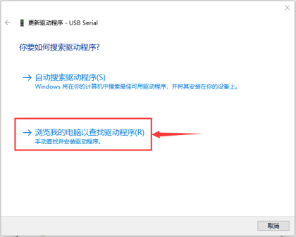
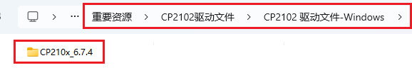

.. |image19| image:: ./media/img-20230329151628.png

.. |image22| image:: ./media/img-20230213155615.png

.. |image25| image:: ./media/img-20230213155746.png
.. |image26| image:: ./media/img-20230213155821.png
.. |image27| image:: ./media/img-20230213155849.png
.. |image28| image:: ./media/img-20230329155004.png
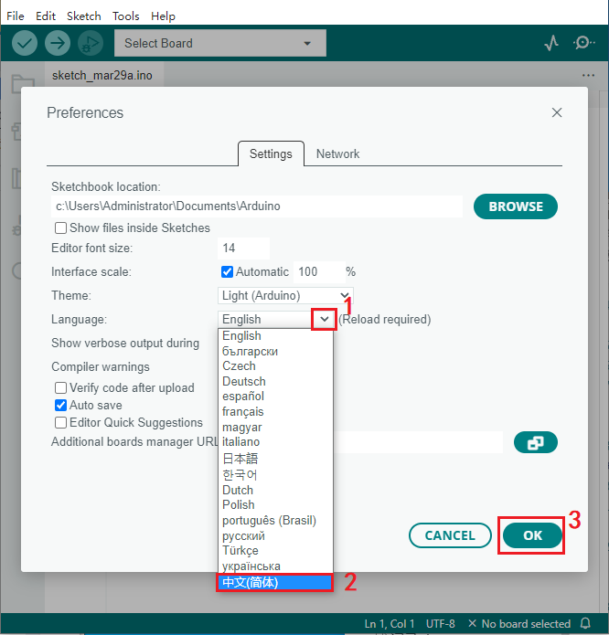

.. |image31| image:: ./media/img-20230329153500.png

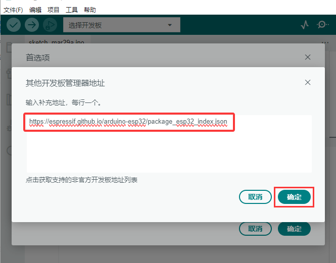

.. |image37| image:: ./media/img-20230425140528.png

.. |image39| image:: ./media/img-20230425140913.png

.. |image42| image:: ./media/img-20230329151628.png
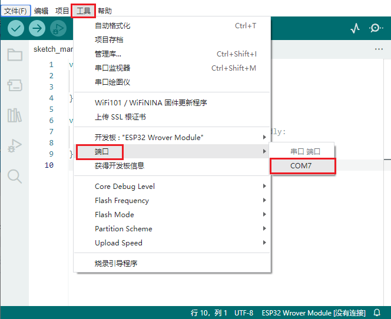
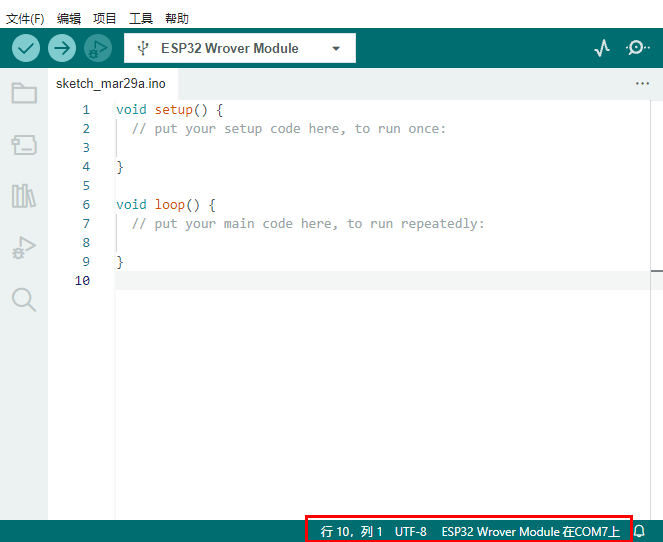

.. |image47| image:: ./media/img-20230505164202.png

.. |image49| image:: ./media/img-20230329173510.png

.. |image51| image:: ./media/img-20230329173728.png
.. |image52| image:: ./media/img-20230329173738.png
.. |image53| image:: ./media/img-20230329173804.png
.. |image54| image:: ./media/img-20230329173816.png
.. |image55| image:: ./media/img-20230329173824.png
.. |image56| image:: ./media/img-20230329173832.png
.. |image57| image:: ./media/img-20230329173836.png
.. |image58| image:: ./media/img-20230329173845.png
.. |image59| image:: ./media/img-20230329173854.png
.. |image60| image:: ./media/img-20230329173858.png
.. |image61| image:: ./media/img-20230329173907.png
.. |image62| image:: ./media/img-20230329173914.png
.. |image63| image:: ./media/img-20230329173923.png
.. |image64| image:: ./media/img-20230329153500.png
.. |image65| image:: ./media/img-20230424101946.png
.. |image66| image:: ./media/img-20230424102212.png

.. |image69| image:: ./media/img-20230425142725.png

.. |image72| image:: ./media/img-20230424103120.png
.. |image73| image:: ./media/img-20230424105011.png

.. |image77| image:: ./media/img-20230403171418.png
.. |image78| image:: ./media/img-20230424110521.png

.. |image81| image:: ./media/img-20230330090513.png

.. |image85| image:: ./media/img-20230331092416.png

.. |image89| image:: ./media/img-20230518082838.png
.. |image90| image:: ./media/img-20230330094132.png
.. |image91| image:: ./media/img-20230330094146.png
.. |image92| image:: ./media/img-20230330094300.png
.. |image93| image:: ./media/img-20230330094419.png
.. |image94| image:: ./media/img-20230330094531.png
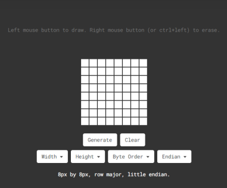
.. |image96| image:: ./media/img-20230330094552.png
.. |image97| image:: ./media/img-20230518104321.png
.. |image98| image:: ./media/img-20230508111302.png

.. |image102| image:: ./media/img-20230330095339.png
.. |image103| image:: ./media/img-20230324190535.png
.. |image104| image:: ./media/img-20230324190601.png
.. |image105| image:: ./media/img-20230508091835.png

.. |image108| image:: ./media/img-20230330104317.png
.. |image109| image:: ./media/img-20230330104518.png

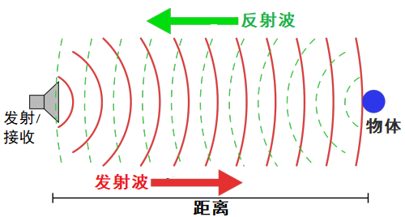
.. |image113| image:: ./media/img-20230330112930.png
.. |image114| image:: ./media/img-20230330112940.png
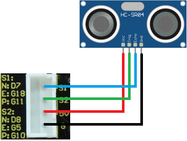

.. |image120| image:: ./media/img-20230518083845.png
.. |image121| image:: ./media/img-20230330120246.png

.. |image124| image:: ./media/img-20230518083634.png
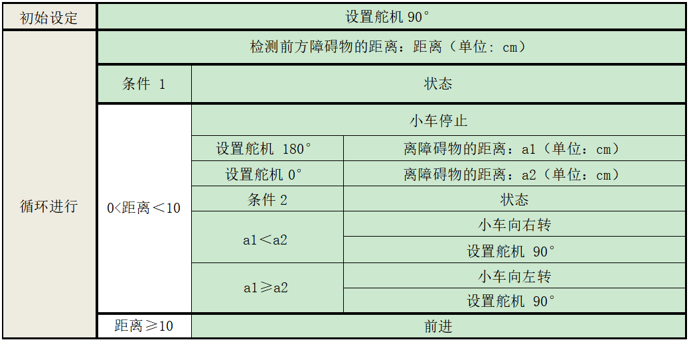
.. |image126| image:: ./media/img-20230330131159.png

.. |image129| image:: ./media/img-20230522172021.png
.. |image130| image:: ./media/img-20230522173140.png

.. |image135| image:: ./media/img-20230518082944.png
.. |image136| image:: ./media/img-20230522175919.png
.. |image137| image:: ./media/img-20230330133157.png

.. |image140| image:: ./media/img-20230508101203.png

.. |image144| image:: ./media/img-20230413081000.png
.. |image145| image:: ./media/img-20230518083512.png
.. |image146| image:: ./media/img-20230508101203.png
.. |image147| image:: ./media/img-20230508101729.png
.. |image148| image:: ./media/img-20230330134855.png

.. |image151| image:: ./media/img-20230330135918.png
.. |image152| image:: ./media/img-20230331103440.png

.. |image157| image:: ./media/img-20250427155519.png
.. |image158| image:: ./media/img-20230518082547.png

.. |image160| image:: ./media/img-20230330140636.png
.. |image161| image:: ./media/img-20230330140706.png

.. |image163| image:: ./media/img-20230330140806.png

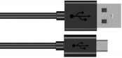
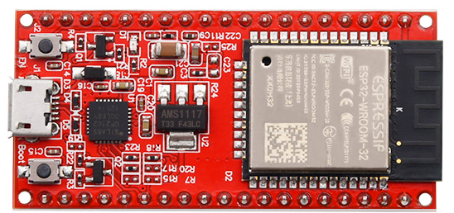
.. |image169| image:: ./media/img-20230330142518.png
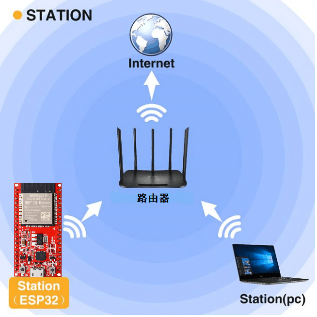

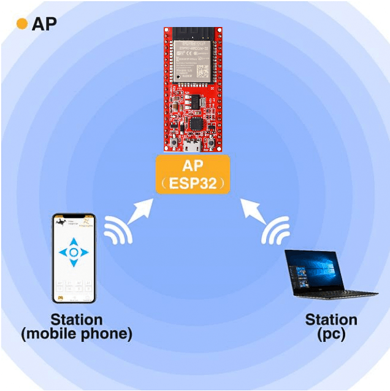
.. |image177| image:: ./media/img-20230330145132.png

.. |image182| image:: ./media/img-20230330145323.png

.. |image188| image:: ./media/img-20230330150315.png

.. |image191| image:: ./media/img-20230506150200.png

.. |image193| image:: ./media/img-20230506150539.png
.. |image194| image:: ./media/img-20230330152214.png
.. |image195| image:: ./media/img-20230330152300.png
.. |image196| image:: ./media/img-20230330152329.png

.. |image207| image:: ./media/img-20230330154408.png
.. |image208| image:: ./media/img-20230330154416.png
.. |image209| image:: ./media/img-20230330154423.png
.. |image210| image:: ./media/img-20230518083704.png

