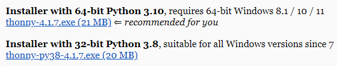
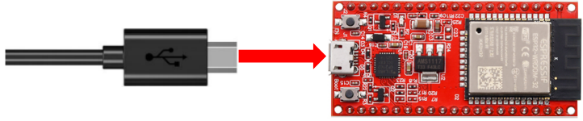
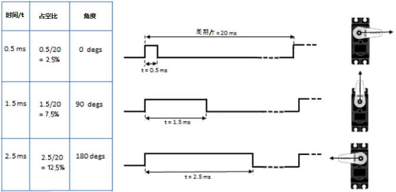
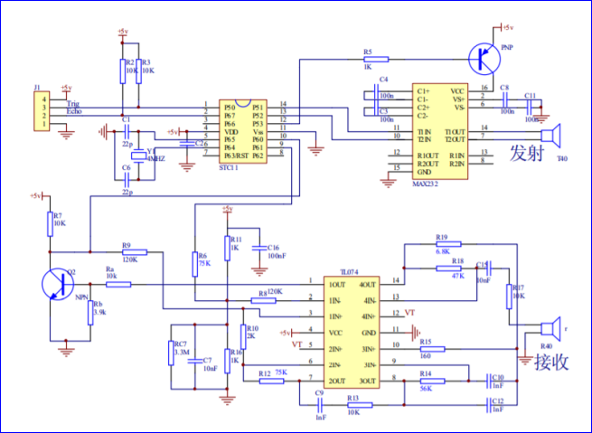
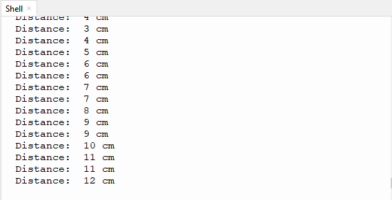
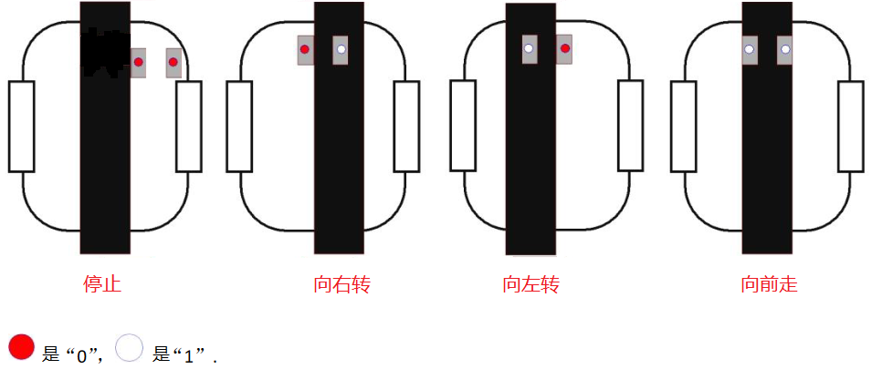
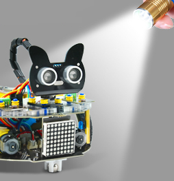
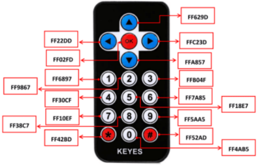
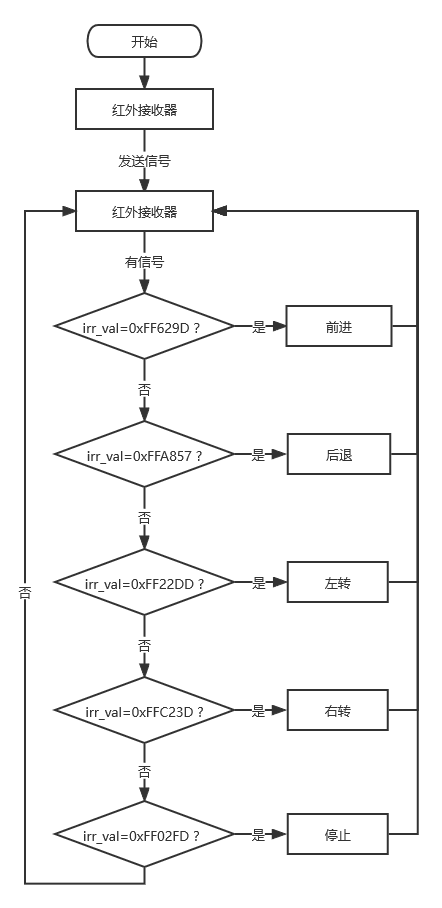
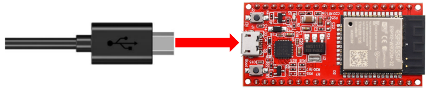

# Python 教程

<span style="color: rgb(2550, 10, 50);"><span style="font-size: 20px;">请确保代码已经下载完成并解压存放于方便使用的地方，本教程以代码存放于 **Disk(D:)** 路径下为例，路径为 **`D:..\重要资源\项目代码\MicroPython代码`**。</span></span>你也可以把代码存放于其他的盘内。

## 1. 关于 MicroPython IDE

在开始构建项目之前，你需要首先做一些准备，这是非常重要的，你不能跳过。

## 2-1 MicroPython IDE 环境配置

### 2-1-1 软件下载:

#### Windows系统

**操作系统：Windows 10**

软件下载链接：[Thonny IDE 软件官网](https://thonny.org)

鼠标触碰到箭头所示处，会出现 Windows 官方下载的版本选择。


#### MAC系统

请参考Windows系统教程。


#### Linux系统

请参考Windows系统教程。


### 2-1-2 软件安装:

Thonny应用程序安装支持两种安装方式：

- 安装Thonny+Python捆绑包

  这种方式本质是将Python环境和Thonny打包在一起，即可一键安装使用，快捷方便，推荐新手使用此方式。捆绑包的方式安装又分为两种：

  - Installer安装

    

  - 免安装版本

    

- 单独安装Thonny

  Thonny应用本质是以python包的形式存在，当用户已经具备python环境，即可通过`pip install thonny`单独安装Thonny。这种方式更适合开发者。

  

请根据您的需求选择下载相应版本的压缩包。

#### Installer 安装

请根据您的操作系统选择对应的程序下载。以 <span style="background:#ff0;color:#000">64bit Windows 10</span> 环境下，安装程序`Installer with 64-bit Python 3.10` 为例。

（1）下载完成后双击。弹出 Select Setup Install Mode 窗口，选择 **Install for me only** 。


（2）单击 **Next** 。


（3）选中 **I accept the agreement** ，单击 **Next** 。


（4）Thonny软件的安装路径，默认安装在C盘。单击 **Browse...** 可以选择其他安装位置，单击 **Next** 进行下一步。


（5）默认将在下面的开始菜单文件夹中创建程序的快捷方式。单击 **Browse...** 可以选择其他安装位置，单击 **Next** 进行下一步。


（6）勾选 **Creat desktop icon** ，单击 **Next** 。


（7）单击 Intall 进行安装。


（8）单击“**Finish**”结束安装,安装完成。


（9）回到桌面，双击 Thonny 图标。选择语言，即可开始运行。


（10）安装完成。


#### 免安装版本

请根据您的操作系统选择对应的程序下载。以 <span style="background:#ff0;color:#000">64bit Windows 10</span> 环境下，安装程序`Portable variant with 64-bit Python 3.10` 为例。

（1）下载完成后解压，双击，选择语言，即可开始运行。


（2）安装完成。


（3）为了使用方便，可以创建快捷方式到桌面。右键单击，选择 **发送到** ，再选择 **桌面快捷方式** 。


桌面快捷方式创建成功：

<span style="color: rgb(255, 76, 65);">**特别提醒：** 除了前面设置语言，还可以采用下面的方法设置语言。</span>

打开Thonny IDE软件，点击 “Tools” → “Options”。


单击 “English()US[default]” 后面的下拉箭头，选择 “简体中文”，最后点击 “OK”。


关闭Thonny IDE软件，然后重新启动Thonny IDE软件，这样，语言切换成功。


---

### 2-1-3 安装驱动:

我们需要一个驱动程序来启动我们的ESP32主控板。否则，将找不到连接到计算机的COM端口。

请参照链接：[安装驱动](https://www.keyesrobot.cn/projects/KE3059/zh-cn/latest/docs/3.%20Arduino%20%E6%95%99%E7%A8%8B/3.%20Arduino%20%E6%95%99%E7%A8%8B.html)

**如果已经安装过驱动，这一步骤就跳过。**

---

### 2-1-4 烧录固件(重要):

<span style="color: rgb(255, 76, 65); background: rgb(255, 251, 0);">（特别提醒：我们提供的ESP32 MicroPython的固件存放于 **ESP32固件** 文件夹中，本教程的ESP32固件是使用我们对应文件夹提供的，如果你下载最新版本或其他版本的ESP32固件，有可能会不兼容本教程的代码，导致代码运行有问题。）</span>


下载Micropython固件的网站：[http://micropython.org/](http://micropython.org/)

下载 ESP32 固件的网站：[https://micropython.org/download/esp32/](https://micropython.org/download/esp32/)

1\. 首先，使用 Micro USB 数据线将 ESP32 主控板连接到您的计算机。



2\. 点击 Thonny IDE 上的 “**运行**”，然后选择 “**配置管理器**”。


3\. 首先点击 “**解释器**”，然后选择“**MicroPython(ESP32)**”，再对应的 “**串口端口(COMXX)**”<span style="color: rgb(255, 76, 65);">(不同的主控板，串口端口(COMXX)不一样)</span> ，最后点击 “**安装或更新MicroPython(esptool)(UF2)**” 


4\. 单击 “”，然后选择 “**Select local MicroPython image...**”。找到存放于文件夹 **Firmware esp32** 中的固件资料，选中 “<span style="color: rgb(255, 76, 65);">ESP32_GENERIC-20241129-v1.24.1.bin</span>” 文件，单击 “**打开**”。


5\. 选择好对应的 “**串口端口(COMXX)**”<span style="color: rgb(255, 76, 65);">(不同的主控板，串口端口(COMXX)不一样)</span> ，然后点击 “**安装**” 。（<span style="color: rgb(255, 76, 65);">注意：如果安装固件失败，请按住ESP32主板上的Boot键，出现上传进度百分比再松开Boot键。再次点击“**安装**”。</span>）


6\. 安装一会儿后，安装完成，单击 “**关闭**” ，然后单击 “**确认**” 。


7\. 这样，ESP32固件安装完成。单击“”就可以了。


---

### 2-1-5 软件介绍:

#### 页面介绍

单击 **视图** ，勾选 **文件** ，打开文件路径管理，方便使用。


#### 工具栏介绍


|          按钮           |       功能        |
| :---------------------: | :---------------: |
| |       新建        |
|  |      打开...      |
| |       保存        |
| |   运行当前脚本    |
| |   调试当前脚本    |
| |       步过        |
|  |       步进        |
| |       步出        |
|  |     恢复执行      |
| | 停止/重启后端进程 |

---

### 2-1-6 测试(重要):

<span style="color: rgb(2550, 10, 50);"><span style="font-size: 20px;">请确保代码已经下载完成并解压存放于方便使用的地方，本教程以代码存放于 **Disk(D:)** 路径下为例，路径为 **`D:..\重要资源\项目代码\MicroPython代码`**。</span></span>你也可以把代码存放于其他的盘内。

在 文件 区单击 **此电脑** 。


双击 **软件(D:)** ，双击选择 **重要资源** ，然后双击**项目代码** ，再双击 **MicroPython代码 文件夹** ，打开本教程的所有代码。


确保 ESP32主控板 已通过 USB 数据线 连接到计算机上。


#### 测试Shell命令

在Shell窗口输入以下代码。	

```python
print('hello world')
```


然后按下键盘上的 **回车键(Enter 键)** ，Shell窗口打印出 **hello world** 。


---

### 2-1-7 添加 MicroPython 库(重要)：

在某些项目中，您将需要额外的库。所以这里我们先把这些库上传到 ESP32 主控板上，然后我们可以直接运行代码。

1\. 使用 Micro USB 数据线将 ESP32 主控板连接到您的计算机。


2\. 打开 Thonny IDE 并单击右下角的 “**MicroPython(ESP32) . USB Serial @ COMxx**” 解释器。


3\. 在顶部的菜单栏中，单击 “ **视图** -> **文件** ”。


4\. 将路径切换到之前下载的 **重要资源** 文件夹，然后转到 **库文件** 文件夹，最后转到 **MicroPython库文件** 文件夹。
(<span style="color: rgb(255, 76, 65);">提醒：这里是以 **重要资源** 的文件夹下载到D盘为例，你以你自己下载 **重要资源** 文件夹而保存的位置为准。</span>)


5\. 选中 <span style="color: rgb(255, 76, 65);">MicroPython库文件</span> 文件夹中的 **ht16k33\.py** 文件，鼠标右键单击 **ht16k33\.py** 文件，然后选择 “**<span style="color: rgb(255, 76, 65);">上传到/</span>**” ，这样，**ht16k33\.py** 文件被上传到 “**MicroPython device**” 驱动器中。


6\. 您将看到您刚刚上传到 “**MicroPython设备**” 驱动器中的文件。


7\. 用相同的方法，将剩余的库文件都上传到 “**MicroPython设备**” 驱动器中。


8\. 这样，您将看到您刚刚上传到“**MicroPython设备**”驱动器中的所有文件。


## 项目教程

### 项目01: SK6812 RGB

 **1. 实验简介：**

小车扩展板上有4个RGB LED，RGB LED属于简单的发光模块，可以通过调节色彩调出不同颜色的灯效，可广泛应用于建筑物、桥梁、道路、花园、庭院、地板等领域的装饰照明与会场布置、圣诞节、万圣节、情人节、复活节、国庆节等节日期间烘托气氛等场景。在本实验中，使小车扩展板上的4个RGB实现各种灯光效果。

 **2. 元件知识：**

**SK6812RGB：** 小车扩展板上有4个RGB LED，从原理图中可以看出，这4个RGBLED都是串联起来的，在电压电流充足的情况下可以接几百个RGB LED，都可以用一根信号线控制任意一个RGB LED，并且让它显示任意一种颜色。每一颗RGBLED都是一个独立的像素点，每个像素点都是由R、G、B三基色颜色组成，可实现256级亮度显示，完成16777216种颜色的全真色彩显示，同时像素点内部包含了智能数字接口数据锁存信号整形放大驱动电路，还内置信号整形电路，有效保证了像素点光的颜色高度一致。


 **3. 实验代码：**

小车PCB板上的SK6812RGB是由ESP32主板上的GPIO 14 控制。

打开 “**Thonny**” 软件，点击 “**此电脑**” → “**D:**” → “**重要资源**” → “**项目代码**” → “**MicroPython代码**”，然后鼠标左键双击 “**Project_01_SK6812_RGB.py**”。

```python
# 导入 Pin, neopiexl and time 模块
from machine import Pin
import neopixel
import time

# 定义连接到neopixel和led的引脚数量
pin = Pin(14, Pin.OUT)
np = neopixel.NeoPixel(pin, 4)

# 亮度 :0-255
brightness=100                                
colors=[[brightness,0,0],                    # 红
        [0,brightness,0],                    # 绿
        [0,0,brightness],                    # 蓝
        [brightness,brightness,brightness],  # 白
        [0,0,0]]                             # 关闭

# 嵌套两个for循环，使模块反复显示红、绿、蓝、白、OFF五种状态。    
while True:
    for i in range(0,5):
        for j in range(0,4):
            np[j]=colors[i]
            np.write()
            time.sleep_ms(50)
        time.sleep_ms(500)
    time.sleep_ms(500)  

```
 **4. 实验现象：**

确保ESP32主板已经连接到电脑上，单击“”，代码开始执行，你会看到的现象是：小车PCB板上的4个RGB LED亮红灯，绿灯，蓝灯，白灯和熄灭，循环进行。按“Ctrl+C”或单击“”退出程序。


### 项目02: 演奏音乐

 **1. 实验简介：**

小车扩展板上有个喇叭功放元件，它常用来播放音乐，作为一些音乐播放设备的外接扩音设备。在本实验中，我们利用喇叭功放元件来播放一段音调。

 **2.元件知识：**

喇叭功放元件：喇叭功放元件（原理相当于无源蜂鸣器），其内部不带震荡电路，控制时需要在元件正极输入不同频率的方波，负极接地，从而控制喇叭功放元件响起不同频率的声音。

 **3. 实验代码：**

小车PCB板上的喇叭功放元件是由ESP32主板上的GPIO 2 控制。

打开 “**Thonny**” 软件，点击 “**此电脑**” → “**D:**” → “**重要资源**” → “**项目代码**” → “**MicroPython代码**”，然后鼠标左键双击 “**Project_02_Buzzer.py**”。


```python
from machine import Pin, PWM
import time

beeper = PWM(Pin(2, Pin.OUT)) 

notes = [1915, 1700, 1519, 1432, 1275, 1136, 1014, 956, 834, 765, 593, 468, 346, 224, 655, 715]

for note in notes:     
    if note == 0:        
        beeper.duty(0)
    else:
        beeper.duty(512)  
        beeper.freq(note) 
    time.sleep(0.2)       
    beeper.duty(0)        
    time.sleep(0.1)
```

 **4. 实验现象：**

确保ESP32主板已经连接到电脑上，单击“”，代码开始执行，你会看到的现象是：小车PCB板上的喇叭功放元件就开始播放一段音调；按“Ctrl+C”或单击“”退出程序。


### 项目03: 点阵屏


 **1. 实验简介：**

8×8 点阵屏通过LED(发光二极管）组成，以灯珠亮灭来显示文字、图片、动画、视频等，8×8 点阵显示屏制作简单，安装方便，被广泛应用于各种公共场合，如汽车报站器、广告屏、银行窗口屏、叫号屏以及停车系统等等。在本实验中，将使用8×8 点阵屏来显示图案。

 **2.元件知识：**

**8×8点阵屏：** LED点阵屏按照LED发光颜色可分为单色、双色、三色灯等，可显示红、黄、绿甚至是真彩色。根据LED的数量又分为4×4、8×8、16×16等不同类型。这里我们通过单色8×8点阵屏来了解其原理。

不同点阵屏封装不同，8×8点阵屏由8行8列共64个LED灯组成，其内部结构如下图：


每个LED放置在行线和列线的交叉点上，当对应的某一行电平拉高，某一列电拉低，则对应交叉点的LED就会点亮。8×8点阵屏有16个管脚，将有丝印的一边朝下，逆时针编号为1-8，9-16。


其对应内部管脚定义如下如所示：


比如我们要点亮第一行第一列LED灯，则对应将点阵屏的第9脚拉高，第13脚拉低，其他LED控制以此类推即可。

**HT16K33 8X8点阵驱动模块：** 上面介绍了8*8点阵的原理，想控制8*8点阵需要多达16个单片机的引脚。这样既浪费资源也浪费时间。这里用了一个驱动点阵屏的芯片：HT16K33。HT16K33是一款内存映射和多功能LED控制器驱动芯片。利用HT16K33芯片驱动1个8*8点阵，只需要利用单片机的I2C通信端口控制点阵，大大的节约了单片机资源。下图是HT16K33 芯片工作原理图。


我们基于以上原理设计了一个8X8点阵驱动模块，从上图我们可以看出，我们只要通过I2C 通讯利用单片机的2个引脚就可以很好的控制点阵显示。

**8X8点阵模块的参数：**

- 工作电压: 5V    
- 额定输入频率: 400KHZ 
- 输入功率: 2.5W  
- 输入电流: 500mA  
- 
**取模工具的使用说明：**

点阵和驱动的原理都已经介绍完了，那点阵上显示的内容是怎么来的呢，有没有比较简便的方法？这里给大家介绍一款点阵取模工具，这块工具使用的是在线版，链接：[http://dotmatrixtool.com/#](http://dotmatrixtool.com/#)

现在就一起看看怎么使用吧。


①打开链接如下图：


②我们的点阵是8X8的，所以调整高度为8，宽度为8，如下图：


③在Endian 这里选择Big Endian(MSB)这个模式


④将图案生成16进制的数据

如下图，按鼠标左键选中，右键取消，画好自己想要的图案，点击<span style="color: rgb(255, 76, 65);">Generate</span>，就会生成我们所需要的十六进制的数据了，这里是以下面的图案为例的。


这个生成的十六进制的代码（0x22, 0x14, 0x48, 0x40, 0x40, 0x48, 0x14, 0x22）就是点阵需要显示的内容，如果想要点阵显示这样的图案，则需要将这十六进制的代码放到程序里面。

 **3. 实验接线：**

| 8X8点阵 | 小车PCB板 |
| :--: | :--: |
| G | G |
| 5V | 5V |
| SDA | SDA |
| SCL | SCL |


 **4. 实验代码：**

8X8点阵是由ESP32主板的GPIO21（SDA），GPIO22（SCL）控制。

打开 “**Thonny**” 软件，点击 “**此电脑**” → “**D:**” → “**重要资源**” → “**项目代码**” → “**MicroPython代码**”，然后鼠标左键双击 “**Project_03_8×8_Dot_Matrix_Display.py**”。


```python
# 导入库
import utime as time
from machine import I2C, Pin, RTC
from ht16k33matrix import HT16K33Matrix

# 定义常量
DELAY = 0.01
PAUSE = 3

# 初始化
if __name__ == '__main__':
    i2c = I2C(scl=Pin(22), sda=Pin(21))
    display = HT16K33Matrix(i2c)
    display.set_brightness(2)

    # 在LED上绘制自定义图标
    icon = b"\x00\x66\x00\x00\x18\x42\x3c\x00"
    display.set_icon(icon).draw()
    # 旋转图标
    display.set_angle(0).draw()
    time.sleep(PAUSE)
```
<span style="color: rgb(255, 76, 65);">注意：</span>程序代码中的是由修改过来的。

 **4. 实验现象：**

确保ESP32主板已经连接到电脑上，单击“”，代码开始执行，你会看到的现象是：8*8点阵屏显示“笑脸”图案。按“Ctrl+C”或单击“”退出程序。


### 项目04: 舵机转动

 **1. 实验简介：**

小车上有两个舵机，这里以接在引脚GPIO4的舵机为例，舵机是一种可以非常精确地旋转的电机。目前已广泛应用于玩具车、遥控直升机、飞机、机器人等领域。在这个项目中，我们将使用ESP32主板控制舵机转动。

 **2. 元件知识：**


**舵机：** 舵机是一种位置伺服的驱动器，主要是由外壳、电路板、无核心马达、齿轮与位置检测器所构成。其工作原理是由接收机或者单片机发出信号给舵机，其内部有一个基准电路，产生周期为20ms，宽度为1.5ms 的基准信号，将获得的直流偏置电压与电位器的电压比较，获得电压差输出。经由电路板上的IC 判断转动方向，再驱动无核心马达开始转动，透过减速齿轮将动力传至摆臂，同时由位置检测器送回信号，判断是否已经到达定位。适用于那些需要角度不断变化并可以保持的控制系统。当电机转速一定时，通过级联减速齿轮带动电位器旋转，使得电压差为0，电机停止转动。

舵机有多种规格，但它们都有三根连接线，分别是棕色、红色、橙色(不同品牌可能有不同的颜色)。棕色为GND，红色为电源正极，橙色为信号线


舵机的伺服系统由可变宽度的脉冲来进行控制，橙色的控制线是用来传送脉冲的。一般而言，PWM控制舵机的基准信号周期为20ms（50Hz），理论上脉宽应在1ms到2ms之间，对应控制舵机角度是0°～180°。但是，实际上更多控制舵机的脉宽范围是0.5ms 到2.5ms，具体需要自己实际调试下。



经过实测，舵机的脉冲范围为0.65ms~2.5ms。180度舵机，对应的控制关系是这样的：

|高电平时间|舵机角度|基准信号周期时间（20ms）|
| :--: | :--: | :--: |
|0.65ms|0度|0.65ms高电平+19.35ms低电平|
|1.5ms|90度|1.5ms高电平+18.5ms低电平|
|2.5ms|180度|2.5ms高电平+17.5ms低电平|

舵机的规格参数：

|工作电压：|DC 4.8V〜6V|
| :--: | :--: |
|可操作角度范围：|可操作角度范围：|
|脉波宽度范围：|500→2500 μsec|
|外观尺寸：|22.9*12.2*30mm|
|空载转速：|0.12±0.01 sec/60度（DC 4.8V）  0.1±0.01 sec/60度（DC 6V）|
|空载电流：|200±20mA（DC 4.8V）  220±20mA（DC 6V）|
|停止扭力：|1.3±0.01kg·cm（DC 4.8V）  1.5±0.1kg·cm（DC 6V）|
|停止电流：|≦850mA（DC 4.8V）  ≦1000mA（DC 6V）|
|待机电流：|3±1mA（DC 4.8V）  4±1mA（DC 6V）|
|重量:|9±1g (不带舵机轴)|
|使用温度：|-30℃~60℃|

 **3. 实验接线：**

| 舵机 | 小车PCB板 |
| :--: | :--: |
| 棕线 | G |
| 红线 | 5V |
| 橙黄线 | S1（GPIO4） |


 **4. 实验代码：**

控制超声波传感器转动的舵机是由ESP32主板的GPIO4控制。

打开 “**Thonny**” 软件，点击 “**此电脑**” → “**D:**” → “**重要资源**” → “**项目代码**” → “**MicroPython代码**”，并鼠标左键双击 “**Project_04_Servo_Sweep.py**”。


```python
import machine
import time

# 在引脚4上创建一个PWM（脉冲宽度调制）对象
servo = machine.PWM(machine.Pin(4))

# 将PWM信号的频率设置为50hz，用于伺服系统
servo.freq(50)

# 为区间映射定义一个函数
def interval_mapping(x, in_min, in_max, out_min, out_max):
    return (x - in_min) * (out_max - out_min) / (in_max - in_min) + out_min

# 定义一个函数来写入一个角度到伺服
def servo_write(pin, angle):

    pulse_width = interval_mapping(angle, 0, 180, 0.5, 2.5) # 计算脉冲宽度
    duty = int(interval_mapping(pulse_width, 0, 20, 0, 1023))     # 计算占空比
    pin.duty(duty) # 设置PWM信号的占空比

# 创建一个无限循环
while True:
    # 从0到180度的角度进行循环
    for angle in range(180):
        servo_write(servo, angle)
        time.sleep_ms(20)

    # 从180度到0度反向循环
    for angle in range(180, -1, -1):
        servo_write(servo, angle)
        time.sleep_ms(20)

```
**5. 实验现象：**

确保ESP32主板已经连接到电脑上，单击“”，代码开始执行，你会看到的现象是：舵机将转动。按“Ctrl+C”或单击“”退出程序。


### 项目05: 电机驱动和调速

 **1. 实验简介：**

驱动电机的方法有很多，我们这个小车用到的是最常用的DRV8833电机驱动芯片，该芯片为玩具、打印机及其它电机一体化应用提供了一款双通道桥式电动驱动器解决方案。
在本实验中，我们使用扩展板上的DRV8833电机驱动芯片驱动小车的两个直流电机，通过编写代码实现小车分别向前，向后，向左，向右行走的效果。

 **2. 元件知识：**

**DRV8833电机驱动芯片：** 具有电流控制功能的双H桥电机驱动器，可以驱动两个直流电机、一个双极步进电机、电磁阀或其他电感负载。每个H桥的输出驱动器块由N沟道功率MOSFET组成，配置为H桥以驱动电机绕组。每个H桥包括调节或限制绕组电流的电路。
带有故障输出引脚的内部停机功能是用于过大电流保护、短路保护、欠压锁定和超温。还提供了低功耗睡眠模式。我们来看一下DRV8833电机驱动芯片驱动两个直流电机的电路图和示意图：


 **3. 规格参数：**

- 逻辑部分输入电压：DC 5V
- 驱动部分输入电压：DC 5V
- 逻辑部分工作电流：<30mA
- 驱动部分工作电流：<2A
- 最大耗散功率：10W（T=80℃）
- 电机转速：5V  200 rpm / min
- 电机驱动形式：DRV8833双路H桥驱动
- 控制信号输入电平：高电平2.3V<Vin<5V  ，低电平-0.3V<Vin<1.5V
- 工作温度：-25~130℃

 **4. 驱动小车运行原理：**

根据上面电机驱动板的电路图和示意图，我们知道左电机的方向引脚在GPIO33，调速引脚在GPIO26；右电机的方向引脚在GPIO32，调速引脚在GPIO25，按照以下表格的运动逻辑，就可以知道如何通过控制数字口，PWM口控制2个电机转动，从而实现智能小车的行走。其中PWM值范围为0-255，设置数字越大，电机转动越快。

|功能|GPIO33|GPIO26（PWM）|左电机|GPIO32|GPIO25（PWM）|右电机|
| :--: | :--: | :--: | :--: | :--: | :--: | :--: |
|前进|0|1000|正转|0|1000|正转|
|后退|1|250|反转|1|250|反转|
|左转|1|500|反转|0|1000|正转|
|右转|0|1000|正转|1|500|反转|
|停止|0|0|停止|0|0|停止|

 **5. 实验代码：**

打开 “**Thonny**” 软件，点击 “**此电脑**” → “**D:**” → “**重要资源**” → “**项目代码**” → “**MicroPython代码**”，然后鼠标左键双击 “**Project_05_Motor_Drive_And_Speed_Regulation.py**”。


```python
from machine import Pin,PWM
import time

# 右轮
pin1=Pin(32,Pin.OUT)
pin2=PWM(Pin(25),freq=12500)

# 左轮
pin3=Pin(33,Pin.OUT)
pin4=PWM(Pin(26),freq=12500)

# 用来控制小车前进的函数 
def car_forward(): 
  pin1.value(0)
  pin2.duty(1000) 
  pin3.value(0)
  pin4.duty(1000)  

# 用来控制小车后退的函数
def car_back(): 
  pin1.value(1)
  pin2.duty(250) 
  pin3.value(1)
  pin4.duty(250)

# 用来控制小车左转的函数
def car_left(): 
  pin1.value(0)
  pin2.duty(1000) 
  pin3.value(1)
  pin4.duty(500)  

# 用来控制小车右转的函数 
def car_right(): 
  pin1.value(1)
  pin2.duty(500) 
  pin3.value(0)
  pin4.duty(1000)

# 用来控制小车停止的函数
def car_stop(): 
  pin1.value(0)
  pin2.duty(0) 
  pin3.value(0)
  pin4.duty(0)   
try:
    while True:
        car_forward() #前进
        time.sleep(2) # 延时 2s
        car_back() # 后退
        time.sleep(2)    
        car_left() # 左转
        time.sleep(2)    
        car_right() # 右转
        time.sleep(2)    
        car_stop() # 停止
        time.sleep(2)     
except:
    pass 
    
```
 **6.实验现象：**

确保ESP32主板已经连接到电脑上，小车安上电池，并且将电源开关拨到ON端，上电后。单击“”，代码开始执行，你会看到的现象是：小车前进2秒，后退2秒，左转2秒，右转2秒，停止2秒，循环。按“Ctrl+C”或单击“”退出程序。


### 项目06: 超声波传感器

 **1. 实验简介：**

小车上有个超声波传感器，超声波传感器是一种非常实惠的距离传感器，它可以检测前方是否存在障碍物，并且检测出传感器与障碍物的详细距离。它的原理和蝙蝠飞行的原理一样，就是超声波传感器发送出一种频率很高的超声波信号，通常正常人耳朵的听力的声波范围是20Hz~20kHz，人类无法听到。这些超声波的信号若是碰到障碍物，就会立刻反射回来，在接收到返回的信息之后，通过判断发射信号和接收信号的时间差，计算出传感器和障碍物的距离。超声波传感器主要用于各种机器人项目中的物体躲避和测距，也常被用于水位传感，甚至作为一个停车传感器。

在本实验中，我们使用超声波传感器来测量距离，并将数据打印在串口监视器上。

 **2. 元件知识：**

**HC-SR04超声波传感器：** 像蝙蝠一样使用声纳来确定与物体的距离，它提供了精准的非接触范围检测，高精度和稳定的读数。它的操作不受阳光或黑色材料的影响，就像精密的照相机(在声学上像布料这样比较软的材料很难被探测到)。它带有超声波发射器和接收器。

**参数：**
- 工作电压:+5V DC
- 静态电流: <2mA
- 工作电流: 15mA
- 有效角度: <15°
- 距离范围: 2cm – 400 cm
- 精度: 0.3 cm
- 测量角度: 30 degree
- 触发输入脉宽: 10us

**原理：**

最常用的超声测距的方法是回声探测法，如图：


超声波发射器向某一方向发射超声波，在发射时刻的同时计数器开始计时，超声波在空气中传播，途中碰到障碍物面阻挡就立即反射回来，超声波接收器收到反射回的超声波就立即停止计时。超声波也是一种声波，其声速V与温度有关。一般情况下超声波在空气中的传播速度为340m/s，根据计时器记录的时间t，就可以计算出发射点距障碍物面的距离s，即：s=340t/2：

(1)采用IO口TRIG触发测距，给至少10us的高电平信号;

(2)模块自动发送8个40khz的方波，自动检测是否有信号返回；

(3)有信号返回，通过ECHO输出一个高电平，单片机读取到高电平持续的时间就是超声波从发射到返回的时间。


超声波模块的电路图：



 **3. 实验接线：**

|超声波传感器| 小车PCB板 |
| :--: | :--: |
|Vcc|5V|
|Trig|S2（GPIO5）|
|Echo|S1（GPIO18）|
| Gnd |G|


 **4. 实验代码：**

超声波传感器的Trig引脚是由ESP32主板的GPIO5控制，Echo引脚是由ESP32主板的GPIO18控制。

打开 “**Thonny**” 软件，点击 “**此电脑**” → “**D:**” → “**重要资源**” → “**项目代码**” → “**MicroPython代码**”，然后鼠标左键双击 “**Project_06_Ultrasonic_Sensor.py**”。

```python
from machine import Pin
import time

# 定义超声波模块的控制引脚 
trigPin=Pin(5,Pin.OUT,0)
echoPin=Pin(18,Pin.IN,0)
# 设置声速
soundVelocity=340
distance=0

# 子函数 getSonar() 用于启动超声波模块开始测量，然后返回测量到的距离，单位是厘米。
# 在这个函数中，首先让trigPin发送10us高电平启动超声波模块。
# 然后 pulseIn() 读取超声波模块并返回高电平持续时间。
# 最后根据时间计算出测量到的距离。
def getSonar():
    trigPin.value(1)
    time.sleep_us(10)
    trigPin.value(0)
    while not echoPin.value():
        pass
    pingStart=time.ticks_us()
    while echoPin.value():
        pass
    pingStop=time.ticks_us()
    pingTime=time.ticks_diff(pingStop,pingStart)
    distance=pingTime*soundVelocity//2//10000
    return int(distance)

# 延时2秒，等待超声波模块稳定；
# 打印每500毫秒从超声波模块获得的数据。
time.sleep_ms(2000)
while True:
    time.sleep_ms(500)
    print('Distance: ',getSonar(),'cm' )
```
 **5. 实验现象：**

确保ESP32主板已经连接到电脑上，单击“”，代码开始执行，你会看到的现象是：Thonny IDE下的”Shell”窗口中将打印超声波传感器和物体之间的距离值。按“Ctrl+C”或单击“”退出程序。




### 项目07: 跟随我


** 1. 实验简介：**

在上面实验中，我们已经了解了8*8点阵、电机驱动和调速、超声波传感器、舵机等硬件知识，那么在本实验中，我们将结合它们打造一款跟随小车! 在电路设计过程中，我们可以利用超声波传感器来检测小车与前方物体的距离。通过测量距离控制电机的旋转，从而控制小车的运动状态，使小车跟随物体运动。

 **2.工作原理：**

|检测|检测前方物体的距离（单位：cm）|
| :--: | :--: |
|条件1|距离＜8|
|状态|小车后退|
|条件2|8≤距离<13|
|状态|小车停止|
|条件3|13≤距离<35|
|状态|小车前进|
|条件3|距离≥35|
|状态|小车停止|

 **3. 流程图：**


 **4. 实验代码：**

打开 “**Thonny**” 软件，点击 “**此电脑**” → “**D:**” → “**重要资源**” → “**项目代码**” → “**MicroPython代码**”，然后鼠标左键双击 “**Project_07_Follow_Me.py**”。


```python
from machine import Pin, PWM
import time

# 定义GPIO4的输出频率为50Hz，占空比为77，并分配给PWM
servoPin = Pin(4)
pwm = PWM(servoPin, freq=50)
pwm.duty(77)
time.sleep(1)

# 设置超声波传感器的引脚和声速
trigPin=Pin(5,Pin.OUT,0)
echoPin=Pin(18,Pin.IN,0)
soundVelocity=340
distance=0
# 右轮
pin1=Pin(32,Pin.OUT)
pin2=PWM(Pin(25),freq=50,duty=0)
# 左轮
pin3=Pin(33,Pin.OUT)
pin4=PWM(Pin(26),freq=50,duty=0)

# 控制小车前进函数
def car_forward(): 
  pin1.value(0)
  pin2.duty(800) 
  pin3.value(0)
  pin4.duty(800)  

# 控制小车后退函数
def car_back(): 
  pin1.value(1)
  pin2.duty(550) 
  pin3.value(1)
  pin4.duty(550)
  
# 控制小车停下函数  
def car_stop():
  pin2.deinit()
  pin4.deinit()
  pin1.value(0)
 # pin2.duty(0) 
  pin3.value(0)
 # pin4.duty(0)

# 子函数 getSonar() 用于启动超声波模块开始测量，然后返回测量到的距离，单位是厘米。
# 在这个函数中，首先让trigPin发送10us高电平启动超声波模块。
# 然后 pulseIn() 读取超声波模块并返回高电平持续时间。
# 最后根据时间计算出测量到的距离。
def getSonar(): 
    trigPin.value(1)
    time.sleep_us(10)
    trigPin.value(0)
    while not echoPin.value():
        pass
    pingStart=time.ticks_us()
    while echoPin.value():
        pass
    pingStop=time.ticks_us()
    pingTime=time.ticks_diff(pingStop,pingStart)
    distance=pingTime*soundVelocity//2//10000
    time.sleep_ms(10)
    return int(distance)

try:
    while True:
        Distance=getSonar() # 用超声波测量距离。
        print(Distance) # 发送一个脉冲来计算以厘米为单位的距离，并打印结果。
        if Distance<8: # 如果距离小于8
            pin2=PWM(Pin(25),freq=50)
            pin4=PWM(Pin(26),freq=50)
            car_back() # 小车后退
        elif Distance>=8 and Distance<13: # 如果这个距离大于等于8，小于13。
            car_stop() # 小车停下
        elif Distance>=13 and Distance<35: # 如果这个距离大于等于13，小于35。
            pin2=PWM(Pin(25),freq=50)
            pin4=PWM(Pin(26),freq=50)
            car_forward() # 小车前进
        else:
           car_stop() 
except:
    pass
```
**5. 实验现象：**

确保ESP32主板已经连接到电脑上，小车安上电池，并且将电源开关拨到ON端，上电后。单击“”，代码开始执行，你会看到的现象是：小车可以随着前方障碍物的移动而移动（只能在一条线直上，不能转弯）。按“Ctrl+C”或单击“”退出程序。


### 项目08: 躲避障碍物


 **1. 实验简介：**

在上一实验中，我们制作了一个超声波跟随小车。实际上，利用同样硬件，我只需要更改一个测试代码就可以将跟随小车变为避障小车。那超声波避障小车，是怎么实现的呢？当然也是通过超声波传感器的测距来实现的。通过超声波传感器检测机器人前方障碍物，然后根据这一个数据获得机器人运动方向。

 **2. 工作原理：**


 **3. 流程图：**


 **4. 实验代码：**

打开 “**Thonny**” 软件，点击 “**此电脑**” → “**D:**” → “**重要资源**” → “**项目代码**” → “**MicroPython代码**”，然后鼠标左键双击 “**Project_08_Avoid_Obstacles.py**”。

```python
import utime as time
from machine import I2C, Pin, RTC, PWM 
from ht16k33matrix import HT16K33Matrix

# 定义GPIO4的输出频率为50Hz，占空比为77，并分配给PWM
servoPin = Pin(4)
pwm = PWM(servoPin, freq=50)
pwm.duty(77)
time.sleep(1)

# 设置超声波传感器的引脚和声速。
trigPin=Pin(5,Pin.OUT,0)
echoPin=Pin(18,Pin.IN,0)
soundVelocity=340
distance=0
# 右轮
pin1=Pin(32,Pin.OUT)
pin2=PWM(Pin(25),freq=50,duty=0)
# 左轮
pin3=Pin(33,Pin.OUT)
pin4=PWM(Pin(26),freq=50,duty=0)

# 控制小车前进函数
def car_forward():
  pin1.value(0)
  pin2.duty(200) 
  pin3.value(0)
  pin4.duty(250)  

# 控制小车左转函数
def car_left():
  pin1.value(0)
  pin2.duty(500) 
  pin3.value(1)
  pin4.duty(500)  

# 控制小车右转函数
def car_right():
  pin1.value(1)
  pin2.duty(500) 
  pin3.value(0)
  pin4.duty(500)

# 控制小车停下函数
def car_stop():
  pin2.deinit()
  pin4.deinit()
  pin1.value(0)
#  pin2.duty(0) 
  pin3.value(0)
#  pin4.duty(0)
  
  
# 子函数 getSonar() 用于启动超声波模块开始测量，然后返回测量到的距离，单位是厘米。
# 在这个函数中，首先让trigPin发送10us高电平启动超声波模块。
# 然后 pulseIn() 读取超声波模块并返回高电平持续时间。
# 最后根据时间计算出测量到的距离。
def getSonar(): 
    trigPin.value(1)
    time.sleep_us(10)
    trigPin.value(0)
    while not echoPin.value():
        pass
    pingStart=time.ticks_us()
    while echoPin.value():
        pass
    pingStop=time.ticks_us()
    pingTime=time.ticks_diff(pingStop,pingStart)
    distance=pingTime*soundVelocity//2//10000
    time.sleep_ms(10)
    return int(distance)

# 常量
DELAY = 0.01
PAUSE = 3
# 初始化
if __name__ == '__main__':
    i2c = I2C(scl=Pin(22), sda=Pin(21))
    display = HT16K33Matrix(i2c)
    display.set_brightness(2)

try:
    while True:
        Distance=getSonar() # 用超声波测量距离。
        if Distance>0 and Distance<10: # 如果距离大于0，小于10。
            car_stop() # 小车停下
            # 在LED上绘制自定义图标
            icon = b"\x18\x18\x18\x18\x18\x00\x00\x18"
            display.set_icon(icon).draw()
            # 旋转图标
            display.set_angle(0).draw()
            time.sleep(0.3)
            pwm = PWM(servoPin, freq=50)
            pwm.duty(128)
            time.sleep(0.5)
            a1=getSonar()
            time.sleep(0.3)
            pwm = PWM(servoPin, freq=50)
            pwm.duty(25)
            time.sleep(0.5)
            a2=getSonar()
            time.sleep(0.2)
            if a1>a2:
                pin2=PWM(Pin(25),freq=50)
                pin4=PWM(Pin(26),freq=50)
                car_left()
                icon = b"\x48\x24\x12\x09\x09\x12\x24\x48"
                display.set_icon(icon).draw()
                display.set_angle(0).draw()
                pwm = PWM(servoPin, freq=50)
                pwm.duty(77)
                time.sleep(0.5)
                icon = b"\x18\x24\x42\x99\x24\x42\x81\x00"
                display.set_icon(icon).draw()
                display.set_angle(0).draw()
            else:
                pin2=PWM(Pin(25),freq=50)
                pin4=PWM(Pin(26),freq=50)
                car_right()
                icon = b"\x12\x24\x48\x90\x90\x48\x24\x12"
                display.set_icon(icon).draw()
                # 旋转图标
                display.set_angle(0).draw()
                pwm = PWM(servoPin, freq=50)
                pwm.duty(77)
                time.sleep(0.5)
                icon = b"\x18\x24\x42\x99\x24\x42\x81\x00"
                display.set_icon(icon).draw()
                display.set_angle(0).draw()
        else:
            pin2=PWM(Pin(25),freq=50)
            pin4=PWM(Pin(26),freq=50)
            car_forward() # 小车前进
            icon = b"\x18\x24\x42\x99\x24\x42\x81\x00"
            display.set_icon(icon).draw()
            display.set_angle(0).draw()
except:
    pass    
```
 **5. 实验现象：**

确保ESP32主板已经连接到电脑上，小车安上电池，并且将电源开关拨到ON端，上电后，单击“”，代码开始执行，你会看到的现象是：小车可以自动避障。按“Ctrl+C”或单击“”退出程序。


### 项目09: 红外循迹读值

 **1. 实验简介：**

小车上有2个红外循迹，实际上就是2对ST188L3红外对管，常应用于循迹小车循线。红外循迹可以用来检测黑白线，在本实验中，我们使用ST188L3红外对管来检测黑白线，并将数据打印在串口监视器上。

 **2. 元件知识：**

**红外循迹传感器：** 红外循迹传感器的红外对管分为两部分，一部分是红外发射端，另一部分是红外接收端。


黑线或黑色物体对红外线有很好的吸收效果。当红外循迹发射端向黑线发射时，发射的红外线被吸收而未形成反射信号，红外循迹接收端未接收到信号，这样红外循迹输出高电平(1);白线或白色物体对红外线没有吸收作用，红外循迹发射端的红外信号会反射回接收端，这样红外循迹输出低电平(0)。

下表给出了小车底板上的红外循迹传感器检测不同颜色物体的所有情况下的数值。其中检测到黑线、黑色物体或无物体代表1，检测到白线或白色物体代表0。


|左边红外循迹传感器|右边红外循迹传感器|值（二进制）|
| :--: | :--: | :--: |
|0|0|00|
|0|1|01|
|1|0|10|
|1|1|11|

<span style="color: rgb(255, 76, 65);">警告：反射式光学传感器(包括红外循迹)应避免在阳光等有红外干扰的环境中使用。阳光中含有许多不可见光，如红外线和紫外线。在强光环境下，反射式光学传感器不能正常工作。</span>

 **3. 实验代码：**

小车PCB板上的左边红外循迹是由ESP32主板的GPIO17控制，右边红外循迹是由ESP32主板的GPIO16控制。

打开 “**Thonny**” 软件，点击 “**此电脑**” → “**D:**” → “**重要资源**” → “**项目代码**” → “**MicroPython代码**”，然后鼠标左键双击 “**Project_09_Line_Tracking_Sensor.py**”。

```python
from machine import Pin
import time

tracking_left = Pin(17, Pin.IN)
tracking_right = Pin(16, Pin.IN)

while True:
    L_value = tracking_left.value()
    R_value = tracking_right.value()
    print("L_value:%d, R_value:%d" %(L_value, R_value))
    time.sleep(0.5)
    
```
 
 **4. 实验现象：**

确保ESP32主板已经连接到电脑上，单击“”，代码开始执行，你会看到的现象是：在小车的红外循迹下面放个黑色的东西，移动它，你会看到不同的指示灯亮起来，同时在Thonny IDE下的”Shell”窗口中将打印红外循迹读取的值。按“Ctrl+C”或单击“”退出程序。


### 项目10: 循线行走


 **1. 实验简介：**

在前面的项目中，我们详细的介绍了在上面实验中，我们已经了解了电机驱动和调速、红外循迹等硬件知识。在本实验中，小车会根据红外循迹传送的数值做出不同的动作。

 **2. 工作原理：**

|左边红外循迹传感器|右边红外循迹传感器|值（二进制）|动作|
| :--: | :--: | :--: | :--: |
|0|0|00|停止|
|0|1|01|向右转|
|1|0|10|向左转|
|1|1|11|向前走|



 **3. 流程图：**


 **4. 实验代码：**

打开 “**Thonny**” 软件，点击 “**此电脑**” → “**D:**” → “**重要资源**” → “**项目代码**” → “**MicroPython代码**”，然后鼠标左键双击 “**Project_10_Line_Tracking.py**”。


```python
from machine import Pin, PWM
import time

# 定义GPIO4的输出频率为50Hz，占空比为77，并分配给PWM
servoPin = Pin(4)
pwm = PWM(servoPin, freq=50)
pwm.duty(77)
time.sleep(1)

# 设置巡线传感器的引脚
tracking_left = Pin(17, Pin.IN)
tracking_right = Pin(16, Pin.IN)
# 右轮
pin1=Pin(32,Pin.OUT)
pin2=PWM(Pin(25),freq=50,duty=0)
# 左轮
pin3=Pin(33,Pin.OUT)
pin4=PWM(Pin(26),freq=50,duty=0)

# 控制小车前进函数
def car_forward(): 
  pin1.value(0)
  pin2.duty(200) 
  pin3.value(0)
  pin4.duty(200)  

# 控制小车左转函数
def car_left(): 
  pin1.value(0)
  pin2.duty(180) 
  pin3.value(1)
  pin4.duty(1023)  

# 控制小车右转函数
def car_right(): 
  pin1.value(1)
  pin2.duty(1023) 
  pin3.value(0)
  pin4.duty(220)

# 控制小车停下函数
def car_stop():
  pin2.deinit()
  pin4.deinit()
  pin1.value(0)
#  pin2.duty(0) 
  pin3.value(0)
#  pin4.duty(0)

try:
    while True:
        L_value = tracking_left.value() # 左红外跟踪值赋给变量L_value
        R_value = tracking_right.value() # 右红外跟踪值赋给变量R_value
        if L_value == 1 and R_value == 1: # 左右红外跟踪均检测到黑线。
            pin2=PWM(Pin(25),freq=50)
            pin4=PWM(Pin(26),freq=50)
            car_forward() # 小车前进
        elif L_value == 1 and R_value == 0:
            pin2=PWM(Pin(25),freq=50)
            pin4=PWM(Pin(26),freq=50)
            car_left()
        elif L_value == 0 and R_value == 1:
            pin2=PWM(Pin(25),freq=50)
            pin4=PWM(Pin(26),freq=50)
            car_right()
        else:
            car_stop() 
except:
    pass
        
```
 **5. 实验现象：**

确保ESP32主板已经连接到电脑上，小车安上电池，并且将电源开关拨到ON端，上电后，单击“”，代码开始执行，你会看到的现象是：把小车放在循迹轨道（**我们提供有**）上，小车就开始根据红外循迹传送的数值做出不同的动作。按“Ctrl+C”或单击“”退出程序。


### 项目11: 读取光敏传感器的值

 **1. 实验简介：**

我们都知道人类可以通过自己的眼睛在黑暗中寻找光源，那么机器人是怎样完成这项任务呢？让机器人完成这项任务首先需要给机器人安装上能看见光亮的眼睛，即光敏传感器，这样就能让机器人通过光源的强弱来寻找光源。我们的小车上左右各装有1个光敏传感器，当外界环境光线的强、弱发生变化的时候，光敏传感器的电阻也跟随发生相应的改变，并把这种变化传输给小车上的ESP32主板，ESP32主板就像人的大脑一样可以判断和思考，指挥着小车寻找光线。两个光敏传感器不停的检测是否有光线，检测到光线后就判断左、右两边哪个方向的光线较强，最后就指挥小车向着光线强的方向前进。

在本实验中，我们将了解光敏传感器的工作原理。

 **2. 元件知识：**

**光敏传感器：** 它主要采用光敏电阻元件，该电阻元件电阻大小随着光照强度的变化而变化。传感器信号端连接单片机模拟口，当光线越强时，模拟口电压越大，即单片机的模拟值也大；反之，光照强度越弱时，模拟口电压越小，即单片机的模拟值也小。这样，就可以利用光敏传感器读取对应的模拟值来反映环境光线强度。

 **3. 实验接线：**

通过前面的安装接线知道，两个光敏传感器的信号脚位已经接到了ESP32主板的GPIO34和GPIO35，下面我们就利用接到GPIO34的光敏传感器来完成下面的实验，首先我们来读取模拟值。
|左边光敏传感器| 小车PCB板 |
| :--: | :--: |
| G| G |
| V| V |
|S|S（GPIO34）|


 **4.实验代码：**

左边光敏传感器是由ESP32主板的GPIO34控制。

打开 “**Thonny**” 软件，点击 “**此电脑**” → “**D:**” → “**重要资源**” → “**项目代码**” → “**MicroPython代码**”，然后鼠标左键双击 “**Project_11_Photosensor.py**”。

```python
from machine import ADC, Pin
import time
# 将光阻初始化为引脚 34 （ADC函数）
adc = ADC(Pin(34))
adc.atten(ADC.ATTN_11DB)
adc.width(ADC.WIDTH_10BIT)

# 循环打印光阻的当前adc值
try:
    while True:
        adcValue = adc.read() # 读取光阻的ADC值
        print("ADC Value:", adcValue) # 发送光阻ADC值并打印结果
        time.sleep(0.5)
except:
    pass
    
```

 **5. 实验现象：**

确保ESP32主板已经连接到电脑上，单击“”，代码开始执行，你会看到的现象是：当光线增强时，Thonny IDE下的“Shell”窗口中打印模拟值增大；反之，打印的模拟值减小。按“Ctrl+C”或单击“”退出程序。


### 项目12: 寻光车



 **1. 实验简介：**

前面实验已经了解过光敏传感器的工作原理、电机驱动与调速，在本实验中，我们利用光敏传感器检测光线强弱来实现小车寻光效果，哪边光敏传感器接收到的光线较强，小车就往那边走。

 **2.工作原理：**

|左光敏传感器的模拟值|右光敏传感器的模拟值|功能|
| :--: | :--: | :--: |
|大于3000|大于3000|向前移动|
|大于3000|小于等于3000|向左移动|
|小于等于3000|大于3000|向右移动|
|小于3000|小于3000|停止|

 **3. 实验接线：**

|左边光敏传感器|小车PCB板|右边光敏传感器|小车PCB板|
| :--: | :--: | :--: | :--: |
| G| G| G | G |
| V | V | V | V |
| S |S（GPIO34）| S |S（GPIO35）|

  


 **4. 流程图：**


 **5. 实验代码：**

左边光敏传感器是由ESP32主板的GPIO34控制，右边光敏传感器是由ESP32主板的GPIO35控制。

打开 “**Thonny**” 软件，点击 “**此电脑**” → “**D:**” → “**重要资源**” → “**项目代码**” → “**MicroPython代码**”，然后鼠标左键双击 “**Project_12_Light_Following_Car.py**”。

```python
from machine import Pin, ADC, PWM
import time

# 定义GPIO4的输出频率为50Hz，占空比为77，并分配给PWM
servoPin = Pin(4)
pwm = PWM(servoPin, freq=50)
pwm.duty(77)
time.sleep(1)

# 初始化左光阻至引脚34 （ADC函数）
adc1 = ADC(Pin(34))
adc1.atten(ADC.ATTN_11DB)
adc1.width(ADC.WIDTH_10BIT)
# 初始化右光阻至引脚35 （ADC函数）
adc2 = ADC(Pin(35))
adc2.atten(ADC.ATTN_11DB)
adc2.width(ADC.WIDTH_10BIT)

# 右轮
pin1=Pin(32,Pin.OUT)
pin2=PWM(Pin(25),freq=50,duty=0)
# 左轮
pin3=Pin(33,Pin.OUT)
pin4=PWM(Pin(26),freq=50,duty=0)

# 控制小车前进函数
def car_forward(): 
  pin1.value(0)
  pin2.duty(300) 
  pin3.value(0)
  pin4.duty(300)  

# 控制小车后退函数
def car_back(): 
  pin1.value(1)
  pin2.duty(200) 
  pin3.value(1)
  pin4.duty(200)

# 控制小车左转函数
def car_left(): 
  pin1.value(0)
  pin2.duty(200) 
  pin3.value(1)
  pin4.duty(900)  

# 控制小车右转函数
def car_right(): 
  pin1.value(1)
  pin2.duty(900) 
  pin3.value(0)
  pin4.duty(200)

# 控制小车停下函数
def car_stop():
  pin2.deinit()
  pin4.deinit() 
  pin1.value(0)
#  pin2.duty(0) 
  pin3.value(0)
#  pin4.duty(0)   

try:
    while True:
        adcValue1 = adc1.read() # 读取左光敏电阻的ADC值。
        adcValue2 = adc2.read() # 读取右光敏电阻的ADC值。
        print("ADC Value1:", adcValue1 ,"ADC Value2:", adcValue2)
        time.sleep(0.5)
        if adcValue1 > 700 and adcValue2 > 700: # 由左、右光阻测量的范围值。
            pin2=PWM(Pin(25),freq=50)
            pin4=PWM(Pin(26),freq=50)
            car_forward() # 小车前进
        elif adcValue1 > 700 and adcValue2 <= 700:
            pin2=PWM(Pin(25),freq=50)
            pin4=PWM(Pin(26),freq=50) 
            car_left()
        elif adcValue1 <= 700 and adcValue2 > 700:
            pin2=PWM(Pin(25),freq=50)
            pin4=PWM(Pin(26),freq=50)
            car_right()
        else:
            car_stop()
except:
    pass    
```
 **6. 实验现象：**

确保ESP32主板已经连接到电脑上，小车安上电池，并且将电源开关拨到ON端，上电后，单击“”，代码开始执行，你会看到的现象是：用手电筒光对着小车上光敏传感器，寻光车能够跟随着光移动。按“Ctrl+C”或单击“”退出程序。


### 项目13: 红外遥控和接收

 **1. 实验简介：**

红外遥控在日常生活中随处可见，它被用来控制各种家电，如电视、音响、录影机和卫星信号接收器。红外遥控是由红外发射和红外接收系统组成的，也就是一个红外遥控器、红外接收器和一个能解码的单片机组成的，小车上有个红外接收器。

在本实验中，使用红外接收器和红外遥控器相结合，读取红外遥控器上的按键值并将按键值打印在串口监视器上。

 **2. 元件知识：**

**红外(IR)遥控器：** 是一种具有一定数量按钮的设备。按下不同的按钮会使位于遥控器前端的红外发射管以不同的编码发送红外信号。红外遥控技术应用广泛，如电视、空调等。因此，在当今科技发达社会，红外遥控技术使你切换电视节目和调节空调温度都很方便。

我们使用的遥控器如下所示：

该红外遥控器采用NEC编码，信号周期为110ms。


**红外(IR)接收器：** 它是一种元件，可以接收红外光，所以可以用它来检测红外遥控器发出的红外光信号。红外接收器解调接收到的红外光信号，并将其转换回二进制，然后将信息传递给微控制器。

红外信号调制过程图：


 **3. 实验代码：**

小车PCB板上的红外接收器是由ESP32主板的GPIO19控制。

打开 “**Thonny**” 软件，点击 “**此电脑**” → “**D:**” → “**重要资源**” → “**项目代码**” → “**MicroPython代码**”，然后鼠标左键双击 “**Project_13_IR_Remote_Control.py**”。

```python
from irrecvdata import irGetCMD #导入红外解码器库

recvPin = irGetCMD(19) #将红外解码器与引脚（19）关联

#得到红外键值后，在“Shell”中重复打印
try:
    while True:
        irValue = recvPin.ir_read() #调用 ir_read() 读取按下的键的值并将其赋值给IRValue
        if irValue:
           print(irValue) # 发送红外线接收器的irValue并打印
except:
    pass
   
```
**4. 实验现象：**

确保ESP32主板已经连接到电脑上，单击“”，代码开始执行，你会看到的现象是：将红外遥控器发射器对准红外接收头，按下红外控制器上的按键，Thonny IDE下的”Shell”窗口将打印当前接收到的按键编码值。按“Ctrl+C”或单击“”退出程序。


写下红外遥控器与每个按钮相关联的代码，因为你稍后将需要这些信息。




### 项目14: 红外遥控车


 **1. 实验简介：**

在上面实验中，我们已经了解了8*8点阵、电机驱动和调速、红外接收器和红外遥控器等硬件知识，在本实验中，我们将使用红外遥控器和红外接收器来控制小车做一些动作。

 **2. 工作原理：**

|按键|按键代码|功能|
| :--: | :--: | :--: |
|| FF629D |前进，点阵屏显示“前进”图案|
|| FFA857 | 后退，点阵屏显示“后退”图案 |
|| FF22DD | 向左转，点阵屏显示“左转”图案|
|| FFC23D |向右转，点阵屏显示“右转”图案 |
|| FF02FD|停止，点阵屏显示“停止”图案 |

 **3. 流程图：**



 **4. 实验代码：**

打开 “**Thonny**” 软件，点击 “**此电脑**” → “**D:**” → “**重要资源**” → “**项目代码**” → “**MicroPython代码**”，然后鼠标左键双击 “**Project_14_IR_Remote_Control_Car.py**”。

```python
# 导入相关库文件
import utime as time
from machine import I2C, Pin, RTC, PWM 
from ht16k33matrix import HT16K33Matrix
from irrecvdata import irGetCMD 

recvPin = irGetCMD(19) # 将红外解码器与引脚（19）相关联

# 定义GPIO4的输出频率为50Hz，占空比为77，并分配给PWM
servoPin = Pin(4)
pwm = PWM(servoPin, freq=50)
pwm.duty(77)
time.sleep(1)

# 右轮
pin1=Pin(32,Pin.OUT)
pin2=PWM(Pin(25),freq=50,duty=0)
# 左轮
pin3=Pin(33,Pin.OUT)
pin4=PWM(Pin(26),freq=50,duty=0)

# 常量
DELAY = 0.01
PAUSE = 3

# 初始化
if __name__ == '__main__':
    i2c = I2C(scl=Pin(22), sda=Pin(21))
    display = HT16K33Matrix(i2c)
    display.set_brightness(2)
    
# 控制小车前进函数
def car_forward(): 
  pin1.value(0)
  pin2.duty(1000) 
  pin3.value(0)
  pin4.duty(1000)  

# 控制小车后退函数
def car_back(): 
  pin1.value(1)
  pin2.duty(250) 
  pin3.value(1)
  pin4.duty(250)

# 控制小车左转函数
def car_left(): 
  pin1.value(0)
  pin2.duty(1000) 
  pin3.value(1)
  pin4.duty(500)  

# 控制小车右转函数
def car_right(): 
  pin1.value(1)
  pin2.duty(500) 
  pin3.value(0)
  pin4.duty(1000)

# 控制小车停下函数 
def car_stop():
  pin2.deinit()
  pin4.deinit()
  pin1.value(0)
#  pin2.duty(0) 
  pin3.value(0)
#  pin4.duty(0)
  
def handleControl(value): 
    if value == '0xff629d':
        pin2=PWM(Pin(25),freq=50)
        pin4=PWM(Pin(26),freq=50)
        car_forward() # 小车前进
   # 点阵显示 前进 图标 
        icon = b"\x18\x24\x42\x99\x24\x42\x81\x00"
        display.set_icon(icon).draw()
        display.set_angle(0).draw()
        time.sleep(PAUSE)
    elif value == '0xffa857':
        pin2=PWM(Pin(25),freq=50)
        pin4=PWM(Pin(26),freq=50)
        car_back() # 小车后退
    # 点阵显示 后退 图标
        icon = b"\x00\x81\x42\x24\x99\x42\x24\x18"
        display.set_icon(icon).draw()
        display.set_angle(0).draw()
        time.sleep(PAUSE)
    elif value == '0xff22dd': 
        pin2=PWM(Pin(25),freq=50)
        pin4=PWM(Pin(26),freq=50)
        car_left() # 小车左转
    # 点阵显示 向左 图标
        icon = b"\x48\x24\x12\x09\x09\x12\x24\x48"
        display.set_icon(icon).draw()
        display.set_angle(0).draw()
        time.sleep(PAUSE)
    elif value == '0xffc23d': 
        pin2=PWM(Pin(25),freq=50)
        pin4=PWM(Pin(26),freq=50)
        car_right() # 小车右转
    # 点阵显示 向右 图标
        icon = b"\x12\x24\x48\x90\x90\x48\x24\x12"
        display.set_icon(icon).draw()
        display.set_angle(0).draw()
        time.sleep(PAUSE)
    elif value == '0xff02fd': 
        car_stop() # 小车停下
    # 点阵显示 停止 图标
        icon = b"\x18\x18\x18\x18\x18\x00\x00\x18"
        display.set_icon(icon).draw()
        display.set_angle(0).draw()
        time.sleep(PAUSE)
try:
    while True:
        irValue = recvPin.ir_read() # 调用 ir_read() 读取按下的键的值并将其赋值给IRValue。
        if irValue:
            print(irValue)
            handleControl(irValue)
except:
    pass
 ```

 **5. 实验现象：** 

确保ESP32主板已经连接到电脑上，小车安上电池，并且将电源开关拨到ON端，上电后，单击“”，代码开始执行，你会看到的现象是：按下红外遥控器对应按键，小车跟着遥控器按下的按键做出相应的动作。按“Ctrl+C”或单击“”退出程序。


### 项目15: WIFI Station 模式

在如今科技高速发展的时代，人们的生活质量越来越好，生活节奏越来越快，开始有人觉得复杂多样的智能化设备控制起来十分麻烦，通过手机统一控制智能化设备这种方法逐渐得到了人们的青睐。这种方法是利用单片机通过wifi模块和Internet网络建立手机和智能化设备之间的连接以此来实现对智能化设备的远程控制。在本章中，我们将重点关注ESP32的WiFi基础设施。ESP32有3种不同的WiFi工作模式：Station模式、AP模式和AP+Station模式。所有WiFi编程项目在使用WiFi前必须配置WiFi运行模式，否则无法使用WiFi。


**1. 实验元件：**

|||
| :--: | :--: |
| USB 线 x1|ESP32x1|

 **2. 实验接线：**

使用USB线将ESP32主板连接到电脑上的USB口。



 **3. 元件知识：**

**Station 模式：** 当ESP32选择Station模式时，它作为一个WiFi客户端。它可以连接路由器网络，通过WiFi连接与路由器上的其他设备通信。如下图所示，PC和路由器已经连接，ESP32如果要与PC通信，需要将PC和路由器连接起来。


 **4. 实验代码：**

打开 “**Thonny**” 软件，点击 “**此电脑**” → “**D:**” → “**重要资源**” → “**项目代码**” → “**MicroPython代码**”，然后鼠标左键双击“**Project_15_WiFi_Station_Mode.py**”。

 **注意：手机或平板一定要与ESP32开发板连接的是同一个wifi，否则将无法进入控制页面，还有就是ESP32开发板在使用WiFi功能时功耗很大需要外接DC电源才能满足他的工作电力需求，如果达不到他的工作电力需求ESP32板将会一直复位导致代码无法正常运行。**

由于各地的WiFi名称和密码是不同，所以在程序代码运行之前，用户需要在下图所示的框中输入正确的WiFi名称和密码。


```python
import time
import network # 导入网络模块

# 请输入正确的路由器名称和密码
ssidRouter     = 'REPLACE_WITH_YOUR_SSID'      # 输入路由器名称
passwordRouter = 'REPLACE_WITH_YOUR_PASSWORD'  # 输入路由器密码

def STA_Setup(ssidRouter,passwordRouter):
    print("Setup start")
    sta_if = network.WLAN(network.STA_IF) # 将ESP32设置为“Station”模式
    if not sta_if.isconnected():
        print('connecting to',ssidRouter)
# 激活ESP32的Station模式，向路由器发起连接请求
# 然后输入密码进行连接
        sta_if.active(True)
        sta_if.connect(ssidRouter,passwordRouter)
# 等待ESP32连接到路由器，直到两者连接成功。
        while not sta_if.isconnected():
            pass
# 在“Shell”中打印分配给ESP32的IP地址。
    print('Connected, IP address:', sta_if.ifconfig())
    print("Setup End")

try:
    STA_Setup(ssidRouter,passwordRouter)
except:
    sta_if.disconnect()

```
 **5. 实验现象：**

由于各个地方的路由器名称和密码不同，所以在运行代码之前，用户需要在上图所示的红色框中输入正确的路由器名称和密码。

在确认正确输入路由器名和密码后，单击“”，代码开始执行，等待ESP32连接到你的路由器，在“Shell”窗口中打印路由器分配给ESP32的IP地址。


 ### 项目16：WIFI AP 模式

 **1. 实验元件&接线：**

实验元件和实验接线与**项目15: WIFI Station 模式**相同。

 **2. 元件知识：**

**AP模式：** 当ESP32选择AP模式时，会创建一个独立于Internet的热点网络，等待其他WiFi设备连接。如下图所示，以ESP32为热点。如果手机或PC需要与ESP32通信，则必须连接到ESP32的热点。只有通过ESP32建立连接后才能进行通信。


 **3. 实验代码：**

打开 “**Thonny**” 软件，点击 “**此电脑**” → “**D:**” → “**重要资源**” → “**项目代码**” → “**MicroPython代码**”，然后鼠标左键双击“**Project_16_WiFi_AP_Mode.py**”。

 **注意：手机或平板一定要与ESP32开发板连接的是同一个wifi，否则将无法进入控制页面，还有就是ESP32开发板在使用WiFi功能时功耗很大需要外接DC电源才能满足他的工作电力需求，如果达不到他的工作电力需求ESP32板将会一直复位导致代码无法正常运行。**

在程序代码运行之前，你可以像下图所示对框中ESP32的AP名称和密码进行任何更改。当然，在默认情况下，你也可以不修改它。


```python
import network

###请输入正确的AP名称和密码.
ssidAP         = 'ESP32_WiFi' #输入AP名称
passwordAP     = '12345678'  #输入AP密码

local_IP       = '192.168.1.149'
gateway        = '192.168.1.1'
subnet         = '255.255.255.0'
dns            = '8.8.8.8'

###配置ESP32为AP模式.
ap_if = network.WLAN(network.AP_IF)

def AP_Setup(ssidAP,passwordAP):
    ap_if.ifconfig([local_IP,gateway,subnet,dns]) #配置ESP32的IP地址、网关和子网掩码.
    print("Setting soft-AP  ... ")
###在ESP32中打开AP，名称为ssid_AP，密码为password_AP
    ap_if.config(essid=ssidAP,authmode=network.AUTH_WPA_WPA2_PSK, password=passwordAP)
    ap_if.active(True)
    print('Success, IP address:', ap_if.ifconfig())
    print("Setup End\n")

try:
    AP_Setup(ssidAP,passwordAP)
except:
    print("Failed, please disconnect the power and restart the operation.")
    ap_if.disconnect() #如果程序运行不正常，将调用AP断开连接函数.

```
 **4.实验现象：**

在程序代码运行之前，你可以像上图所示对红色框中ESP32的AP名称和密码进行任何更改。当然，在默认情况下，你也可以不修改它。

单击“”，代码开始执行，打开ESP32的AP功能，“Shell”窗口中打印接入点信息。


观察串口监视器打印信息时，打开手机WiFi扫描功能，可以看到ESP32上的ssid_AP，在本程序代码中称为“ESP32_Wifi”。你可以输入密码“12345678”连接它，也可以通过修改程序代码来修改它的AP名称和密码。


 ### 项目17：WIFI AP+Station模式

**1.实验元件&接线：**

实验元件和实验接线与**项目15: WIFI Station 模式**和**项目16: WIFI AP 模式**相同。

 **2.元件知识：**

**AP+Station模式：** ESP32除AP模式和Station模式外，还可以同时使用AP模式和Station模式。此模式包含前两种模式的功能。打开ESP32的Station模式，将其连接到路由器网络，它可以通过路由器与Internet通信。同时开启其AP模式，创建热点网络。其他WiFi设备可以选择连接路由器网络或热点网络与ESP32通信。

 **3. 实验代码：**

打开 “**Thonny**” 软件，点击 “**此电脑**” → “**D:**” → “**重要资源**” → “**项目代码**” → “**MicroPython代码**”，然后鼠标左键双击“**Project_17_WiFi_AP_Station_Mode.py**”。

 **注意：手机或平板一定要与ESP32开发板连接的是同一个wifi，否则将无法进入控制页面，还有就是ESP32开发板在使用WiFi功能时功耗很大需要外接DC电源才能满足他的工作电力需求，如果达不到他的工作电力需求ESP32板将会一直复位导致代码无法正常运行。**

类似于**项目15: WIFI Station 模式**和**项目16: WIFI AP 模式**，在运行程序代码之前，你需要修改下图框中显示的ssid_Router、password_Router、ssid_AP和password_AP。如下图中的红色框所示：


```python
import network

ssidRouter     = 'REPLACE_WITH_YOUR_SSID'      # 输入路由器名称
passwordRouter = 'REPLACE_WITH_YOUR_PASSWORD'  # 输入路由器密码

ssidAP         = 'ESP32_WiFi'# 输入AP名称
passwordAP     = '12345678' # 输入AP密码

local_IP       = '192.168.1.149'
gateway        = '192.168.1.1'
subnet         = '255.255.255.0'
dns            = '8.8.8.8'

sta_if = network.WLAN(network.STA_IF)
ap_if = network.WLAN(network.AP_IF)
    
def STA_Setup(ssidRouter,passwordRouter):
    print("Setting soft-STA  ... ")
    if not sta_if.isconnected():
        print('connecting to',ssidRouter)
        sta_if.active(True)
        sta_if.connect(ssidRouter,passwordRouter)
        while not sta_if.isconnected():
            pass
    print('Connected, IP address:', sta_if.ifconfig())
    print("Setup End")
    
def AP_Setup(ssidAP,passwordAP):
    ap_if.ifconfig([local_IP,gateway,subnet,dns])
    print("Setting soft-AP  ... ")
    ap_if.config(essid=ssidAP,authmode=network.AUTH_WPA_WPA2_PSK, password=passwordAP)
    ap_if.active(True)
    print('Success, IP address:', ap_if.ifconfig())
    print("Setup End\n")

try:
    AP_Setup(ssidAP,passwordAP)    
    STA_Setup(ssidRouter,passwordRouter)
except:
    sta_if.disconnect()
    ap_if.idsconnect()
```
 **4. 实验现象：**

在确保正确修改代码后，单击“”，代码开始执行，“Shell”窗口中将显示如下：


在观察串口显示器打印信息时，打开手机WiFi扫描功能，可以在ESP32上看到ssid_AP。


