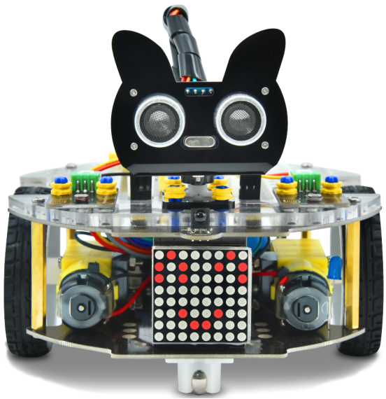

首先感谢选择keyes产品,

我们将继续为你提供好的产品和服务!

\**关于keyes \*\*

Keyes是KEYES
Corporation旗下最畅销的品牌，我们的产品包括Arduino开发板、扩展板、传感器模块；树莓派、micro：bit扩展板和智能小车；以及为各阶段客户设计的完整入门套件。这些入门套件旨在为任何水平的客户学习Arduino、树莓派、micro：bit相关知识。

我们所有产品，均符合国际质量标准，在世界各地不同市场中，得到了极大的赞赏。

欢迎从我们的官方网站查看更多内容：

http://www.keyes-robot.com

\**售后服务 \*\*

1. 如果发现某些东西丢失或损坏，或者学习套件时遇到一些困难，keyes会提供免费和快速的支持。如果您有任何疑问，请联系我们我们客服或工作人员。

2. 欢迎提出建议和反馈，我们会根据您的反馈不断更新套件和教程，以使其更好。谢谢！

3. 

**产品安全**

1. 本产品内含细小的零件（螺丝，铜柱等），请放在儿童接触不到的地方，防止划伤或误食。8岁及以下儿童使用，请在大人监督下使用。

2. 本产品包含导电部件(控制板和电子模块），请按照本教程的要求进行操作，不当的操作可能导致过热并且损害零件，请勿触摸并立即断开电路电源（请按照正确的方式安装电池）。

**版权**

keyes商标和徽标是KEYES DIY ROBOT
co.,LTD的版权,任何人和公司在没有授权的情况下，不得复制，售卖，转卖，keyes品牌的产品。如果您有兴趣在当地售卖我们的产品，请联系我们专业的批发销售人员。

产品介绍
========

**KEYES Beetlebot ESP32 3合1 智能小车（含主板）**

|Img|

.. _1-beetlebot-esp32-3合1-智能小车简介:

1. Beetlebot ESP32 3合1 智能小车简介：
--------------------------------------

Beetlebot ESP32 3合1
智能小车是一款兼容乐高积木的STEM教育产品，可以模拟道路环境中自动躲避路障，可以精准的循着地面的黑线行驶，可以识别自然环境中的光线并随之移动，还可以通过红外或者WIFI来遥控。Beetlebot有三种非常炫酷的外形，分别是：足球机器人，投石攻城车，搬运机器人。当然你也可以发挥想象力，搭建自己喜欢的结构形态。

相对于之前的智能小车，Beetlebot做了很多的革新。小车的电机驱动和传感器都采用集成式的设计，功能可靠并且安装简便。Beetlebot的控制核心是当今主流的开源硬件ESP32，可以使用Beetlebot实现低成本的arduino
C编程、MicroPython编程和Scratch图形化编程等学习计划。

Beetlebot不仅让孩子们学习到编程基础知识和人工智能的应用，还着力培养孩子们的创新思维、编程思维和动手实践的能力、解决问题的能力，以及团队协作的能力。比如使用自己编程的Beetlebot和小伙伴们来一场机器人踢足球比赛或者来一场攻城对战游戏，也是非常有趣的呢！

.. _2-特点:

2. 特点：
---------

（1）兼容乐高积木：可以用乐高积木扩展外形和增加兼容乐高的传感器;

（2）三种机器人外形：足球机器人，投石攻城车，搬运机器人;

（3）功能丰富：有表情显示，氛围灯控制，循迹，避障，追光，红外控制，WIFI控制;

（4）安装简单：车体采用嵌入式设计，只需要几个步骤就可以完成车体的安装和接线;

（5）兼容性强：车体预留了Raspberry Pi Pico和Arduino
Nano控制板的插口，兼容这两种开发板;

（6）充电功能: 集成了18650锂电池的充放电的电路，使用起来更经济便捷;

（7）WiFi控制：小车采用的是WiFi控制，有能力的朋友可以在此基础上进行二次开发;

（8）小车APP：兼容Android和iOS系统，精美的软件界面和丰富灵活的控制系统.

.. _3-参数:

3. 参数：
---------

- 工作电压：5v
- 输入电压：4.2V（单节锂电池）
- 最大输出电流：3.5A
- 最大耗散功率：17.5W（T=80℃）
- 电机转速：5V  200 rpm / min
- 电机驱动形式：DRV8833 双路H桥电机驱动
- 超声波感应角度：<15度
- 超声波探测距离：2cm-400cm
- 红外遥控距离：7米左右（实测）
- 尺寸：176mm×137mm×130mm
- 环保属性：ROHS

.. _4-清单:

4. 清单：
---------

当收到这个Keyes Beetlebot ESP32 3合1
智能小车工具包的时候，首先看到是一个包装精美的外盒，每个配件被安全且有序的装在外盒里面的小袋子里，先来清点一下：

+------+-------------------------+--------+---------------------+
| 序号 | 规格                    | 倍用量 | 图片                |
+======+=========================+========+=====================+
| 1    | Keyes ESP32开发板       | 1      | |image87|           |
+------+-------------------------+--------+---------------------+
| 2    | 光敏电阻传感器          | 2      | |image88|           |
+------+-------------------------+--------+---------------------+
| 3    | 兼容乐高舵机 270°舵机   | 1      | |image89|           |
+------+-------------------------+--------+---------------------+
| 4    | Beetlebot 3 in1 Robot   | 1      | |image90|           |
|      | STEM教育 扩展板         |        |                     |
+------+-------------------------+--------+---------------------+
| 5    | Beetlebot 3 in1 Robot   | 1      | |image91|           |
|      | STEM教育 驱动板         |        |                     |
+------+-------------------------+--------+---------------------+
| 6    | Beetlebot 3 in 1 Robot  | 1      | |image92|           |
|      | 乐高套件                |        |                     |
+------+-------------------------+--------+---------------------+
| 7    | 亚克力垫高板            | 1      | |image93|           |
+------+-------------------------+--------+---------------------+
| 8    | MD0487                  | 1      | |image94|           |
|      | 超声波固定亚克力折弯板  |        |                     |
+------+-------------------------+--------+---------------------+
| 9    | 乐高                    | 1      | |image95|           |
|      | 孔位亚克力舵机固定平台  |        |                     |
+------+-------------------------+--------+---------------------+
| 10   | 电机                    | 2      | |image96|           |
+------+-------------------------+--------+---------------------+
| 11   | 8X8点阵模块             | 1      | |image97|           |
+------+-------------------------+--------+---------------------+
| 12   | 电机固定件              | 2      | |image98|           |
+------+-------------------------+--------+---------------------+
| 13   | 180度舵机               | 1      | |image99|           |
+------+-------------------------+--------+---------------------+
| 14   | 车轮                    | 2      | |image100|          |
|      |                         |        | |image101|          |
+------+-------------------------+--------+---------------------+
| 15   | HC-SR04超声波传感器     | 1      | |image102|          |
+------+-------------------------+--------+---------------------+
| 16   | 十字螺丝刀              | 1      | |image103|          |
+------+-------------------------+--------+---------------------+
| 17   | 大的万向轮              | 1      | |image104|          |
+------+-------------------------+--------+---------------------+
| 18   | USB数据线               | 1      | |image105|          |
+------+-------------------------+--------+---------------------+
| 19   | 遥控器                  | 1      | |image106|          |
+------+-------------------------+--------+---------------------+
| 20   | USB2.0充电线            | 1      | |image107|          |
+------+-------------------------+--------+---------------------+
| 21   | 十字螺丝刀              | 1      | |image108|          |
+------+-------------------------+--------+---------------------+
| 22   | 3P转杜邦母单连接线      | 2      | |image109|          |
+------+-------------------------+--------+---------------------+
| 23   | 4P                      | 1      | |image110|          |
|      | 母对母                  |        |                     |
|      | 连拼杜邦线（黑红蓝绿）  |        |                     |
+------+-------------------------+--------+---------------------+
| 24   | HX2.54mm-4P转2.5        | 1      | |image111|          |
|      | 4杜邦母单线（绿蓝红黑） |        |                     |
+------+-------------------------+--------+---------------------+
| 25   | 10P XH2.54白色端子      | 1      | |image112|          |
|      | 两头同向线（            |        |                     |
|      | 绿蓝紫白棕橙灰黄红黑）  |        |                     |
+------+-------------------------+--------+---------------------+
| 26   | 缠绕管                  | 1      | |image113|          |
+------+-------------------------+--------+---------------------+
| 27   | 亚克力垫片              | 6      | |image114|          |
+------+-------------------------+--------+---------------------+
| 28   | M3*40MM 双通六角铜柱    | 4      | |image115|          |
+------+-------------------------+--------+---------------------+
| 29   | M1.2*5MM 圆头 十字      | 4      | |image116|          |
|      | 自攻螺钉                |        |                     |
+------+-------------------------+--------+---------------------+
| 30   | M2.3*16MM 圆头十字      | 2      | |image117|          |
|      | 自攻螺钉                |        |                     |
+------+-------------------------+--------+---------------------+
| 31   | M1.4 镀镍螺母           | 4      | |image118|          |
+------+-------------------------+--------+---------------------+
| 32   | M1.4*10MM 圆头 十字     | 4      | |image119|          |
|      | 螺钉                    |        |                     |
+------+-------------------------+--------+---------------------+
| 33   | M2 镀镍螺母             | 2      | |image120|          |
+------+-------------------------+--------+---------------------+
| 34   | M2*8MM 圆头 十字螺钉    | 2      | |image121|          |
+------+-------------------------+--------+---------------------+
| 35   | M3*10MM 圆头 十字螺钉   | 6      | |image122|          |
+------+-------------------------+--------+---------------------+
| 36   | M3*6MM 圆头 十字螺钉    | 10     | |image123|          |
+------+-------------------------+--------+---------------------+
| 37   | M3 镀镍螺母             | 8      | |image124|          |
+------+-------------------------+--------+---------------------+
| 38   | M3*30MM 圆头 十字螺钉   | 4      | |image125|          |
+------+-------------------------+--------+---------------------+
| 39   | 桌上足球 28mm           | 1      | |image126|          |
+------+-------------------------+--------+---------------------+
| 40   | 小的万向轮              | 1      | |image127|          |
+------+-------------------------+--------+---------------------+
| 41   | 18650电池 2550mAh       | 1      | |image128|          |
|      | 动力5c                  |        |                     |
+------+-------------------------+--------+---------------------+
| 42   | 寻迹跑道                | 1      | |image129|          |
+------+-------------------------+--------+---------------------+

.. |image1| image:: ./media/img-20230329084843.png
.. |image2| image:: ./media/img-20230329090316.png
.. |image3| image:: ./media/img-20230329085510.png
.. |image4| image:: ./media/img-20230329094428.png

.. |image7| image:: ./media/img-20230329094522.png

.. |image9| image:: ./media/img-20230329094609.png
.. |image10| image:: ./media/img-20230329094634.png
.. |image11| image:: ./media/img-20230329094703.png
.. |image12| image:: ./media/img-20230329094800.png
.. |image13| image:: ./media/img-20230329095649.png

.. |image15| image:: ./media/img-20230329094846.png
.. |image16| image:: ./media/img-20230329094906.png

.. |image23| image:: ./media/img-20230329105415.png
.. |image24| image:: ./media/img-20230329112353.png
.. |image25| image:: ./media/img-20230329105543.png

.. |image27| image:: ./media/img-20230329105638.png

.. |image29| image:: ./media/img-20230329110051.png

.. |image33| image:: ./media/img-20230329111922.png

.. |image37| image:: ./media/img-20230329110724.png
.. |image38| image:: ./media/img-20230329110855.png
.. |image39| image:: ./media/img-20230329112102.png
.. |image40| image:: ./media/img-20230329112125.png
.. |image41| image:: ./media/img-20230329112152.png

.. |image43| image:: ./media/img-20230510131229.png
.. |image44| image:: ./media/img-20230329084843.png
.. |image45| image:: ./media/img-20230329090316.png
.. |image46| image:: ./media/img-20230329085510.png
.. |image47| image:: ./media/img-20230329094428.png

.. |image50| image:: ./media/img-20230329094522.png

.. |image52| image:: ./media/img-20230329094609.png
.. |image53| image:: ./media/img-20230329094634.png
.. |image54| image:: ./media/img-20230329094703.png
.. |image55| image:: ./media/img-20230329094800.png
.. |image56| image:: ./media/img-20230329095649.png

.. |image58| image:: ./media/img-20230329094846.png
.. |image59| image:: ./media/img-20230329094906.png

.. |image66| image:: ./media/img-20230329105415.png
.. |image67| image:: ./media/img-20230329112353.png
.. |image68| image:: ./media/img-20230329105543.png

.. |image70| image:: ./media/img-20230329105638.png

.. |image72| image:: ./media/img-20230329110051.png

.. |image76| image:: ./media/img-20230329111922.png

.. |image80| image:: ./media/img-20230329110724.png
.. |image81| image:: ./media/img-20230329110855.png
.. |image82| image:: ./media/img-20230329112102.png
.. |image83| image:: ./media/img-20230329112125.png
.. |image84| image:: ./media/img-20230329112152.png

.. |image86| image:: ./media/img-20230510131229.png
.. |image87| image:: ./media/img-20230329084843.png
.. |image88| image:: ./media/img-20230329090316.png
.. |image89| image:: ./media/img-20230329085510.png
.. |image90| image:: ./media/img-20230329094428.png

.. |image93| image:: ./media/img-20230329094522.png

.. |image95| image:: ./media/img-20230329094609.png
.. |image96| image:: ./media/img-20230329094634.png
.. |image97| image:: ./media/img-20230329094703.png
.. |image98| image:: ./media/img-20230329094800.png
.. |image99| image:: ./media/img-20230329095649.png

.. |image101| image:: ./media/img-20230329094846.png
.. |image102| image:: ./media/img-20230329094906.png

.. |image109| image:: ./media/img-20230329105415.png
.. |image110| image:: ./media/img-20230329112353.png
.. |image111| image:: ./media/img-20230329105543.png

.. |image113| image:: ./media/img-20230329105638.png

.. |image115| image:: ./media/img-20230329110051.png

.. |image119| image:: ./media/img-20230329111922.png

.. |image123| image:: ./media/img-20230329110724.png
.. |image124| image:: ./media/img-20230329110855.png
.. |image125| image:: ./media/img-20230329112102.png
.. |image126| image:: ./media/img-20230329112125.png
.. |image127| image:: ./media/img-20230329112152.png

.. |image129| image:: ./media/img-20230510131229.png
