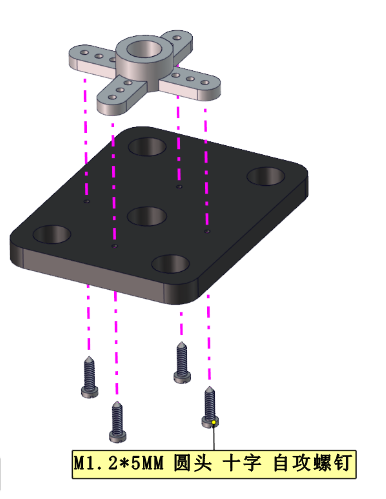
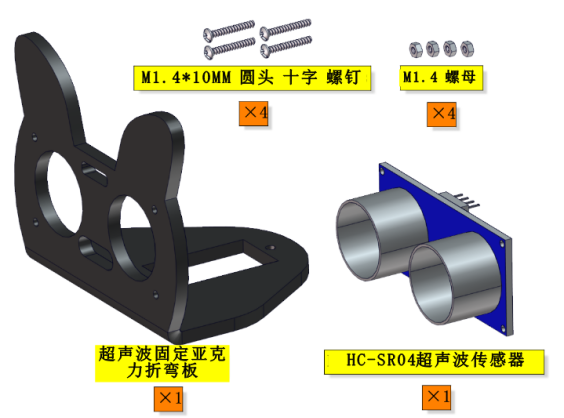
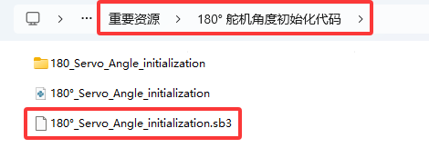
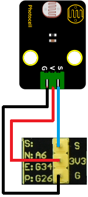
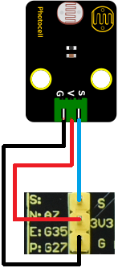

ESP32 3合1小车初始形态组装
==========================

|Img|

**安装1**

安装所需零件：

|image1|

安装：

|image2|

完成：

|image3|

**安装2**

安装所需零件：

|image4|

安装：

|image5|

完成：

|image6|

**安装3**

安装所需零件：

|image7|

安装：

|image8|

完成：

|image9|

**安装4**

安装所需零件：

|image10|

安装：

|image11|

完成：

|image12|

**安装5**

安装所需零件：

|image13|

先将电机、8*8点阵屏和上下pcb板的连接线都接上。

====== ======
左电机 右电机
====== ======
**L**  **R**
====== ======

|image14|

======= =========
8*8点阵 小车PCB板
======= =========
G       G
5V      5V
SDA     SDA
SCL     SCL
======= =========

|image15|

|image16|

安装：

|image17|

完成：

|image18|

**安装6**

安装所需零件：

|image19|

安装：

|image20|

完成：

|image21|

**安装7**

安装所需零件：

|image22|

安装：

|image23|

完成：

|image24|

**安装8**

安装所需零件：

|image25|

安装：

|image26|

完成：

|image27|

安装9

安装所需零件：

|image28|

\ **安装前需要调节舵机角度为90°。**\ 

====== ===========
舵机   小车PCB板
====== ===========
棕线   G
红线   5V
橙黄线 S1（GPIO4）
====== ===========

|image29|

**方法一：Arduino代码**

⚠️\ **特别提示：** 在编写代码并上传之前，必须安装Arduino
IDE，请到链接：\ `关于Arduino
IDE <https://www.keyesrobot.cn/projects/KE3059/zh-cn/latest/docs/Arduino%E6%95%99%E7%A8%8B.html>`__

.. code:: c

   #include <Arduino.h>
   #include <ESP32Servo.h>

   Servo myservo;  // 创建伺服对象来控制伺服

   int servoPin = 4; // 舵机引脚

   void setup() {
     myservo.setPeriodHertz(50);           // 标准50赫兹伺服
     myservo.attach(servoPin, 500, 2500);  // 将servoPin上的伺服附加到伺服对象上

     myservo.write(0);  // 舵机的角度是0°.
     delay(1000);
     myservo.write(180);  // 舵机的角度是180°.
     delay(1000);
     myservo.write(90);  // 舵机的角度是90°.
     delay(1000);
   }
   void loop() {

   }

上面的Arduino代码在资料中有提供，打开舵机的调整代码并烧录到Beetlebot的ESP32主板，完成。代码如下图位置：

|image30|

**方法二：MicroPython代码**

⚠️\ **特别提示：** 在您编写代码并上传之前，必须安装 MicroPython
IDE，请转到链接：\ `关于MicroPython
IDE <https://www.keyesrobot.cn/projects/KE3059/zh-cn/latest/docs/Python%E6%95%99%E7%A8%8B.html>`__

.. code:: python

   from machine import Pin, PWM
   import time

   #定义GPIO4的输出频率为50Hz，占空比为77，并分配给PWM
   servoPin = Pin(4)
   pwm = PWM(servoPin, freq=50)
   pwm.duty(25)
   time.sleep(1)
   pwm.duty(128)
   time.sleep(1)
   pwm.duty(77)
   time.sleep(1)

上面的MicroPython代码在资料中有提供，打开舵机的调整代码并烧录到Beetlebot的ESP32主板，完成。代码如下图位置：

|image31|

**方法三：KidsBlock（Scratch）代码**

⚠️\ **特别提示：** 在编写和上传代码之前，必须安装KidsBlock
IDE，请到链接：\ `关于KidsBlock
IDE <https://www.keyesrobot.cn/projects/KE3059/zh-cn/latest/docs/Scratch%E6%95%99%E7%A8%8B.html>`__

|image32|

上面的KidsBlock（Scratch）代码在资料中有提供，打开舵机的调整代码并烧录到Beetlebot的ESP32主板，完成。代码如下图位置：

|image33|

调整之后，正向前安装：

|image34|

完成：

|image35|

**安装10**

安装所需零件：

|image36|

安装：

|image37|

完成：

|image38|

**安装11**

安装所需零件：

|image39|

安装：

|image40|

完成：

|image41|

**初始形态接线图**

超声波接线图：

============ ============
超声波传感器 小车PCB板
============ ============
Vcc          5V
Trig         S2（GPIO5）
Echo         S1（GPIO18）
Gnd          G
============ ============

|image42|

|image43|

云台舵机接线图：

====== ===========
舵机   小车PCB板
====== ===========
棕线   G
红线   5V
橙黄线 S1（GPIO4）
====== ===========

|image44|

|image45|

左边光敏接线图：

============== ===========
左边光敏传感器 小车PCB板
============== ===========
G              G
V              V
S              S（GPIO34）
============== ===========

|image46|

|image47|

|image48|

右边光敏接线图：

============== ===========
右边光敏传感器 小车PCB板
============== ===========
G              G
V              V
S              S（GPIO35）
============== ===========

|image49|

|image50|

|image51|

**原型态安装完成示意图：**

|image52|

.. |Img| image:: ./media/img-20230403160548.png
.. |image1| image:: ./media/img-20230403160628.png
.. |image2| image:: ./media/img-20230403160639.png
.. |image3| image:: ./media/img-20230403160651.png
.. |image4| image:: ./media/img-20230403160715.png
.. |image5| image:: ./media/img-20230403160726.png

.. |image7| image:: ./media/img-20230403160945.png
.. |image8| image:: ./media/img-20230403160957.png
.. |image9| image:: ./media/img-20230403161008.png
.. |image10| image:: ./media/img-20230403161032.png
.. |image11| image:: ./media/img-20230403161044.png
.. |image12| image:: ./media/img-20230403161056.png

.. |image14| image:: ./media/img-20230508105400.png
.. |image15| image:: ./media/img-20230508111302.png
.. |image16| image:: ./media/img-20230508105414.png
.. |image17| image:: ./media/img-20230508112106.png
.. |image18| image:: ./media/img-20230403161648.png
.. |image19| image:: ./media/img-20230403161716.png

.. |image21| image:: ./media/img-20230403161752.png

.. |image23| image:: ./media/img-20230403162348.png

.. |image25| image:: ./media/img-20230403162701.png
.. |image26| image:: ./media/img-20230403162930.png
.. |image27| image:: ./media/img-20230403162721.png
.. |image28| image:: ./media/img-20230403163656.png
.. |image29| image:: ./media/img-20230508091835.png

.. |image34| image:: ./media/img-20230403164300.png
.. |image35| image:: ./media/img-20230403164312.png
.. |image36| image:: ./media/img-20230403164357.png

.. |image42| image:: ./media/img-20230508100004.png
.. |image43| image:: ./media/img-20230505145136.jpg
.. |image44| image:: ./media/img-20230508091835.png

.. |image47| image:: ./media/img-20230505150208.png
.. |image48| image:: ./media/img-20230505150639.jpg

.. |image50| image:: ./media/img-20230505151028.jpg
.. |image51| image:: ./media/img-20230505151526.jpg
.. |image52| image:: ./media/img-20230506135431.png
