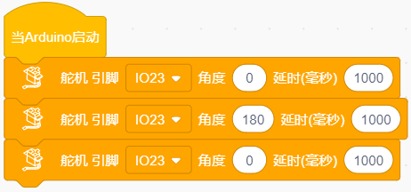

# 投石机器人教程


## 投石机器人简介：

投石攻城车在古代主要用于围攻和防守要塞，主要是用木头制作的，是利用配重物的重力发射，把石头抛出去。我们也制作了一款投石攻城车，是由车和乐高积木搭建而成的，车上装有舵机和齿轮，长臂末端有乐高搭建的凹槽是用于装投射物。发射时，舵机转动带动齿轮把长臂向后推，把投射物放入凹槽中,当舵机转动一定角度带动齿轮把长臂完全升起时，投射物从凹槽中飞出。

## 安装APP:

**⚠️<span style=“color: rgb(255,76,65);”>特别提示：</span>** 如果APP已下载安装好，则跳过此步骤；如果没有，请参考链接的安装说明：[项目18：读取APP按钮字符串](https://www.keyesrobot.cn/projects/KE3059/zh-cn/latest/docs/3.%20Arduino%20%E6%95%99%E7%A8%8B/3.%20Arduino%20%E6%95%99%E7%A8%8B.html#app)

## 投石机器人形态安装步骤

 **安装1**

 安装所需零件：


 安装：


 完成：


 **安装2**

 安装所需零件：


 安装：


 完成：


 **安装3**

 安装所需零件：


 安装：


 完成：


 **安装4**

 安装所需零件：


 安装：


 完成：


 **安装5**

 安装所需零件：


 安装：


 完成：


 **安装6**

 安装所需零件：


 安装：


 完成：


 **安装7**

 安装所需零件：


 安装：


 完成：


 **安装8**

 安装所需零件：


 安装：

<span style="color: rgb(255, 76, 65);">（注意舵机线的位置）</span>


 完成：


 **安装9**

 安装所需零件：


 安装：


 完成：


 **安装10**

 安装所需零件：


 安装：


 完成：


 **安装11**

 安装所需零件：


 安装：


 完成：


 **安装12**

 安装所需零件：


 安装：


 完成：


 **安装13**

 安装所需零件：


 安装：


 完成：


 **安装14**

 安装所需零件：


 安装：


 完成：


 **安装15**

 安装所需零件：


 安装：


 完成：


 **安装16**

 安装所需零件：


 安装：


 完成：


 **安装17**

 安装所需零件：


<span style="color: rgb(255, 76, 65);">安装前需调节舵机角度为0°。</span>

将舵机的线接到PCB上板的S2接口：

|舵机|小车PCB板|
| :--: | :--: |
|棕线| G |
| 红线 | 5V |
| 橙黄线 | S2（GPIO23）|


将舵机初始化的代码上传到Beetlebot小车上的ESP32主板上，如下所示：

**方法一：Arduino 代码：**

```c
//*************************************************************************************
#include <Arduino.h>
#include <ESP32Servo.h>

Servo myservo;  // 创建舵机对象来控制舵机

int servoPin = 23; // 舵机引脚

void setup() {
  myservo.setPeriodHertz(50);           // 标准50赫兹舵机
  myservo.attach(servoPin, 500, 2500);  // 将servoPin上的舵机附加到舵机对象上

  myservo.write(0);  // 舵机角度为 0°.
  delay(1000);
  myservo.write(90);  // 舵机角度为 90°.
  delay(1000);
  myservo.write(0);  // 舵机角度为 0°.
  delay(1000);
}
void loop() {

}
//*************************************************************************************
```
上面的Arduino代码在资料中有提供，打开舵机的调整代码并烧录到Beetlebot的ESP32主板，上传完成。代码如下图位置：


**方法二：KidsBlock(Scratch)代码:**

也可以使用下面的KidsBlock(Scratch)代码来调整舵机初始化角度.



KidsBlock(Scratch)代码在资料中也有提供，打开舵机的调整代码并烧录到Beetlebot的ESP32主板，上传完成。代码如下图位置:


 安装：

<span style="color: rgb(255, 76, 65);">（安装姿态与下图保持一致）</span>

 完成：


 **安装18**

 安装所需零件：


 安装：


 完成：


 **投石机器人完成**


 灰色乐高舵机接线图：

|舵机|小车PCB板|
| :--: | :--: |
|棕线| G |
| 红线 | 5V |
| 橙黄线 | S2（GPIO23）|


## 投石机器人Arduino代码:

**注意：手机或平板一定要与ESP32开发板连接的是同一个wifi，否则将无法进入控制页面，还有就是ESP32开发板在使用WiFi功能时功耗很大需要外接DC电源才能满足他的工作电力需求，如果达不到他的工作电力需求ESP32板将会一直复位导致代码无法正常运行。**

⚠️<span style="color: rgb(255, 76, 65);">注意：上传代码前，请将代码中的WiFi名称（REPLACE_WITH_YOUR_SSID）和密码（REPLACE_WITH_YOUR_PASSWORD）替换为您自己的WiFi名称和密码。</span>

```c
#include <WiFi.h>
#include <ESPmDNS.h>
#include <WiFiClient.h>

#include <ESP32Servo.h>
//电机
#define left_ctrl  33  //左电机的方向控制引脚 gpio33
#define left_pwm  26   //左电机的PWM控制引脚 gpio26
#define right_ctrl  32 //右电机的方向控制引脚 gpio32
#define right_pwm  25  //右电机的PWM控制引脚 gpio25

/*替换为您的网络凭据（输入您的SSID和密码）*/
const char* ssid = "REPLACE_WITH_YOUR_SSID"; //此处输入SSID
const char* password = "REPLACE_WITH_YOUR_PASSWORD"; //此处输入密码
// 端口80的TCP服务器将响应HTTP请求
WiFiServer server(80);

//舵机
const int servoPin = 23;//设置舵机引脚为gpio23
Servo myservo;  // 创建舵机对象来控制舵机

void setup(void)
{
    Serial.begin(115200);
    pinMode(left_ctrl,OUTPUT); //将左电机控制引脚设置为OUTPUT
    ledcAttach(left_pwm, 1200, 8); //设置left_pwm引脚的频率为1200，PWM分辨率为8，占空比为256。
    pinMode(right_ctrl,OUTPUT);//设置右侧电机方向控制引脚为OUTPUT
    ledcAttach(right_pwm, 1200, 8); //设置right_pwm引脚的频率为1200，PWM分辨率为8，占空比为256。
  
    myservo.setPeriodHertz(50);           // 标准50赫兹舵机
    myservo.attach(servoPin, 500, 2500);  // 将servoPin上的舵机附加到舵机对象上
    myservo.write(0);  // 舵机的初始角度设置为0°
    delay(300);

    // 连接WiFi网络
    WiFi.begin(ssid, password);
    Serial.println("");

    // 等待连接
    while (WiFi.status() != WL_CONNECTED) {
        delay(500);
        Serial.print(".");
    }
    Serial.println("");
    Serial.print("Connected to ");
    Serial.println(ssid);
    Serial.print("IP address: ");
    Serial.println(WiFi.localIP());

    // 设置mDNS响应器：
    // - 在本例中，第一个参数是域名
    //   全限定域名是“esp32.local”
    // - 第二个参数是要发布的IP地址
    //   我们通过WiFi网络发送我们的IP地址
    if (!MDNS.begin("esp32")) {
        Serial.println("Error setting up MDNS responder!");
        while(1) {
            delay(1000);
        }
    }
    Serial.println("mDNS responder started");

    // 启动TCP （HTTP）服务器
    server.begin();
    Serial.println("TCP server started");

    // 向mmds - sd添加业务
    MDNS.addService("http", "tcp", 80);
}

void loop(void)
{
    // 检查客户端是否已连接
    WiFiClient client = server.available();
    if (!client) {
        return;
    }
    //Serial.println("");
    //Serial.println("New client");

    // 等待来自客户端的数据变为可用
    while(client.connected() && !client.available()){
        delay(1);
    }

    // 读取HTTP请求的第一行
    String req = client.readStringUntil('\r');
    //Serial.println(req);
    // HTTP请求的第一行看起来像“GET /path HTTP/1.1”
    // 通过查找空格来检索“/path”部分
    int addr_start = req.indexOf(' ');
    int addr_end = req.indexOf(' ', addr_start + 1);
    if (addr_start == -1 || addr_end == -1) {
        //Serial.print("Invalid request: ");
        //Serial.println(req);
        return;
    }
    req = req.substring(addr_start + 1, addr_end);
    //Serial.print("Request: ");
    Serial.println(req);
    String s;
    if (req == "/")
    {
        IPAddress ip = WiFi.localIP();
        String ipStr = String(ip[0]) + '.' + String(ip[1]) + '.' + String(ip[2]) + '.' + String(ip[3]);
        s = "HTTP/1.1 200 OK\r\nContent-Type: text/html\r\n\r\n<!DOCTYPE HTML>\r\n<html>Hello from ESP32 at ";
        s += ipStr;
        s += "</html>\r\n\r\n";
        Serial.println("Sending 200");
        client.println(WiFi.localIP());
    }
    else if(req == "/btn/F")
    {
      digitalWrite(left_ctrl,LOW); //将左电机方向控制引脚设为LOW。
      ledcWrite(left_pwm, 150); //左电机输出PWM 150
      digitalWrite(right_ctrl,LOW); //将右电机的控制引脚设置为LOW。
      ledcWrite(right_pwm, 150); //右电机输出PWM 150
    }
    else if(req == "/btn/B")
    {
      digitalWrite(left_ctrl, HIGH);
      ledcWrite(left_pwm, 150);
      digitalWrite(right_ctrl, HIGH);
      ledcWrite(right_pwm, 150);
    }
    else if(req == "/btn/L")
    {
      digitalWrite(left_ctrl,HIGH); 
      ledcWrite(left_pwm, 150); 
      digitalWrite(right_ctrl,LOW); 
      ledcWrite(right_pwm, 150); 
    }
    else if(req == "/btn/R")
    {
      digitalWrite(left_ctrl,LOW); 
      ledcWrite(left_pwm, 150); 
      digitalWrite(right_ctrl,HIGH); 
      ledcWrite(right_pwm, 150); 
    }
    else if(req == "/btn/S")
    {
      digitalWrite(left_ctrl,LOW);
      ledcWrite(left_pwm, 0);
      digitalWrite(right_ctrl,LOW);
      ledcWrite(right_pwm, 0); 
    }
    else if(req == "/btn/p")
    {
      Serial.write('p');
      myservo.write(55);
      delay(200);
    }
    else if(req == "/btn/q")
    {
      Serial.write('q');
      client.println("q");
    }
    else if(req == "/btn/x")
    {
      myservo.write(0);
      delay(200); 
    }
}
```

## 投石机器人Kidsblock代码:

**注意：手机或平板一定要与ESP32开发板连接的是同一个wifi，否则将无法进入控制页面，还有就是ESP32开发板在使用WiFi功能时功耗很大需要外接DC电源才能满足他的工作电力需求，如果达不到他的工作电力需求ESP32板将会一直复位导致代码无法正常运行。**

⚠️<span style="color: rgb(255, 76, 65);">注意：上传代码前，请将代码中的WiFi名称（REPLACE_WITH_YOUR_SSID）和密码（REPLACE_WITH_YOUR_PASSWORD）替换为您自己的WiFi名称和密码。</span>


## 投石机器人实验结果：

1\. 打开IDE的串口监视器，读取WiFi IP地址，然后在场地用乐高积木搭建几个目标物（目标物A，B，C，D，E），目标物在投石攻城车前方且都隔一段距离。APP连上WiFi。

2\. 操作APP上的小车方向按钮使投石攻城车正对目标物A一段距离，按住按钮，舵机转动一定角度带动齿轮升起长臂把乐高积木块抛出去；松开按钮，舵机转动带动齿轮把长臂向后推。看看乐高积木块是否打击到目标物A？如果没有，就反复操作小车方向按钮、按住或松开按钮，调整投石攻城车与目标物A之间的距离，使抛出去的乐高积木块刚好可以打击到目标物A。

3\. 打击目标物B，C，D，E的操作方法和上面的一样。按住按钮，舵机转动一定角度带动齿轮升起长臂把乐高积木块抛出去。