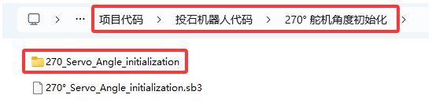

投石机器人教程
==============

|Img|

投石机器人简介：
----------------

投石攻城车在古代主要用于围攻和防守要塞，主要是用木头制作的，是利用配重物的重力发射，把石头抛出去。我们也制作了一款投石攻城车，是由车和乐高积木搭建而成的，车上装有舵机和齿轮，长臂末端有乐高搭建的凹槽是用于装投射物。发射时，舵机转动带动齿轮把长臂向后推，把投射物放入凹槽中,当舵机转动一定角度带动齿轮把长臂完全升起时，投射物从凹槽中飞出。

安装APP:
--------

**⚠️特别提示：**
如果APP已下载安装好，则跳过此步骤；如果没有，请参考链接的安装说明：\ `项目18：读取APP按钮字符串 <https://www.keyesrobot.cn/projects/KE3059/zh-cn/latest/docs/Arduino%E6%95%99%E7%A8%8B.html#app>`__
。

投石机器人形态安装步骤
----------------------

**安装1**

安装所需零件：

|image1|

安装：

|image2|

完成：

|image3|

**安装2**

安装所需零件：

|image4|

安装：

|image5|

完成：

|image6|

**安装3**

安装所需零件：

|image7|

安装：

|image8|

完成：

|image9|

**安装4**

安装所需零件：

|image10|

安装：

|image11|

完成：

|image12|

**安装5**

安装所需零件：

|image13|

安装：

|image14|

完成：

|image15|

**安装6**

安装所需零件：

|image16|

安装：

|image17|

完成：

|image18|

**安装7**

安装所需零件：

|image19|

安装：

|image20|

完成：

|image21|

**安装8**

安装所需零件：

|image22|

安装：

（\ **注意舵机线的位置**\ ）

|image23|

完成：

|image24|

**安装9**

安装所需零件：

|image25|

安装：

|image26|

完成：

|image27|

**安装10**

安装所需零件：

|image28|

安装：

|image29|

完成：

|image30|

**安装11**

安装所需零件：

|image31|

安装：

|image32|

完成：

|image33|

**安装12**

安装所需零件：

|image34|

安装：

|image35|

完成：

|image36|

**安装13**

安装所需零件：

|image37|

安装：

|image38|

完成：

|image39|

**安装14**

安装所需零件：

|image40|

安装：

|image41|

完成：

|image42|

**安装15**

安装所需零件：

|image43|

安装：

|image44|

完成：

|image45|

**安装16**

安装所需零件：

|image46|

安装：

|image47|

完成：

|image48|

**安装17**

安装所需零件：

|image49|

\ **安装前需调节舵机角度为0°。**\ 

将舵机的线接到PCB上板的S2接口：

====== ============
舵机   小车PCB板
====== ============
棕线   G
红线   5V
橙黄线 S2（GPIO23）
====== ============

|image50|

\ **将舵机角度初始化的代码上传到Beetlebot小车上的ESP32主板上，如下所示：**\ 

**方法一：Arduino 代码：**

.. code:: c

   //*************************************************************************************
   #include <Arduino.h>
   #include <ESP32Servo.h>

   Servo myservo;  // 创建舵机对象来控制舵机

   int servoPin = 23; // 舵机引脚

   void setup() {
     myservo.setPeriodHertz(50);           // 标准50赫兹舵机
     myservo.attach(servoPin, 500, 2500);  // 将servoPin上的舵机附加到舵机对象上

     myservo.write(0);  // 舵机角度为 0°.
     delay(1000);
     myservo.write(90);  // 舵机角度为 90°.
     delay(1000);
     myservo.write(0);  // 舵机角度为 0°.
     delay(1000);
   }
   void loop() {

   }
   //*************************************************************************************

上面的Arduino代码在资料中有提供，打开舵机的调整代码并烧录到Beetlebot的ESP32主板，上传完成。代码如下图位置：

|image51|

**方法二：KidsBlock(Scratch)代码:**

也可以使用下面的KidsBlock(Scratch)代码来调整舵机初始化角度.

|image52|

KidsBlock(Scratch)代码在资料中也有提供，打开舵机的调整代码并烧录到Beetlebot的ESP32主板，上传完成。代码如下图位置:

|image53|

安装：

（\ **安装姿态与下图保持一致**\ ）

完成：

|image54|

**安装18**

安装所需零件：

|image55|

安装：

|image56|

完成：

|image57|

**投石机器人完成**

|image58|

**灰色乐高舵机接线图：**

====== ============
舵机   小车PCB板
====== ============
棕线   G
红线   5V
橙黄线 S2（GPIO23）
====== ============

|image59|

|image60|

投石机器人Arduino代码:
----------------------

**注意：手机或平板一定要与ESP32开发板连接的是同一个wifi，否则将无法进入控制页面，还有就是ESP32开发板在使用WiFi功能时功耗很大需要外接DC电源才能满足他的工作电力需求，如果达不到他的工作电力需求ESP32板将会一直复位导致代码无法正常运行。**

⚠️\ **注意：**
上传代码前，请将代码中的WiFi名称（REPLACE_WITH_YOUR_SSID）和密码（REPLACE_WITH_YOUR_PASSWORD）替换为您自己的WiFi名称和密码。

.. code:: c

   #include <WiFi.h>
   #include <ESPmDNS.h>
   #include <WiFiClient.h>

   #include <ESP32Servo.h>
   //电机
   #define left_ctrl  33  //左电机的方向控制引脚 gpio33
   #define left_pwm  26   //左电机的PWM控制引脚 gpio26
   #define right_ctrl  32 //右电机的方向控制引脚 gpio32
   #define right_pwm  25  //右电机的PWM控制引脚 gpio25

   /*替换为您的网络凭据（输入您的SSID和密码）*/
   const char* ssid = "REPLACE_WITH_YOUR_SSID"; //此处输入SSID
   const char* password = "REPLACE_WITH_YOUR_PASSWORD"; //此处输入密码
   // 端口80的TCP服务器将响应HTTP请求
   WiFiServer server(80);

   //舵机
   const int servoPin = 23;//设置舵机引脚为gpio23
   Servo myservo;  // 创建舵机对象来控制舵机

   void setup(void)
   {
       Serial.begin(115200);
       pinMode(left_ctrl,OUTPUT); //将左电机控制引脚设置为OUTPUT
       ledcAttach(left_pwm, 1200, 8); //设置left_pwm引脚的频率为1200，PWM分辨率为8，占空比为256。
       pinMode(right_ctrl,OUTPUT);//设置右侧电机方向控制引脚为OUTPUT
       ledcAttach(right_pwm, 1200, 8); //设置right_pwm引脚的频率为1200，PWM分辨率为8，占空比为256。
     
       myservo.setPeriodHertz(50);           // 标准50赫兹舵机
       myservo.attach(servoPin, 500, 2500);  // 将servoPin上的舵机附加到舵机对象上
       myservo.write(0);  // 舵机的初始角度设置为0°
       delay(300);

       // 连接WiFi网络
       WiFi.begin(ssid, password);
       Serial.println("");

       // 等待连接
       while (WiFi.status() != WL_CONNECTED) {
           delay(500);
           Serial.print(".");
       }
       Serial.println("");
       Serial.print("Connected to ");
       Serial.println(ssid);
       Serial.print("IP address: ");
       Serial.println(WiFi.localIP());

       // 设置mDNS响应器：
       // - 在本例中，第一个参数是域名
       //   全限定域名是“esp32.local”
       // - 第二个参数是要发布的IP地址
       //   我们通过WiFi网络发送我们的IP地址
       if (!MDNS.begin("esp32")) {
           Serial.println("Error setting up MDNS responder!");
           while(1) {
               delay(1000);
           }
       }
       Serial.println("mDNS responder started");

       // 启动TCP （HTTP）服务器
       server.begin();
       Serial.println("TCP server started");

       // 向mmds - sd添加业务
       MDNS.addService("http", "tcp", 80);
   }

   void loop(void)
   {
       // 检查客户端是否已连接
       WiFiClient client = server.available();
       if (!client) {
           return;
       }
       //Serial.println("");
       //Serial.println("New client");

       // 等待来自客户端的数据变为可用
       while(client.connected() && !client.available()){
           delay(1);
       }

       // 读取HTTP请求的第一行
       String req = client.readStringUntil('\r');
       //Serial.println(req);
       // HTTP请求的第一行看起来像“GET /path HTTP/1.1”
       // 通过查找空格来检索“/path”部分
       int addr_start = req.indexOf(' ');
       int addr_end = req.indexOf(' ', addr_start + 1);
       if (addr_start == -1 || addr_end == -1) {
           //Serial.print("Invalid request: ");
           //Serial.println(req);
           return;
       }
       req = req.substring(addr_start + 1, addr_end);
       //Serial.print("Request: ");
       Serial.println(req);
       String s;
       if (req == "/")
       {
           IPAddress ip = WiFi.localIP();
           String ipStr = String(ip[0]) + '.' + String(ip[1]) + '.' + String(ip[2]) + '.' + String(ip[3]);
           s = "HTTP/1.1 200 OK\r\nContent-Type: text/html\r\n\r\n<!DOCTYPE HTML>\r\n<html>Hello from ESP32 at ";
           s += ipStr;
           s += "</html>\r\n\r\n";
           Serial.println("Sending 200");
           client.println(WiFi.localIP());
       }
       else if(req == "/btn/F")
       {
         digitalWrite(left_ctrl,LOW); //将左电机方向控制引脚设为LOW。
         ledcWrite(left_pwm, 150); //左电机输出PWM 150
         digitalWrite(right_ctrl,LOW); //将右电机的控制引脚设置为LOW。
         ledcWrite(right_pwm, 150); //右电机输出PWM 150
       }
       else if(req == "/btn/B")
       {
         digitalWrite(left_ctrl, HIGH);
         ledcWrite(left_pwm, 150);
         digitalWrite(right_ctrl, HIGH);
         ledcWrite(right_pwm, 150);
       }
       else if(req == "/btn/L")
       {
         digitalWrite(left_ctrl,HIGH); 
         ledcWrite(left_pwm, 150); 
         digitalWrite(right_ctrl,LOW); 
         ledcWrite(right_pwm, 150); 
       }
       else if(req == "/btn/R")
       {
         digitalWrite(left_ctrl,LOW); 
         ledcWrite(left_pwm, 150); 
         digitalWrite(right_ctrl,HIGH); 
         ledcWrite(right_pwm, 150); 
       }
       else if(req == "/btn/S")
       {
         digitalWrite(left_ctrl,LOW);
         ledcWrite(left_pwm, 0);
         digitalWrite(right_ctrl,LOW);
         ledcWrite(right_pwm, 0); 
       }
       else if(req == "/btn/p")
       {
         Serial.write('p');
         myservo.write(55);
         delay(200);
       }
       else if(req == "/btn/q")
       {
         Serial.write('q');
         client.println("q");
       }
       else if(req == "/btn/x")
       {
         myservo.write(0);
         delay(200); 
       }
   }

投石机器人Kidsblock代码:
------------------------

**注意：手机或平板一定要与ESP32开发板连接的是同一个wifi，否则将无法进入控制页面，还有就是ESP32开发板在使用WiFi功能时功耗很大需要外接DC电源才能满足他的工作电力需求，如果达不到他的工作电力需求ESP32板将会一直复位导致代码无法正常运行。**

⚠️\ **注意：**
上传代码前，请将代码中的WiFi名称（REPLACE_WITH_YOUR_SSID）和密码（REPLACE_WITH_YOUR_PASSWORD）替换为您自己的WiFi名称和密码。

|image61|

投石机器人实验结果：
--------------------

1. 打开IDE的串口监视器，读取WiFi
IP地址，然后在场地用乐高积木搭建几个目标物（目标物A，B，C，D，E），目标物在投石攻城车前方且都隔一段距离。APP连上WiFi。

2.
操作APP上的小车方向\ |image62|\ 按钮使投石攻城车正对目标物A一段距离，按住按钮\ |image63|\ ，舵机转动一定角度带动齿轮升起长臂把乐高积木块抛出去；松开按钮\ |image64|\ ，舵机转动带动齿轮把长臂向后推。看看乐高积木块是否打击到目标物A？如果没有，就反复操作小车方向按钮\ |image65|\ 、按住或松开按钮\ |image66|\ ，调整投石攻城车与目标物A之间的距离，使抛出去的乐高积木块刚好可以打击到目标物A。

3.
打击目标物B，C，D，E的操作方法和上面的一样。按住按钮\ |image67|\ ，舵机转动一定角度带动齿轮升起长臂把乐高积木块抛出去。

.. |image3| image:: ./media/img-20230406114816.png

.. |image7| image:: ./media/img-20230406114913.png
.. |image8| image:: ./media/img-20230406114923.png
.. |image9| image:: ./media/img-20230406114935.png
.. |image10| image:: ./media/img-20230406115000.png
.. |image11| image:: ./media/img-20230406115008.png

.. |image13| image:: ./media/img-20230406115036.png

.. |image15| image:: ./media/img-20230406115053.png
.. |image16| image:: ./media/img-20230406115116.png

.. |image18| image:: ./media/img-20230406115140.png
.. |image19| image:: ./media/img-20230406120821.png

.. |image21| image:: ./media/img-20230406120840.png

.. |image26| image:: ./media/img-20230406120948.png
.. |image27| image:: ./media/img-20230406120959.png

.. |image29| image:: ./media/img-20230406121029.png
.. |image30| image:: ./media/img-20230406121039.png

.. |image32| image:: ./media/img-20230406131124.png

.. |image34| image:: ./media/img-20230406131208.png

.. |image37| image:: ./media/img-20230406131249.png
.. |image38| image:: ./media/img-20230406131258.png

.. |image46| image:: ./media/img-20230406131450.png

.. |image48| image:: ./media/img-20230406131504.png
.. |image49| image:: ./media/img-20230406131522.png
.. |image50| image:: ./media/img-20230518115057.png

.. |image52| image:: ./media/img-20250427133120.png

.. |image54| image:: ./media/img-20230406132326.png

.. |image58| image:: ./media/img-20230406133248.png
.. |image59| image:: ./media/img-20230518115057.png

.. |image62| image:: ./media/img-20230406134143.png

.. |image65| image:: ./media/img-20230406134206.png

