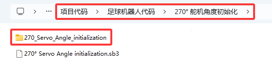
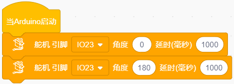
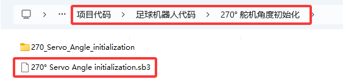
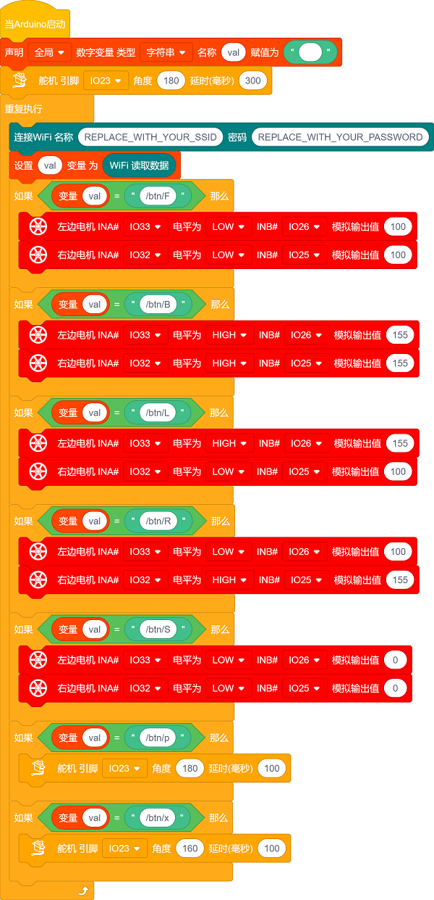

# 足球机器人教程


## 足球机器人简介：

足球运动是一种大家非常喜爱的运动。让机器人去踢足球，听起来像天方夜谭似的。机器人也能去踢足球？ 是的，足球机器人可以做到像我们人一样去组成团队进行踢足球比赛，比如：一年一度的RoboCup机器人世界杯---RoboCup足球赛等。在本实验中，我们利用乐高积木搭建了一款足球机器人，并且使用足球机器人把小足球送进足球门里。

## 安装APP:

**⚠️<span style=“color: rgb(255,76,65);”>特别提示：</span>** 如果APP已下载安装好，则跳过此步骤；如果没有，请参考链接的安装说明：[项目18：阅读WiFi APP按键串]（https://docs.keyestudio.com/projects/KS5002/en/latest/docs/Arduino_C%20Tutorial/Arduino_C_Tutorial.html#project-18-read-wifi-app-button-string）。

## 足球机器人形态安装步骤:

 **安装1**

 先将两个光敏传感器拆下：


 安装所需零件：


 安装：


 完成：


 **安装2**

 安装所需零件：


 安装：


 完成：


 **安装3**

 安装所需零件：


 安装：


 完成：


 **安装4**

 安装所需零件：


 安装：


 完成：


 **安装5**

 安装所需零件：


 安装：


 完成：


 **安装6**

 安装所需零件：


 安装：

<span style="color: rgb(255, 76, 65);">（注意舵机线的位置）</span>


 **完成：**


 **安装7**

 安装所需零件：


 安装：


 完成：


 **安装8**

 安装所需零件：


 安装：

<span style="color: rgb(255, 76, 65);">（注意调整夹爪角度，使其闭合朝前）</span>


 完成：


 **安装9**

 安装所需零件：


<span style="color: rgb(255, 76, 65);">注意：在安装前需要先调节舵机角度为180度。</span>

将舵机的线接到PCB上板的S2接口：
|舵机|小车PCB板|
| :--: | :--: |
|棕线| G |
| 红线 | 5V |
| 橙黄线 | S2（GPIO23）|


将舵机初始化的代码上传到Beetlebot小车上的ESP32主板上，如下所示：

**方法一：Arduino 代码：**

```c
//*************************************************************************************
#include <Arduino.h>
#include <ESP32Servo.h>

Servo myservo;  // 创建舵机对象来控制舵机

int servoPin = 23; // 舵机引脚

void setup() {
  myservo.setPeriodHertz(50);           // 标准50赫兹舵机
  myservo.attach(servoPin, 500, 2500);  // 将servoPin上的舵机附加到舵机对象上

  myservo.write(180);  // 舵机角度为 180°.
  delay(1000);
  myservo.write(90);  // 舵机角度为 90°.
  delay(1000);
  myservo.write(180);  // 舵机角度为 180°.
  delay(1000);
}
void loop() {

} 
//*************************************************************************************
```
上面的Arduino代码在资料中有提供，打开舵机的调整代码并烧录到Beetlebot的ESP32主板，上传完成。代码如下图位置：



**方法二：KidsBlock(Scratch)代码:**

也可以使用下面的KidsBlock(Scratch)代码来调整舵机初始化角度.



KidsBlock(Scratch)代码在资料中也有提供，打开舵机的调整代码并烧录到Beetlebot的ESP32主板，上传完成。代码如下图位置:



安装：

<span style="color: rgb(255, 76, 65);">（齿轮安装时保持夹爪为闭合朝前状态）</span>


 完成：


 **安装10**

 安装所需零件：


 安装：


 完成：


 **安装11**

 安装所需零件：


 安装：


 完成：


 **足球机器人形态完成**


 **足球机器人形态接线图**

灰色乐高舵机接线图：

|舵机|小车PCB板|
| :--: | :--: |
|棕线| G |
| 红线 | 5V |
| 橙黄线 | S2（GPIO23）|


## 足球门安装步骤:

 **安装1**

 安装所需零件：


 安装：


 完成：


 **安装2**

 安装所需零件：


 安装：


 完成：


 **安装3**

 安装所需零件：


 安装：


 完成：


## 足球机器人Arduino代码:

**注意：手机或平板一定要与ESP32开发板连接的是同一个wifi，否则将无法进入控制页面，还有就是ESP32开发板在使用WiFi功能时功耗很大需要外接DC电源才能满足他的工作电力需求，如果达不到他的工作电力需求ESP32板将会一直复位导致代码无法正常运行。**

⚠️<span style="color: rgb(255, 76, 65);">注意：上传代码前，请将代码中的WiFi名称（REPLACE_WITH_YOUR_SSID）和密码（REPLACE_WITH_YOUR_PASSWORD）替换为您自己的WiFi名称和密码。</span>

```c
#include <WiFi.h>
#include <ESPmDNS.h>
#include <WiFiClient.h>

#include <ESP32Servo.h>
//电机
#define left_ctrl  33  //左电机的方向控制引脚 gpio33
#define left_pwm  26   //左电机的PWM控制引脚 gpio26
#define right_ctrl  32 //右电机的方向控制引脚 gpio32
#define right_pwm  25  //右电机的PWM控制引脚 gpio25

/*替换为您的网络凭据（输入您的SSID和密码）*/
const char* ssid = "REPLACE_WITH_YOUR_SSID"; //此处输入SSID
const char* password = "REPLACE_WITH_YOUR_PASSWORD"; //此处输入密码
// 端口80的TCP服务器将响应HTTP请求
WiFiServer server(80);

//舵机
const int servoPin = 23;//设置舵机引脚为gpio23
Servo myservo;  // 创建舵机对象来控制舵机

void setup(void)
{
    Serial.begin(115200);
    pinMode(left_ctrl,OUTPUT); //将左电机控制引脚设置为OUTPUT
    ledcAttach(left_pwm, 1200, 8); //设置left_pwm引脚的频率为1200，PWM分辨率为8，占空比为256。
    pinMode(right_ctrl,OUTPUT);//设置右侧电机方向控制引脚为OUTPUT
    ledcAttach(right_pwm, 1200, 8); //设置right_pwm引脚的频率为1200，PWM分辨率为8，占空比为256。
  
    myservo.setPeriodHertz(50);           // // 标准50赫兹舵机
    myservo.attach(servoPin, 500, 2500);  // 将servoPin上的舵机附加到舵机对象上
    myservo.write(180);  // 舵机的初始角度设置为180° .
    delay(300);

    // 连接WiFi网络
    WiFi.begin(ssid, password);
    Serial.println("");

    // 等待连接
    while (WiFi.status() != WL_CONNECTED) {
        delay(500);
        Serial.print(".");
    }
    Serial.println("");
    Serial.print("Connected to ");
    Serial.println(ssid);
    Serial.print("IP address: ");
    Serial.println(WiFi.localIP());

    // 设置mDNS响应器：
    // - 在本例中，第一个参数是域名
    //   全限定域名是“esp32.local”
    // - 第二个参数是要发布的IP地址
    //   我们通过WiFi网络发送我们的IP地址
    if (!MDNS.begin("esp32")) {
        Serial.println("Error setting up MDNS responder!");
        while(1) {
            delay(1000);
        }
    }
    Serial.println("mDNS responder started");

    // 启动TCP （HTTP）服务器
    server.begin();
    Serial.println("TCP server started");

    // 向mmds - sd添加业务
    MDNS.addService("http", "tcp", 80);
}

void loop(void)
{
    // 检查客户端是否已连接
    WiFiClient client = server.available();
    if (!client) {
        return;
    }
    //Serial.println("");
    //Serial.println("New client");

    // 等待来自客户端的数据变为可用
    while(client.connected() && !client.available()){
        delay(1);
    }

    // 读取HTTP请求的第一行
    String req = client.readStringUntil('\r');
    //Serial.println(req);
    // HTTP请求的第一行看起来像“GET /path HTTP/1.1”
    // 通过查找空格来检索“/path”部分
    int addr_start = req.indexOf(' ');
    int addr_end = req.indexOf(' ', addr_start + 1);
    if (addr_start == -1 || addr_end == -1) {
        //Serial.print("Invalid request: ");
        //Serial.println(req);
        return;
    }
    req = req.substring(addr_start + 1, addr_end);
    //Serial.print("Request: ");
    Serial.println(req);
    String s;
    if (req == "/")
    {
        IPAddress ip = WiFi.localIP();
        String ipStr = String(ip[0]) + '.' + String(ip[1]) + '.' + String(ip[2]) + '.' + String(ip[3]);
        s = "HTTP/1.1 200 OK\r\nContent-Type: text/html\r\n\r\n<!DOCTYPE HTML>\r\n<html>Hello from ESP32 at ";
        s += ipStr;
        s += "</html>\r\n\r\n";
        Serial.println("Sending 200");
        client.println(WiFi.localIP());
    }
    else if(req == "/btn/F")
    {
      digitalWrite(left_ctrl,LOW); //将左电机方向控制引脚设为LOW。
      ledcWrite(left_pwm, 150); //左电机输出PWM 150
      digitalWrite(right_ctrl,LOW); //将右电机的控制引脚设置为LOW。
      ledcWrite(right_pwm, 150); //右电机输出PWM 150
    }
    else if(req == "/btn/B")
    {
      digitalWrite(left_ctrl, HIGH);
      ledcWrite(left_pwm, 150);
      digitalWrite(right_ctrl, HIGH);
      ledcWrite(right_pwm, 150);
    }
    else if(req == "/btn/L")
    {
      digitalWrite(left_ctrl,HIGH); 
      ledcWrite(left_pwm, 150); 
      digitalWrite(right_ctrl,LOW); 
      ledcWrite(right_pwm, 150); 
    }
    else if(req == "/btn/R")
    {
      digitalWrite(left_ctrl,LOW); 
      ledcWrite(left_pwm, 150); 
      digitalWrite(right_ctrl,HIGH); 
      ledcWrite(right_pwm, 150); 
    }
    else if(req == "/btn/S")
    {
      digitalWrite(left_ctrl,LOW);
      ledcWrite(left_pwm, 0);
      digitalWrite(right_ctrl,LOW);
      ledcWrite(right_pwm, 0); 
    }
    else if(req == "/btn/p")
    {
      Serial.write('p');
      myservo.write(180);
      delay(200);
    }
    else if(req == "/btn/q")
    {
      Serial.write('q');
      client.println("q");
    }
    else if(req == "/btn/x")
    {
      myservo.write(160);
      delay(200);
    }
}
```

## 足球机器人Kidsblock代码:

**注意：手机或平板一定要与ESP32开发板连接的是同一个wifi，否则将无法进入控制页面，还有就是ESP32开发板在使用WiFi功能时功耗很大需要外接DC电源才能满足他的工作电力需求，如果达不到他的工作电力需求ESP32板将会一直复位导致代码无法正常运行。**

⚠️<span style="color: rgb(255, 76, 65);">注意：上传代码前，请将代码中的WiFi名称（REPLACE_WITH_YOUR_SSID）和密码（REPLACE_WITH_YOUR_PASSWORD）替换为您自己的WiFi名称和密码。</span>




## 足球机器人实验结果：

1\. 打开IDE的串口监视器，读取WiFi IP地址，然后将足球门（乐高造型已搭好）放在地上某个固定的位置，APP连上WiFi。

2\. 将小足球放在足球机器人的夹子中间，按住APP上的按钮使夹子夹住小足球，同时操作小车方向按钮使足球机器人把小足球送到离足球门一小段距离处再松开按钮。这样，小足球掉在地上且往前滚，看看小足球是否会滚进足球门里？如果没有，就反复上面的操作，使小足球最终进入足球门里。

3\. 如果你们小伙伴们也拥有这款足球机器人，可以和小伙伴们一起进行足球比赛，每一个足球机器人都夹着小足球，大家都操作各自的APP上的小车方向按钮，看看谁能最终把足球送到足球门里。
